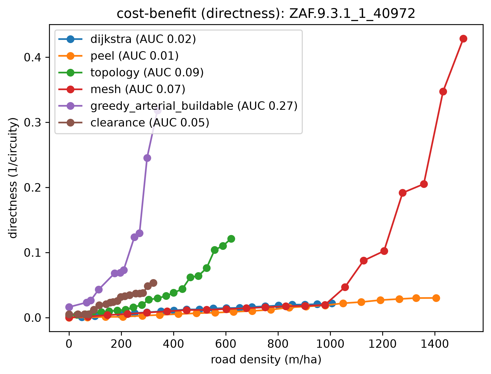
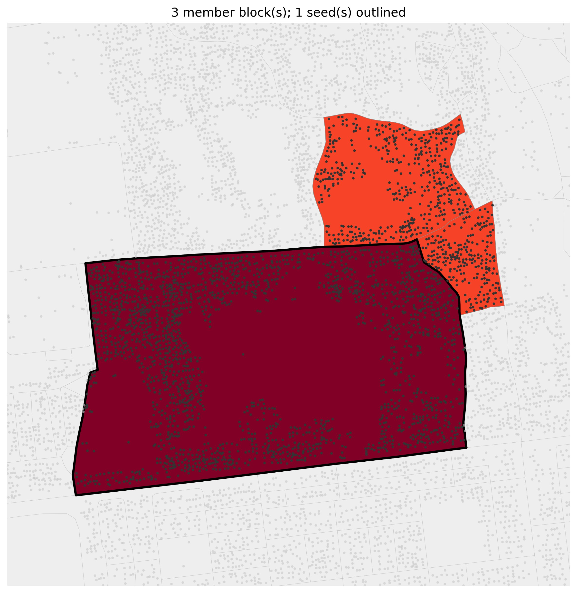

# reblock

Detect the deeply-nested fabric of an informal settlement and thread streets through it so every
home lands within a few parcels of a road. `reblock` screens a whole city for its most access-starved
blocks, grows each into a right-sized region, routes complementary roads with a pluggable method, and
grades the result on access, egress, and navigability — all as composable Hydra stages.

## Setup

```bash
git clone --recurse-submodules <repo-url>
# (or, if already cloned: git submodule update --init --recursive)

# Install pixi: https://pixi.sh/latest/#installation
pixi install
```

## Common tasks

```bash
pixi run test        # pytest + coverage
pixi run typecheck   # mypy --strict
pixi run lint        # ruff check
pixi run fmt         # ruff format
pixi run check       # lint + typecheck + test
```

## Quickstart

Render one block's access-depth heatmaps (before, and after a road-building method) by targeting it
with `block_ids` — no whole-city pass needed:

```bash
pixi run python -m reblock.run data=capetown method=dijkstra eval=kcomplexity \
  "block_ids=[[ZAF.9.3.1_1_44882]]" render.enabled=true
```

Or screen a whole city for dense/deep informal blocks and reblock the worst survivors in one command:

```bash
pixi run python -m reblock.run data=capetown_full screen=dense_compact method=dijkstra \
  eval=kcomplexity render.enabled=true flagged_map.enabled=true max_blocks=5
```

The first `capetown_full` run downloads + caches the full metro under `~/.cache/reblock` (nothing
committed); later runs are instant. Outputs land in the Hydra run dir (`outputs/<date>/<time>/`).
Quote `"block_ids=[...]"` so the shell doesn't glob the brackets.

## The pipeline

Each stage is a swappable Hydra config group; a run composes them left to right:

**`data`** (the city) **→ `screen`** (pick blocks) **→ `region_builder`** (grow each into a region)
**→ `method`** (route the roads) **→ `eval`** (score) **→ render**.

- **`screen`** — `identity` (reblock exactly what you list) or `dense_compact` (flag deep informal
  blocks; its cheap gate is the depth proxy `√(n·A)/P` — building count × block area ÷ perimeter — a
  closed-form estimate of how many parcel-rings deep a block is, tuned with `screen.depth_proxy_min` /
  `mean_depth_min` / `max_depth_min`; see the
  [note](docs/superpowers/notes/2026-07-14-depth-proxy-screen-gate.md)).
- **`region_builder`** — `identity`, `convex_hull` (bridge disjoint seed blocks), or `dense_cluster`
  (grow a seed into a `max_buildings`-sized contiguous region by that same depth proxy, so growth
  follows the deep fabric).
- **`method`** — the reblocker: `dijkstra` (fast buildable street network, the default), `peel`,
  `mesh`, `topology`, `greedy_arterial` (straight through-roads, best directness), or `clearance`
  (least-cost roads on a parametric routing substrate, with a `depth_target` road-budget dial).
- **`eval`** — grades a proposal on four lenses: **access** (burden removed), **efficiency** (network
  E), **directness** (1/circuity), and **resistance** (grounded egress resistance, redundancy-aware).
  `reblock.compare` sweeps these into cost-benefit curves (benefit per metre of road).

## Examples

Flagships in [`examples/`](examples/), each reproducing from the full Cape Town metro via plain
`reblock` CLI commands (no bespoke scripts):

| flagship | what it shows |
|---|---|
| [method-comparison](examples/method-comparison/) | Every reblocker (dijkstra, peel, topology, mesh, greedy_arterial, clearance) graded on the four lenses, on one deep block small enough that all six run |
| [multiblock_depth](examples/multiblock_depth/) | Settlement-scale reblock driven end to end by the `depth` metric, grading `clearance`, `greedy_arterial`, and the as-built `osm_footpaths` baseline on the benefit-vs-added-road frontier |
| [multiblock_depth_density](examples/multiblock_depth_density/) | The same pipeline driven by `depth × density` instead — one swap of the pluggable `BlockMetric` re-aims screen, growth, and colouring at the genuinely *crowded* deep fabric |
| [multiblock_density_compactness](examples/multiblock_density_compactness/) | The same pipeline driven by the peel-free `density × compactness = n/P²` — lands on the *densest* region (142 bldg/ha) yet the *shallowest*, because it scores geometry alone and ignores access depth |
| [nairobi/](examples/nairobi/) | The same three metric variants on a **second city** (central Nairobi). Shipped as-is — the screens carry over, but Nairobi's block sizes and OSM coverage make its regions uneven; see [`nairobi/README.md`](examples/nairobi/README.md) |

| [method-comparison](examples/method-comparison/) | [multiblock_depth_density](examples/multiblock_depth_density/) |
|---|---|
|  |  |
