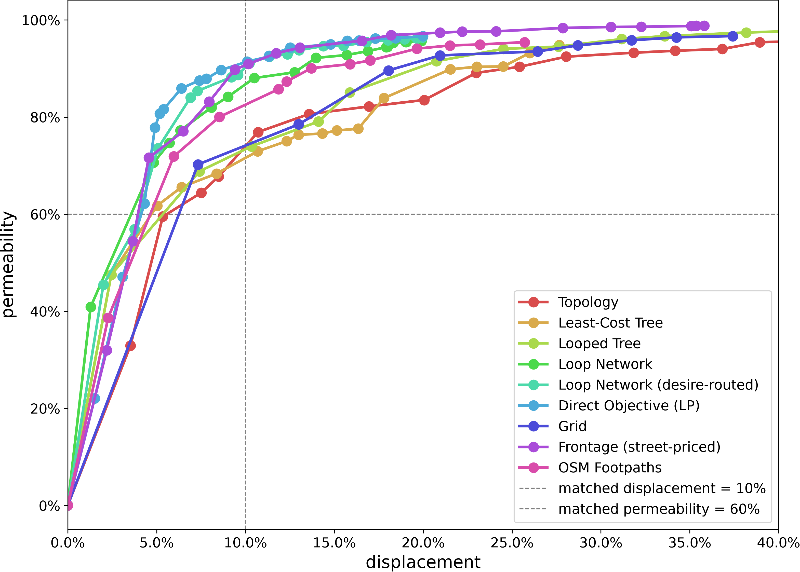

# reblock

Detect the deeply-nested fabric of an informal settlement and thread streets through it so every
home lands within a few parcels of a road. `reblock` screens a whole city for its most access-starved
blocks, grows each into a right-sized region, routes complementary roads with a pluggable method, and
grades every proposal on the same two axes — **permeability** bought against **displacement** — all
as composable Hydra stages.

## Setup

```bash
git clone --recurse-submodules <repo-url>
# (or, if already cloned: git submodule update --init --recursive)

# Install pixi: https://pixi.sh/latest/#installation
pixi install
```

## Common tasks

```bash
pixi run test        # pytest + coverage
pixi run typecheck   # mypy --strict + tsc --noEmit (web/)
pixi run lint        # ruff check
pixi run fmt         # ruff format
pixi run check       # lint + typecheck + test
```

## Quickstart

Render one block's access-depth heatmaps (before, and after a road-building method) by targeting it
with `block_ids` — no whole-city pass needed:

```bash
pixi run python -m reblock.run data=capetown method=clearance eval=kcomplexity \
  "block_ids=[[ZAF.9.3.1_1_44882]]" render.enabled=true
```

Or screen a whole city for dense/deep informal blocks and reblock the worst survivors in one command:

```bash
pixi run python -m reblock.run data=capetown_full screen=dense_compact method=clearance \
  eval=kcomplexity render.enabled=true flagged_map.enabled=true max_blocks=5
```

The first `capetown_full` run downloads + caches the full metro under `~/.cache/reblock` (nothing
committed); later runs are instant. Outputs land in the Hydra run dir (`outputs/<date>/<time>/`).
Quote `"block_ids=[...]"` so the shell doesn't glob the brackets.

## The pipeline

Each stage is a swappable Hydra config group; a run composes them left to right:

**`data`** (the city) **→ `screen`** (pick blocks) **→ `region_builder`** (grow each into a region)
**→ `method`** (route the roads) **→ `eval`** (score) **→ render**.

- **`screen`** — `identity` (reblock exactly what you list) or `dense_compact` (flag deep informal
  blocks). What it scores on is the top-level **`metric`** group: the default `depth_density_proxy`
  is `√(n·A)/P · n/A` — the depth proxy times density — computed from building count, area and
  perimeter alone, so it sweeps a whole metro in one pass. `metric=depth` and `metric=depth_density`
  instead peel a proxy-pre-filtered top slice (`proxy_keep_pct`); `metric_gate` sets the absolute
  floor. Validated against ground truth in the
  [screen bake-off](https://geoffchurch.github.io/REU_Slum_Optimization/results/bakeoff/).
- **`region_builder`** — `identity`, `convex_hull` (bridge disjoint seed blocks), `dense_cluster`
  (grow a seed into a `max_buildings`-sized contiguous region by that same metric, so growth follows
  the deep fabric), or `shape_standardizing`.
- **`method`** — the reblocker: `clearance` (least-cost roads on a parametric routing substrate —
  **the default**), `peel`, `topology`, `greedy_arterial`, `resistance_lp`, `euclidean_grid`, or
  `osm_footpaths` (the network residents already walk, used as an as-built baseline). See
  `conf/method/` for the full set, and
  [Methods](https://geoffchurch.github.io/REU_Slum_Optimization/methodology/methods/) for each one
  on the ground with its own numbers.
- **`eval`** — the per-run scorer: `kcomplexity` by default, with `access_burden`, `structure` and
  `weakdual_k` as alternatives. The published head-to-head grading is separate: `reblock.compare`
  sweeps **permeability** against **displacement** and emits the frontier every method is compared
  on.

## Examples

Flagships in [`examples/`](examples/), each reproducing from the full Cape Town metro via plain
`reblock` CLI commands (no bespoke scripts):

| flagship | what it shows |
|---|---|
| [method-comparison](examples/method-comparison/) | Six reblockers — including `topology`, `clearance`, and the as-built `osm_footpaths` baseline — graded on **permeability vs displacement**, on one deep block small enough that single-block-only `topology` runs alongside the scalable methods |
| [multiblock_depth](examples/multiblock_depth/) | Settlement-scale reblock driven end to end by the `depth` metric: screen, grow a region, then compare the scalable reblockers and the as-built `osm_footpaths` baseline on the permeability-vs-displacement frontier |
| [multiblock_depth_density](examples/multiblock_depth_density/) | The same pipeline driven by `depth × density` instead — one swap of the pluggable `BlockMetric` re-aims screen, growth, and colouring at the genuinely *crowded* deep fabric |
| [multiblock_density_compactness](examples/multiblock_density_compactness/) | The same pipeline driven by the peel-free `density × compactness = n/P²` — lands on the *densest* region (142 bldg/ha) yet the *shallowest*, because it scores geometry alone and ignores access depth |
| [screen-bakeoff](examples/screen-bakeoff/) | Which *screen* actually finds informal settlements, graded against the City of Cape Town's own 117,336-dwelling survey — the shipped `depth_density` proxy is 81.7% precise in its top 1% against `n/P²`'s 56.1%, with city-wide and per-settlement maps of where they disagree |
| [nairobi/](examples/nairobi/) | The same three metric variants on a **second city** (central Nairobi). Shipped as-is — the screens carry over, but Nairobi's block sizes and OSM coverage make its regions uneven; see [`nairobi/README.md`](examples/nairobi/README.md) |

| [method-comparison](examples/method-comparison/) | [multiblock_depth_density](examples/multiblock_depth_density/) |
|---|---|
|  |  |
