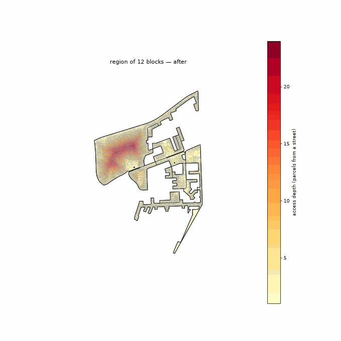

<!-- Generated by scripts/gen_site_pages.py from run artifacts on disk. Do not edit numbers by hand - regenerate instead. -->

# Clearance (looped)

The `clearance` reblocker plus a bridge-tree loop-closure refiner: after the least-cost roads are placed, it greedily adds short connectors that remove bridges (single points of failure) from the network, up to a small budget share. The result keeps clearance's least-road efficiency while buying back the backup-route redundancy (internal connectivity) that pure trees lack.

Configuration: [`conf/method/loop_closure.yaml`](https://github.com/jmendoza167/REU_Slum_Optimization/blob/main/conf/method/loop_closure.yaml)

## Head-to-head on one deep block

From the [method-comparison example](https://github.com/jmendoza167/REU_Slum_Optimization/tree/main/examples/method-comparison): six reblockers on `ZAF.9.3.1_1_40972`, the deepest topology-tractable block in the Cape Town metro (263 parcels, up to 7 rings deep). Blue = added roads; building sites shade grey to red by displacement risk; the depth heatmap goes pale as roads reach every parcel.

| before | after `clearance_looped` |
|---|---|
|  |  |

At this method's full build-out on that block (terminal point of its benefit-vs-road frontier):

| road built | external connectivity | internal connectivity | homes displaced | % of homes |
|---|---|---|---|---|
| 1,300 m | 0.92 | 0.32 | 203 | 77.2% |

## On the settlement-scale benchmark

From the [Cape Town benchmark](../benchmark.md) — the 12-block, 11,006-parcel `multiblock_depth` region.

Full road set added in drainage order, the deep interior draining as the network reaches in:

Truncated to the same road budget as every other method (left) and to the road needed to reach external connectivity 0.70 (right):

| matched road budget | external connectivity 0.70 |
|---|---|
|  |  |

**Lens A (fixed outcome, target 0.70):** reaches external connectivity 0.73 with **2,804 m** of road, displacing 279 homes (2.5%).

**Lens B (matched budget, 7,674 m):** external connectivity 0.91, internal connectivity 0.26, 848 homes displaced (7.7%).

