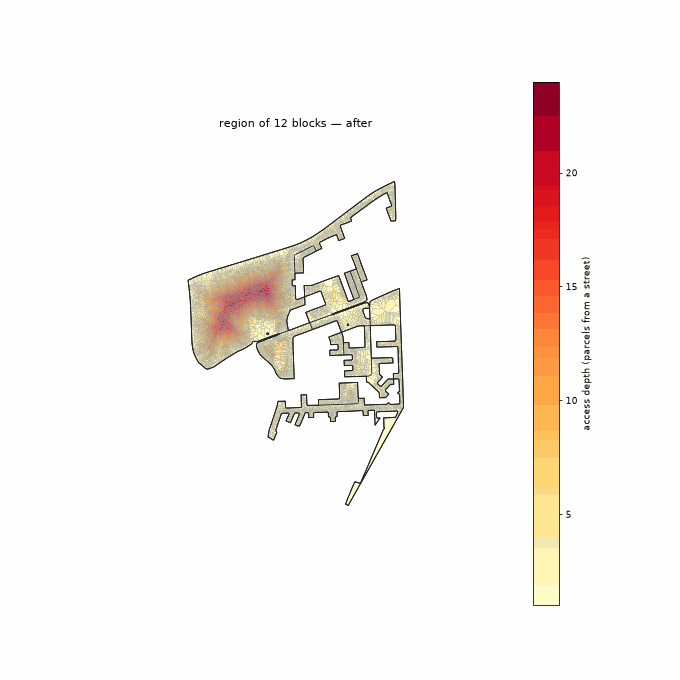
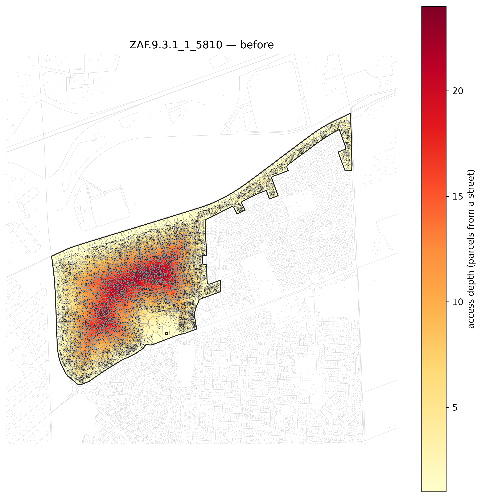
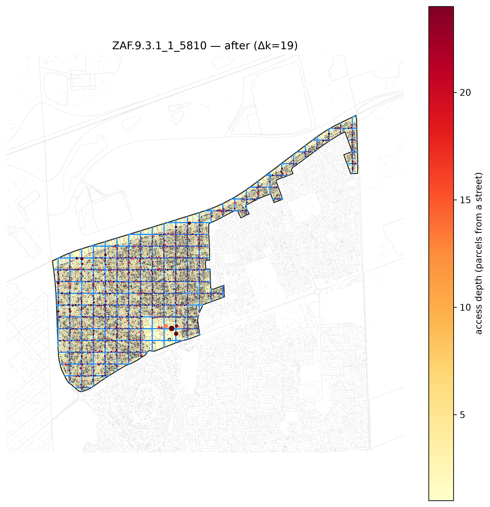

<!-- Generated by scripts/gen_site_pages.py from run artifacts on disk. Do not edit numbers by hand - regenerate instead. -->

# Euclidean Grid

Overlay a fixed, evenly-spaced orthogonal grid of candidate roads across the block — a Manhattan-style plan, as opposed to peel's parcel-by-parcel descent. With `seek_density` the grid is phase-shifted so a line runs through the densest parcel cluster, and with `adaptive` the densest cells get a finer infill layer (quadtree-like: coarse where sparse, fine where crowded). It trades some raw access for a single connected, legible, buildable network.

Configuration: [`conf/method/euclidean_grid.yaml`](https://github.com/jmendoza167/REU_Slum_Optimization/blob/main/conf/method/euclidean_grid.yaml)

## Head-to-head on one deep block

From the [method-comparison example](https://github.com/jmendoza167/REU_Slum_Optimization/tree/main/examples/method-comparison): six reblockers on `ZAF.9.3.1_1_40972`, the deepest topology-tractable block in the Cape Town metro (263 parcels, up to 7 rings deep). Blue = added roads; building sites shade grey to red by displacement risk; the depth heatmap goes pale as roads reach every parcel.

| before | after `euclidean_grid` |
|---|---|
|  |  |

At this method's full build-out on that block (terminal point of its benefit-vs-road frontier):

| road built | external connectivity | internal connectivity | homes displaced | % of homes |
|---|---|---|---|---|
| 741 m | 0.79 | 0.41 | 112 | 42.4% |

## On the settlement-scale benchmark

From the [Cape Town benchmark](../benchmark.md) — the 12-block, 11,006-parcel `multiblock_depth` region.

Full road set added in drainage order, the deep interior draining as the network reaches in:

Truncated to the same road budget as every other method (left) and to the road needed to reach external connectivity 0.70 (right):

| matched road budget | external connectivity 0.70 |
|---|---|
|  |  |

**Lens A (fixed outcome, target 0.70):** reaches external connectivity 0.74 with **3,934 m** of road, displacing 386 homes (3.5%).

**Lens B (matched budget, 7,674 m):** external connectivity 0.83, internal connectivity 0.31, 748 homes displaced (6.8%).

## Single-block k-complexity runs

Access depth is peel-k: the number of BFS rings between the deepest parcel and a street (`k after = 1` means every parcel fronts a road). `road components` counts disconnected pieces in the proposed network — 1 is a single buildable network. Read from the `outputs/*/run.log` evaluation logs on disk:

| run | block | k before | k after | delta k | added road (m) | road components | seek_density | adaptive | spacing |
|---|---|---|---|---|---|---|---|---|---|
| `capetown-dense-cluster-euclidgrid-adaptivefalse-test` | `ZAF.9.3.1_1_5810` | 24 | 5 | 19 | 19,170 | 14 | true | false | 60.0 |
| `capetown-dense-cluster-euclidgrid-noadaptive-test` | `ZAF.9.3.1_1_5810` | 24 | 4 | 20 | 25,410 | 14 | true | — | 60.0 |
| `ct-grid-adaptive` | `ZAF.9.3.1_1_44882` | 7 | 4 | 3 | 2,112 | 1 | true | — | 60.0 |
| `ct-grid-adaptive-on` | `ZAF.9.3.1_1_44882` | 7 | 3 | 4 | 3,043 | 1 | true | true | 60.0 |
| `dji-big-follow-parcels` | `DJI.3_1_3182` | 9 | 2 | 7 | 6,177 | 44 | true | — | 60.0 |
| `dji-big-grid-adaptive` | `DJI.3_1_3182` | 9 | 3 | 6 | 1,873 | 1 | true | true | 60.0 |
| `dji-big-grid-hugging` | `DJI.3_1_3182` | 9 | 3 | 6 | 2,261 | 13 | true | true | 60.0 |
| `dji-big-grid-uniform` | `DJI.3_1_3182` | 9 | 5 | 4 | 1,276 | 1 | true | — | 60.0 |
| `dji-grid-adaptive` | `DJI.3_1_1789` | 8 | 3 | 5 | 955 | 2 | true | true | 60.0 |
| `dji-grid-uniform` | `DJI.3_1_1789` | 8 | 5 | 3 | 622 | 2 | true | — | 60.0 |
| `dji-multiblock-grid` | `region:DJI.3_1_1789+DJI.3_1_1812` | 8 | 4 | 4 | 1,445 | 2 | true | — | 60.0 |

| before | after |
|---|---|
|  |  |

