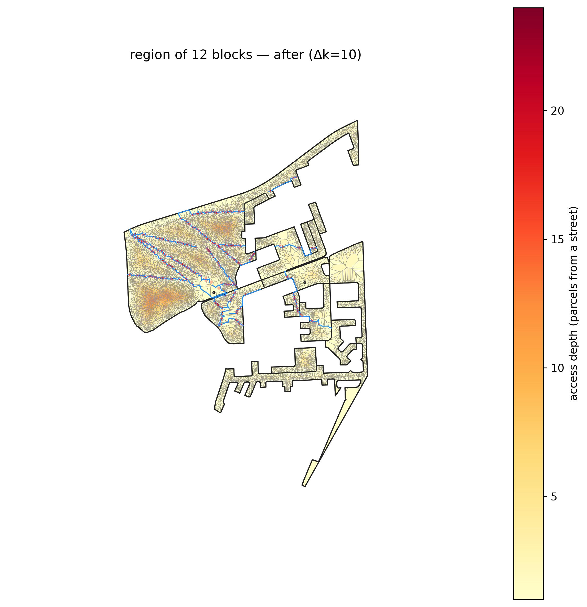

<!-- Generated by scripts/gen_site_pages.py from run artifacts on disk. Do not edit numbers by hand - regenerate instead. -->

# Greedy Arterial (buildable)

Greedily insert the single straight arterial with the best objective gain per metre, one road at a time, with candidates snapped to the parcel-boundary graph so every road is buildable frontage. The evaluated configuration is `greedy_arterial_repulsion`: buildable mode with a soft, never-zero building-proximity (repulsion) cost, so benefit is scored per home displaced and roads thread the gaps *between* building clusters. It runs via CELF/lazy greedy, so it scales to settlement-size regions.

Configuration: [`conf/method/greedy_arterial_repulsion.yaml`](https://github.com/jmendoza167/REU_Slum_Optimization/blob/main/conf/method/greedy_arterial_repulsion.yaml)

## Head-to-head on one deep block

From the [method-comparison example](https://github.com/jmendoza167/REU_Slum_Optimization/tree/main/examples/method-comparison): six reblockers on `ZAF.9.3.1_1_40972`, the deepest topology-tractable block in the Cape Town metro (263 parcels, up to 7 rings deep). Blue = added roads; building sites shade grey to red by displacement risk; the depth heatmap goes pale as roads reach every parcel.

| before | after `greedy_arterial_repulsion` |
|---|---|
|  |  |

At this method's full build-out on that block (terminal point of its benefit-vs-road frontier):

| road built | external connectivity | internal connectivity | homes displaced | % of homes |
|---|---|---|---|---|
| 703 m | 0.84 | 0.47 | 75 | 28.4% |

## On the settlement-scale benchmark

From the [Cape Town benchmark](../benchmark.md) — the 12-block, 11,006-parcel `multiblock_depth` region.

Full road set added in drainage order, the deep interior draining as the network reaches in:

Truncated to the same road budget as every other method (left) and to the road needed to reach external connectivity 0.70 (right):

| matched road budget | external connectivity 0.70 |
|---|---|
|  |  |

**Lens A (fixed outcome, target 0.70):** reaches external connectivity 0.70 with **4,938 m** of road, displacing 403 homes (3.7%).

**Lens B (matched budget, 7,674 m):** external connectivity 0.78, internal connectivity 0.13, 552 homes displaced (5.0%).

