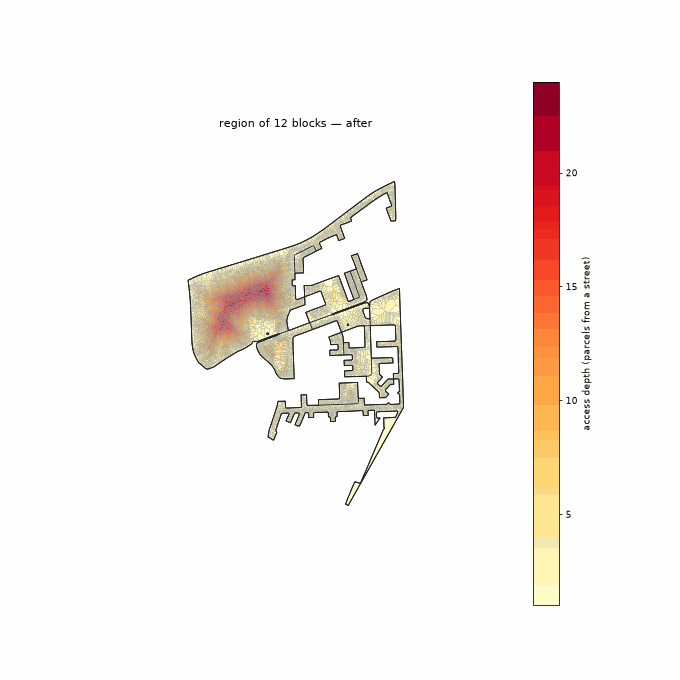

<!-- Generated by scripts/gen_site_pages.py from run artifacts on disk. Do not edit numbers by hand - regenerate instead. -->

# OSM Footpaths

The reblocker whose "proposed roads" are the **real** informal circulation network — the worn footpaths people already walk, as mapped in OpenStreetMap (largely by Humanitarian OSM digitization) — clipped to the region, minus the parts that merely retrace existing streets. It is the as-built baseline every synthesized method is judged against: what do the actual paths score on the same lenses?

Configuration: [`conf/method/osm_footpaths.yaml`](https://github.com/jmendoza167/REU_Slum_Optimization/blob/main/conf/method/osm_footpaths.yaml)

## Head-to-head on one deep block

From the [method-comparison example](https://github.com/jmendoza167/REU_Slum_Optimization/tree/main/examples/method-comparison): six reblockers on `ZAF.9.3.1_1_40972`, the deepest topology-tractable block in the Cape Town metro (263 parcels, up to 7 rings deep). Blue = added roads; building sites shade grey to red by displacement risk; the depth heatmap goes pale as roads reach every parcel.

| before | after `osm_footpaths` |
|---|---|
|  |  |

At this method's full build-out on that block (terminal point of its benefit-vs-road frontier):

| road built | external connectivity | internal connectivity | homes displaced | % of homes |
|---|---|---|---|---|
| 639 m | 0.76 | 0.33 | 75 | 28.4% |

## On the settlement-scale benchmark

From the [Cape Town benchmark](../benchmark.md) — the 12-block, 11,006-parcel `multiblock_depth` region.

Full road set added in drainage order, the deep interior draining as the network reaches in:

Truncated to the same road budget as every other method (left) and to the road needed to reach external connectivity 0.70 (right):

| matched road budget | external connectivity 0.70 |
|---|---|
|  |  |

**Lens A (fixed outcome, target 0.70):** never reaches the 0.70 external-connectivity target — it plateaus at 0.03 after 7,674 m of road.

**Lens B (matched budget, 7,674 m):** external connectivity 0.03, internal connectivity 0.09, 387 homes displaced (3.5%).

