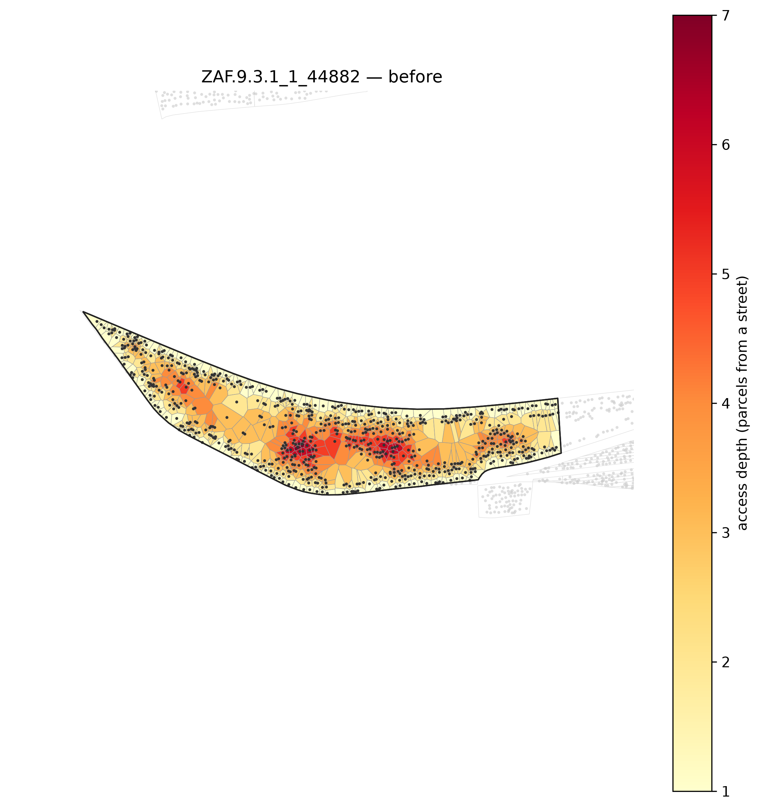
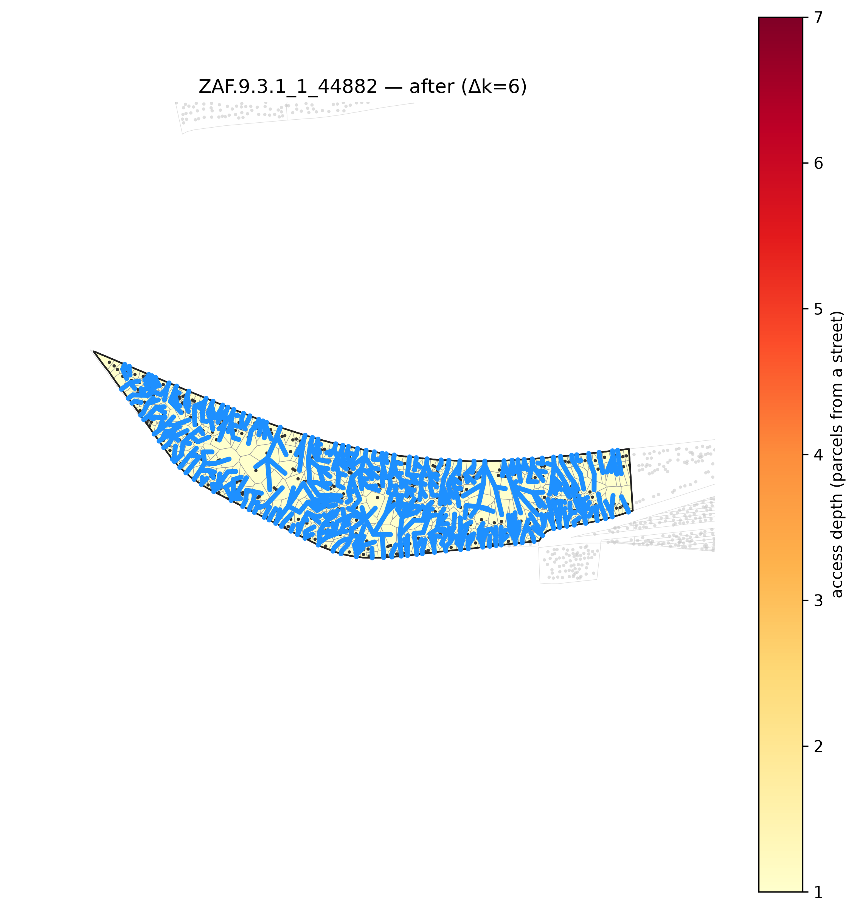

<!-- Generated by scripts/gen_site_pages.py from run artifacts on disk. Do not edit numbers by hand - regenerate instead. -->

# Peel

Route roads by steepest descent down the access-depth peel: every interior parcel links to a neighbour one BFS ring shallower, and each chain roots at the nearest street point. The union is a connected centreline network that reaches **every** parcel — full access by construction. It is the project's deterministic access-optimal baseline: it shows the ceiling on access improvement, and its cost (road length, fragmentation, zero regard for what is buildable) is the price of that ceiling.

Configuration: [`conf/method/peel.yaml`](https://github.com/jmendoza167/REU_Slum_Optimization/blob/main/conf/method/peel.yaml)

## Single-block k-complexity runs

Access depth is peel-k: the number of BFS rings between the deepest parcel and a street (`k after = 1` means every parcel fronts a road). `road components` counts disconnected pieces in the proposed network — 1 is a single buildable network. Read from the `outputs/*/run.log` evaluation logs on disk:

| run | block | k before | k after | delta k | added road (m) | road components |
|---|---|---|---|---|---|---|
| `ct-peel-render` | `ZAF.9.3.1_1_44882` | 7 | 1 | 6 | 7,116 | 109 |
| `dji-big-peel` | `DJI.3_1_3182` | 9 | 1 | 8 | 5,583 | 60 |
| `dji-peel` | `DJI.3_1_1789` | 8 | 1 | 7 | 2,921 | 49 |

| before | after |
|---|---|
|  |  |

