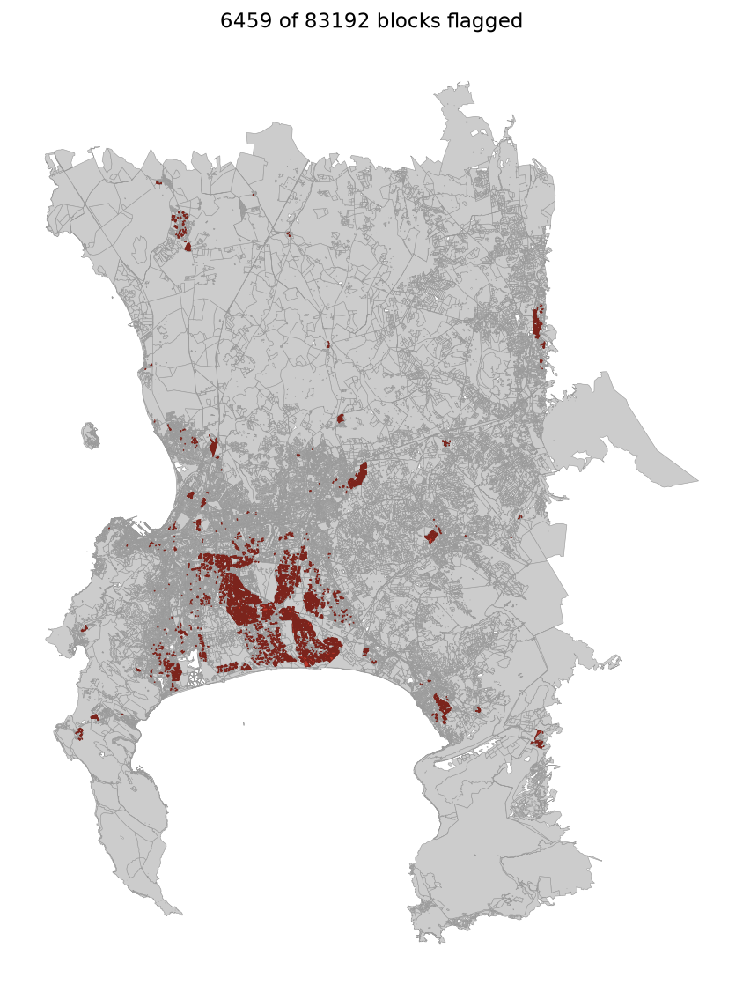
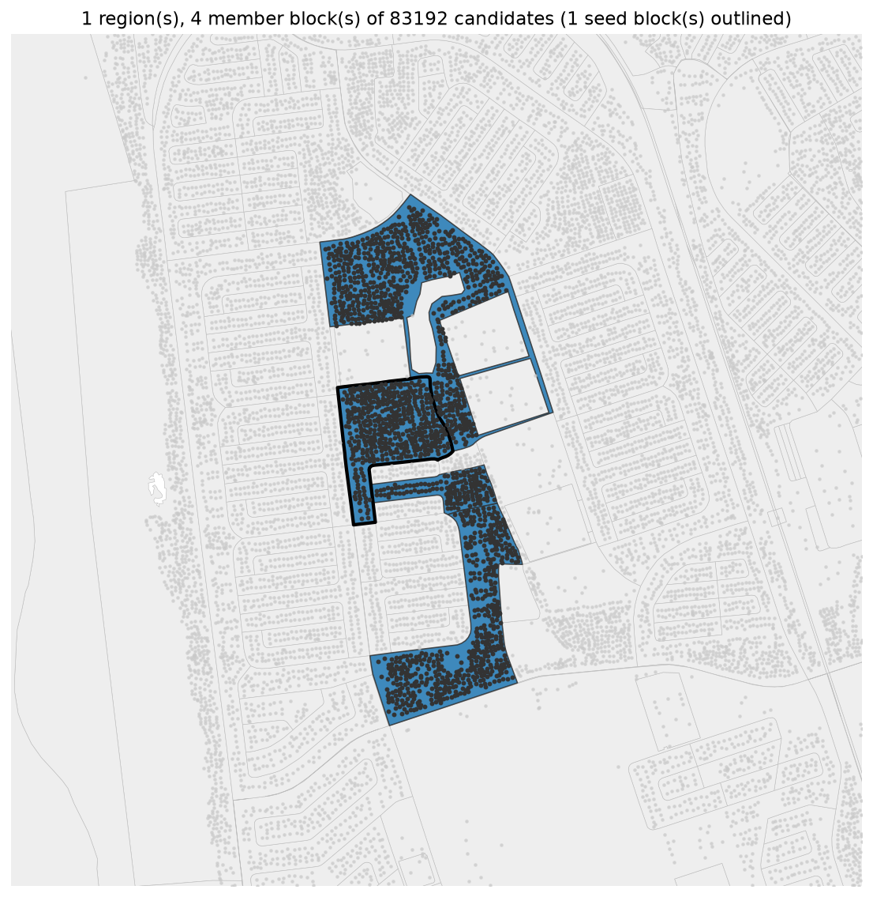
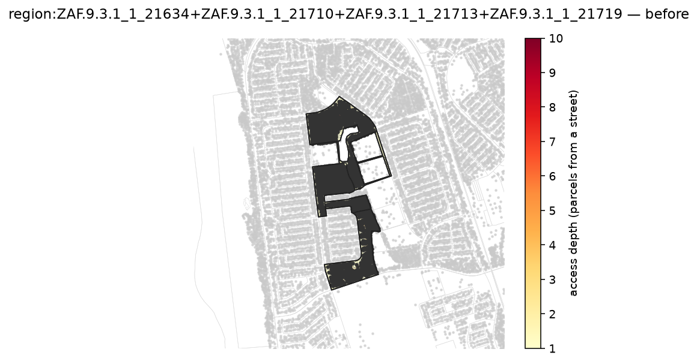
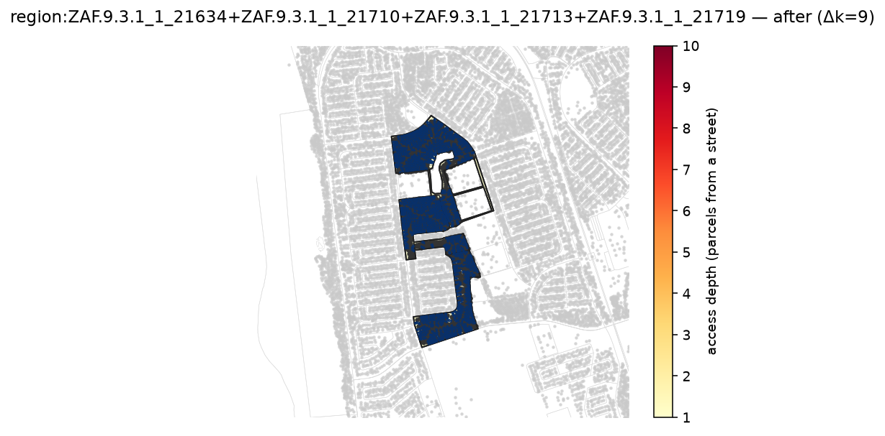
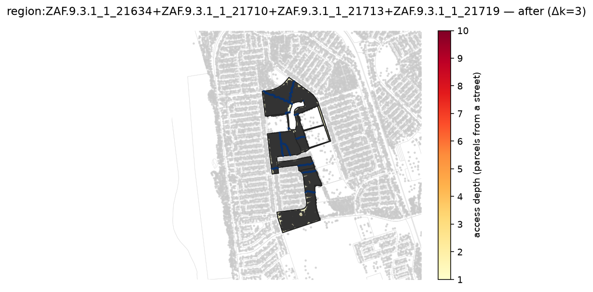
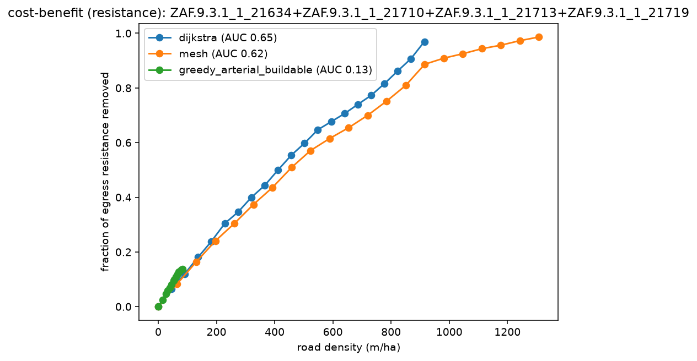
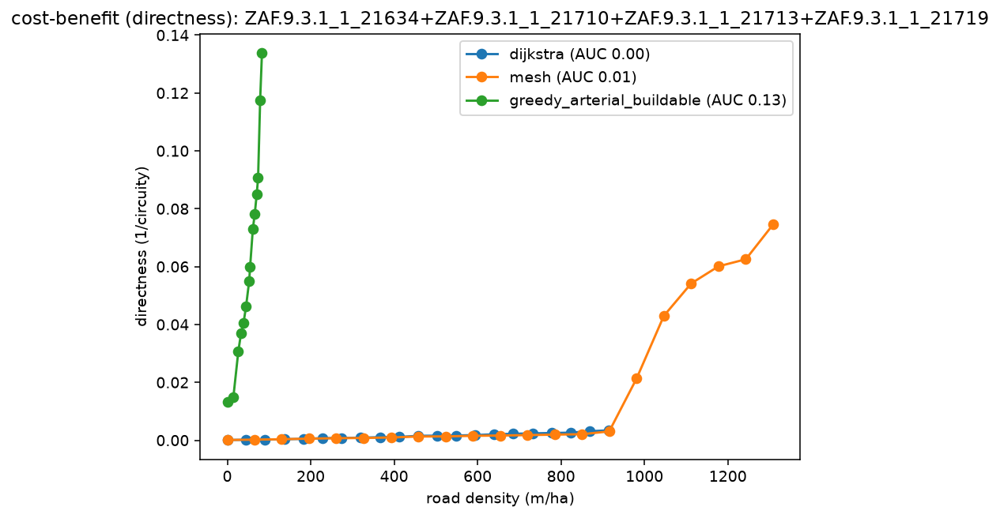

# Cape Town flagship: screen → grow → compare on all four lenses

The full deep-dive on real Cape Town data: screen the whole metro for informal blocks, grow the
worst *tractable* one into its neighborhood, and grade every method on all four lenses — including
the grounded **egress-resistance** metric — with before/after renders.

Unlike the rest of this gallery, this reproduces from **`capetown_full`** (the full metro,
auto-downloaded to `~/.cache/reblock` on first use), not the committed 301-block sample.

## 1. Screen the metro

`dense_compact` flags **6459 of 83192** blocks as dense, deep informal fabric (density ≥ 30 bld/ha,
mean access-depth ≥ 1.3), ranked by max access-depth. The whole ranked selection is memoized (a
`derive()` keyed on the source content hash + gate params), so the 167 s first pass is **0.1 s** on
every rerun.



## 2. Grow a region

Cape Town's *deepest* blocks are single 1000–3000-building informal blocks — too large to reblock in
full. So we seed the deepest **arterial-tractable** block, `ZAF.9.3.1_1_21719` (the same block the
[detect-reblock](../detect-reblock/) sample surfaces as worst-access), and let `dense_cluster` grow
it toward its densest neighbors up to a ~1200-building budget: a contiguous **4-block neighborhood**
(`21634 + 21710 + 21713 + 21719`, ~1594 parcels). The dark buildings packed inside the region vs the
sparse formal grid around it are the informal fabric the screen is built to find.



## 3. Reblock + compare

```bash
pixi run python -m reblock.compare \
  data=capetown_full region_builder=dense_cluster region_builder.max_buildings=1200 \
  "block_ids=[[ZAF.9.3.1_1_21719]]" methods=[dijkstra,mesh,greedy_arterial_buildable] max_blocks=1

pixi run python -m reblock.run \
  data=capetown_full region_builder=dense_cluster region_builder.max_buildings=1200 \
  "block_ids=[[ZAF.9.3.1_1_21719]]" method=greedy_arterial max_blocks=1 \
  render.enabled=true region_map.enabled=true
# swap method=dijkstra / method=mesh for the other after-renders
```

The compare computes each method's region proposal once; the render passes reuse it from the L2
cache (a region proposal is content-addressed on its members + method), so after the one-time
arterial compute the renders are seconds. `flagged_map.png` comes from the screen's selection
(`data=capetown_full screen=dense_compact`).

## What the region looks like

Nearly every parcel sits ~10 parcels from a street (dark = deep). Coverage methods blanket the
neighborhood with roads (dijkstra Δk=9); arterial adds a few strategic through-roads (Δk=3).

| before | dijkstra (coverage) | arterial (strategic) |
|---|---|---|
|  |  |  |

(mesh: [`after_mesh.png`](after_mesh.png).)

## The four lenses

Mean AUC per method (benefit per meter of road, integrated across the shared budget; higher = better):

| lens | dijkstra | mesh | arterial |
|---|---|---|---|
| access — burden removed | **0.82** | 0.81 | 0.42 |
| resistance — egress removed | **0.65** | 0.62 | 0.13 |
| directness — 1/circuity | 0.00 | 0.01 | **0.13** |
| efficiency — network E | 0.00 | 0.00 | 0.00 |

The table reads "coverage wins access + resistance, arterial wins directness" — but the **curves**
tell a sharper, more honest story.

**Access + resistance are coverage-driven.** In arterial's operating regime (0–80 m/ha) all three
curves *coincide* — every method removes access-burden and egress-resistance at the **same rate per
meter**. dijkstra/mesh only pull ahead on AUC by committing ~10× the road to blanket every parcel;
arterial isn't less efficient, it commits less road and stops. The AUC gap is *less road*, not lower
efficiency.



**Directness is uniquely arterial's.** Strategic through-roads make trips direct at ~50 m/ha; a
spanning tree (dijkstra) barely moves circuity even at 900 m/ha, and mesh needs ~1000 m/ha to reach
a third of arterial's directness.



So for **egress and reachability**, road density is what matters and any method delivers it
efficiently — build the cheapest. For **navigability** (direct trips through a deep block),
arterial's few cross-cutting roads are worth far more than blanket coverage.

## The resistance metric on real data

This example doubles as the grounded egress-resistance metric's real-data test. On a deep informal
region it behaves as a **coverage/redundancy** lens — tracking access, distinct from directness —
the intended reading: it measures how easily every parcel reaches egress, and redundant road removes
more of that resistance. (`curve_efficiency.png` — network E — is near-inert at this scale: the
all-pairs mean 1/distance is swamped by the region's many far-apart parcel pairs.)
