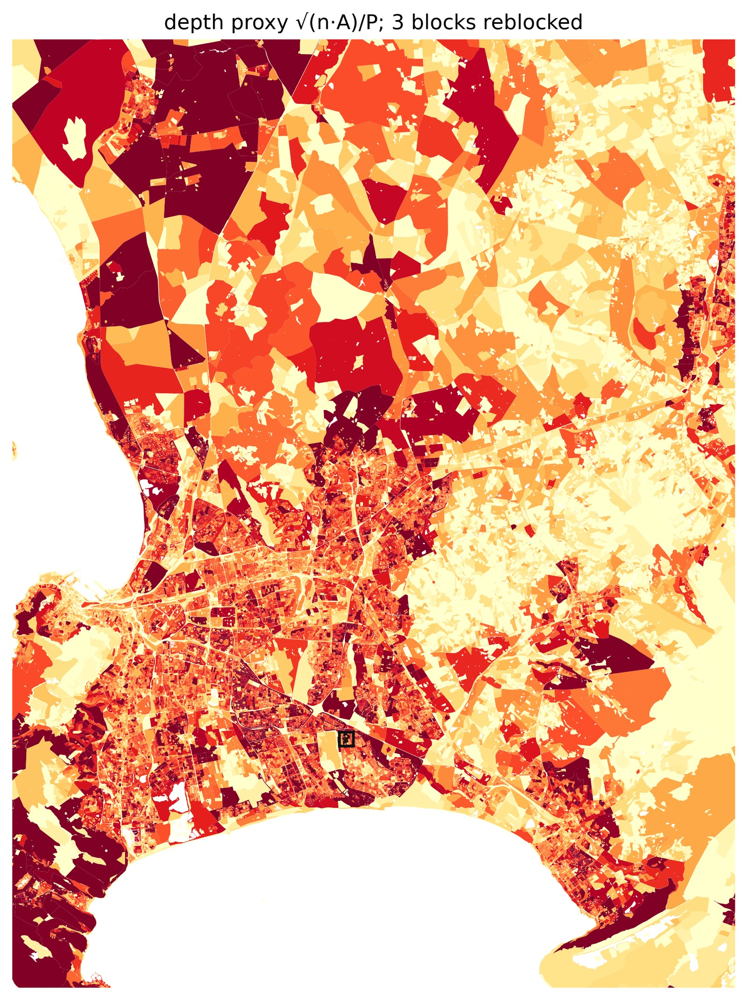
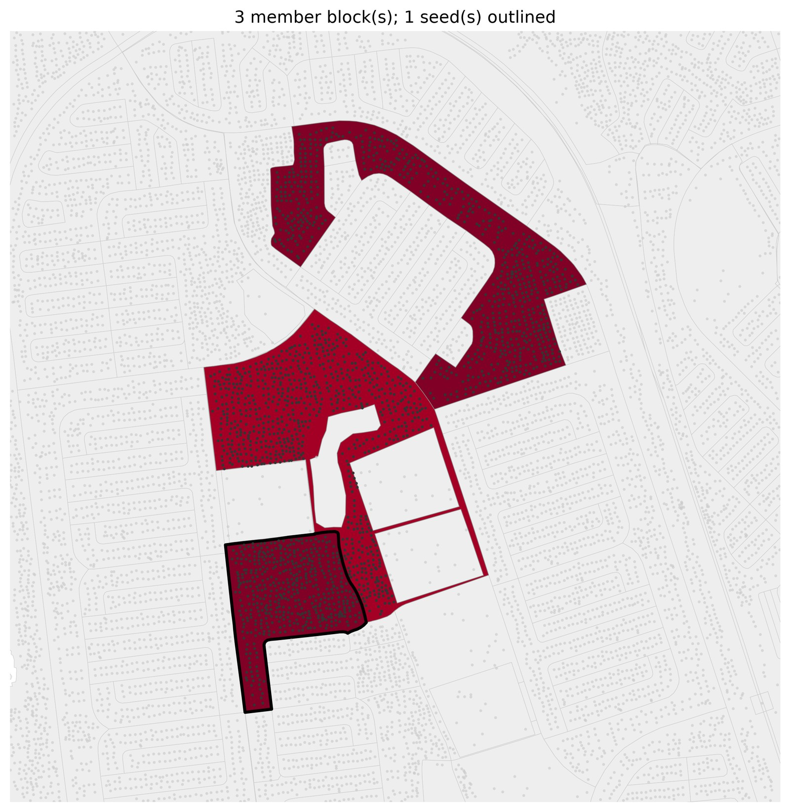
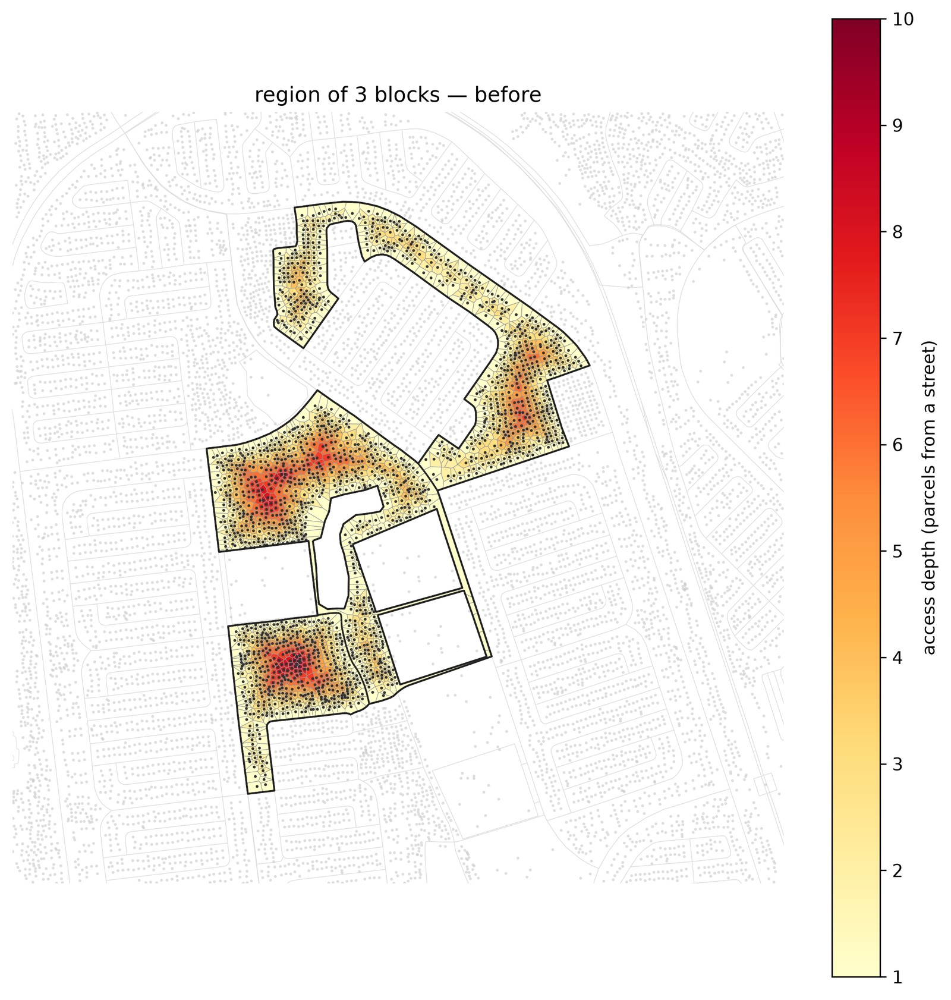
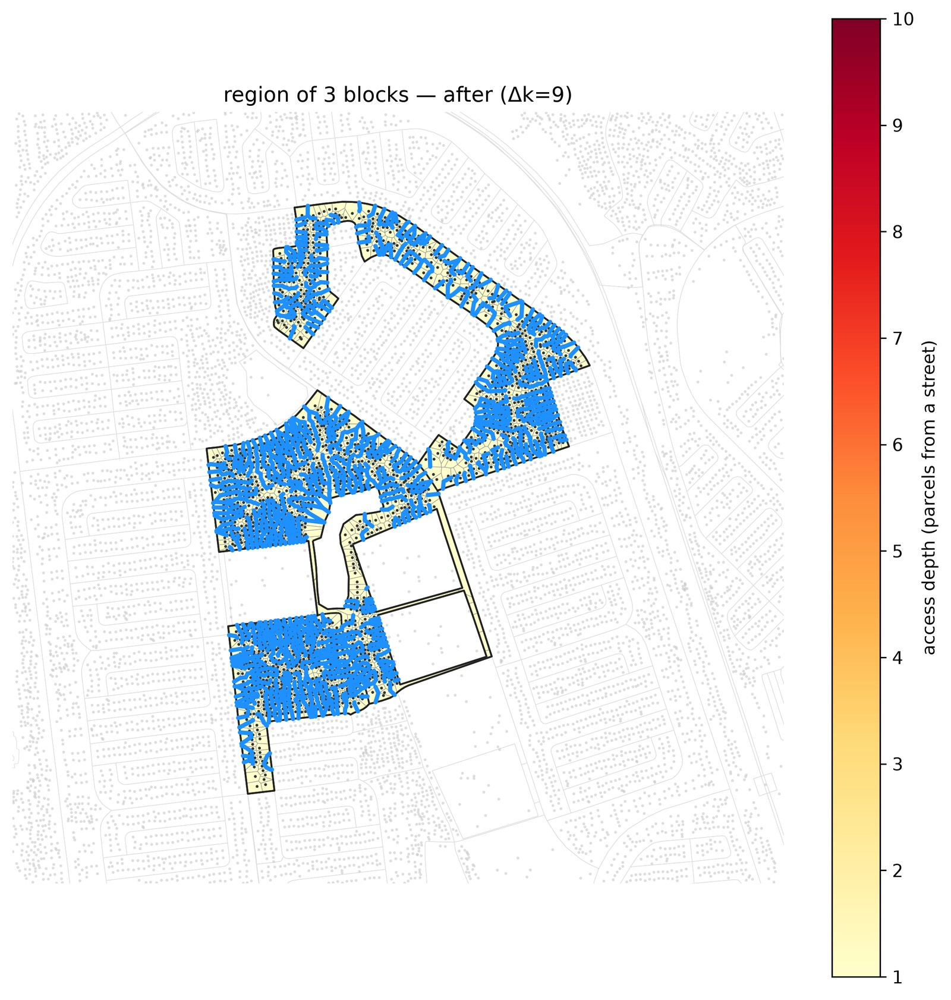
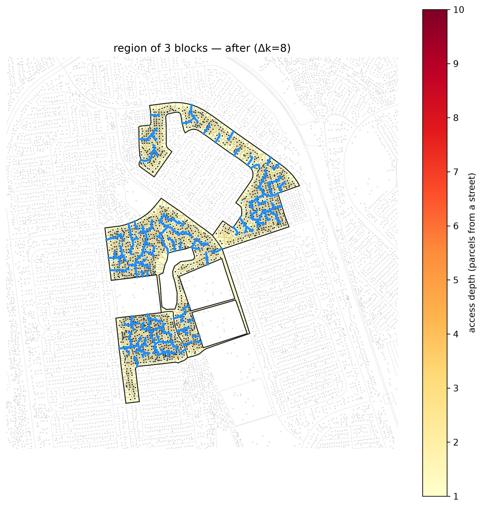
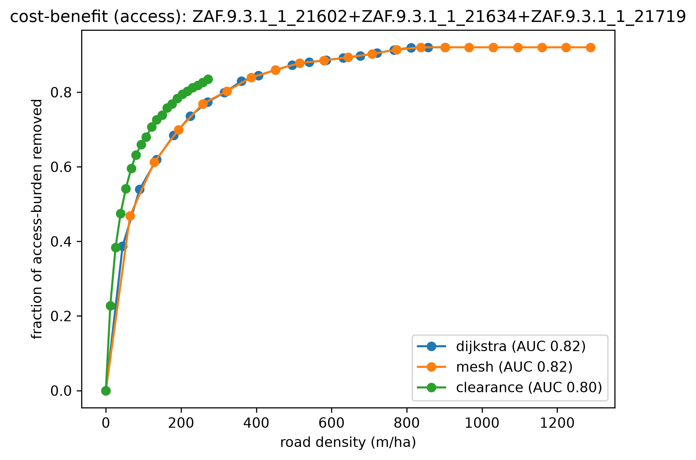

# Cape Town flagship: screen → grow → compare on all four lenses

The full method-comparison deep-dive on real Cape Town data: screen the whole metro for informal
blocks, grow a deep one into its neighborhood, and grade three fast methods on all four lenses —
including the grounded **egress-resistance** metric — with before/after renders. Complements
[`clearance-flagship`](../clearance-flagship/) (one whole settlement reblocked); this one is about
*which method* and *what each lens rewards*.

Reproduces from **`capetown_full`** (the full metro, auto-downloaded to `~/.cache/reblock` on first
use), not the committed sample.

## 1. Screen the metro

`dense_compact` flags **13,906 of 83,192** blocks as deep informal fabric, ranked by max
access-depth. The cheap gate is the depth proxy `√(n·A)/P` (building count · block area ÷ perimeter),
a closed-form estimate of parcel-rings deep (see
[the note](../../docs/superpowers/notes/2026-07-14-depth-proxy-screen-gate.md)). The whole ranked
selection is memoized, so the metro pass is 0.1 s on rerun.



## 2. Grow a region

Seed a deep block, `ZAF.9.3.1_1_21719`, and let `dense_cluster` grow it toward its deepest neighbors
(by that same proxy) up to a ~1200-building budget: a contiguous **3-block neighborhood**
(`21602 + 21634 + 21719`, **1,886 parcels**). The dark fabric packed inside vs the sparse formal grid
around it is what the screen is built to find. Every parcel starts up to **10** deep.



## 3. Reblock + compare

```bash
pixi run python -m reblock.compare \
  data=capetown_full region_builder=dense_cluster region_builder.max_buildings=1200 \
  "block_ids=[[ZAF.9.3.1_1_21719]]" methods=[dijkstra,mesh,clearance] max_blocks=1

# per-method before/after renders (proposals reuse the compare's L2 cache -> seconds)
pixi run python -m reblock.run \
  data=capetown_full region_builder=dense_cluster region_builder.max_buildings=1200 \
  "block_ids=[[ZAF.9.3.1_1_21719]]" method=dijkstra max_blocks=1 \
  render.enabled=true region_map.enabled=true
# swap method=mesh / method=clearance for the other after-renders
```

The whole compare runs in **~30 s** (all three methods are fast; a region proposal is
content-addressed on its members + method, so the render passes reuse it from the L2 cache).

## What the region looks like

Nearly every parcel sits ~10 parcels from a street (dark = deep). The coverage methods (dijkstra,
mesh) blanket it to depth 1 (Δk=9); clearance targets depth 2 and gets there with **a third of the
road**:

| method | depth | Δk | road length |
|---|---|---|---|
| dijkstra | 10 → 1 | 9 | 12,901 m |
| mesh | 10 → 1 | 9 | 18,434 m |
| clearance | 10 → 2 | 8 | **3,888 m** |

| before | dijkstra (coverage) | clearance (sparse + direct) |
|---|---|---|
|  |  |  |

(mesh: [`after_mesh.jpg`](after_mesh.jpg).)

## The four lenses

Mean AUC per method (benefit per metre of road, integrated across the shared budget; higher = better):

| lens | dijkstra | mesh | clearance |
|---|---|---|---|
| access — burden removed | **0.82** | 0.82 | 0.80 |
| resistance — egress removed | **0.66** | 0.62 | 0.47 |
| directness — 1/circuity | 0.00 | 0.01 | **0.04** |
| efficiency — network E | 0.00 | 0.00 | 0.00 |

The table reads "the spanning tree wins access + resistance, clearance wins directness" — but the
**curves** tell the sharper story.

**Access + resistance are coverage-driven.** In the low-road regime all three curves *coincide* —
every method removes access-burden and egress-resistance at nearly the **same rate per metre**.
dijkstra/mesh pull ahead on AUC by committing 3–5× the road to blanket every parcel to depth 1;
clearance isn't less efficient, it stops at depth 2 with far less road. The AUC gap is *more road*,
not lower efficiency per metre.

 

**Directness is clearance's.** Its least-cost roads cut more direct interior routes than a frontage
spanning tree, so it leads directness while dijkstra barely moves circuity. (This is the niche the
old `greedy_arterial` method held — clearance now covers it at seconds instead of core-hours, and
adds a `repulsion` knob to trade directness against homes displaced.)


So for **egress and reachability**, road density is what matters and the cheapest coverage method
(dijkstra) delivers it efficiently. For **navigability** (direct trips through a deep block) at a
fraction of the road, clearance is the one to reach for.

## The resistance metric on real data

This example doubles as the grounded egress-resistance metric's real-data test. On a deep informal
region it behaves as a **coverage/redundancy** lens — tracking access, distinct from directness —
the intended reading: it measures how easily every parcel reaches egress, and redundant road (the
spanning tree's) removes more of that resistance. (`efficiency` — network E — is near-inert at this
scale: the all-pairs mean 1/distance is swamped by the region's many far-apart parcel pairs.)
