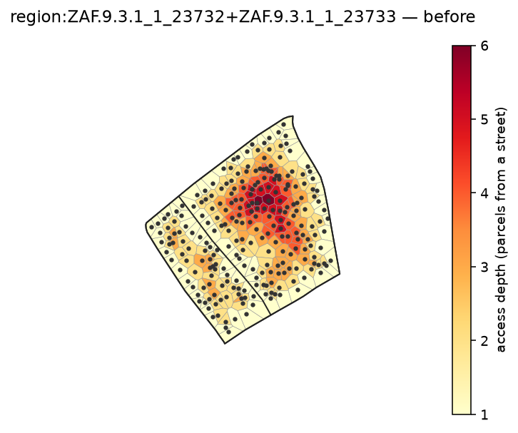
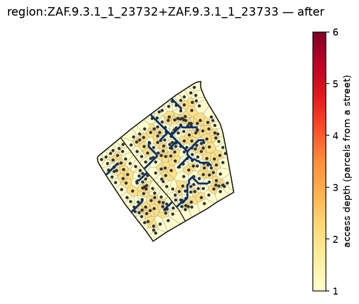
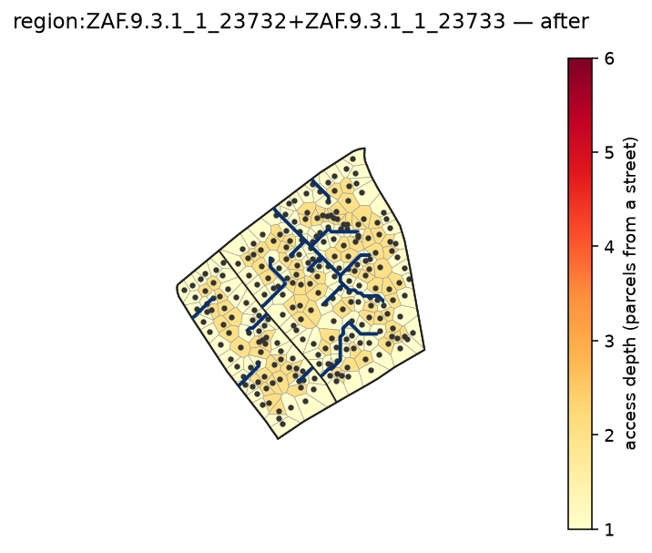
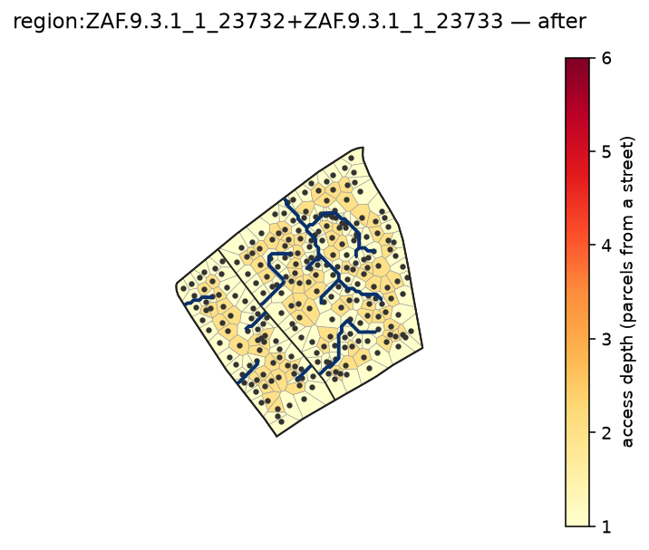
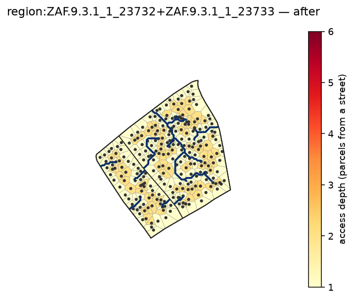
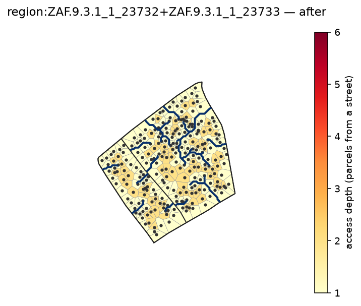

# Clearance reblocker: one knob, one region, five repulsions

`ClearanceReblocker` grows each new road as a least-cost path from the deepest remaining parcel
to the existing street network on an 8-connected grid. The cost field blends a uniform term with
a repulsion-from-buildings term:

```
edge_weight = length * [(1 - t) + t / clearance],   clearance = distance to nearest building
```

The user-facing knob is a logit `repulsion` (`s`); internally `t = sigmoid(s) ∈ (0, 1)`. As
`s → -∞`, `t → 0` and the cost field is uniform, so the least-cost path is the **straight line**
— aspirational, maximally direct, and indifferent to what it crosses. As `s → +∞`, `t → 1` and
the path is pulled onto the **max-clearance ridges** — the Voronoi edges equidistant from the two
nearest buildings — i.e. it follows the gaps that are actually there to build in. `s = 0` is the
balanced default. This example reblocks the same region at five points on that spectrum
(`s = -6, -2, 0, +2, +6`) so the trade is visible directly in the road geometry.

Like [`capetown-flagship`](../capetown-flagship/), this reproduces from **`capetown_full`** (the
full metro, auto-downloaded to `~/.cache/reblock` on first use), not the committed 301-block
sample — but everything here runs on one small, auto-detected region instead of a full
screen-and-grow deep-dive.

## Auto-detecting the region

The generator never hand-picks a `block_id`. It:

1. **Screens the metro.** `DenseCompactScreen(max_depth_min=6.0)` flags blocks that are dense
   (≥ 30 buildings/ha), have mean access-depth ≥ 1.3, *and* have at least one parcel ≥ 6 parcels
   deep — deep informal fabric, not just any dense block. That's **191 of 83192** blocks in the
   metro, ranked deepest-first. `screen.select` is memoized (a `derive()` keyed on the source
   content hash + gate params), so this is instant on rerun.
2. **Picks a tractable seed.** Cape Town's deepest blocks are single 1000–3000-building informal
   giants — too large to reblock as a five-panel gallery entry. So the generator walks the ranked
   list deepest-first and takes the first block whose own `building_count` (kblock metadata) falls
   in a small window (`SEED_MIN=40, SEED_MAX=90`) — deep, but small enough to grow into a legible
   region.
3. **Grows a small multi-block neighborhood.** `DenseClusterRegionBuilder(max_buildings=100)`
   adds the seed's densest touch-adjacent neighbor(s) until the cluster's building-count budget is
   reached.
4. **Builds the region.** The member blocks are re-read through `KblockSource(...).region()` and
   merged with `region_block` into a single `Block` (parcels + buildings + Voronoi geometry).

On the run that produced the committed PNGs, this auto-detection landed on:

```
auto-detected region: seed=ZAF.9.3.1_1_23732  members=['ZAF.9.3.1_1_23732', 'ZAF.9.3.1_1_23733']
region: 250 parcels, 250 buildings
```

a two-block neighborhood — the dark cluster near the middle of `before.png` is where access depth
reaches 6 parcels from any street.

## Reproduce

```bash
PYTHONPATH=. pixi run python examples/clearance-repulsion/generate.py
```

(`PYTHONPATH=.` is needed because `reblock.data.provision` imports the repo-root `scripts/`
package, which is outside the package's own `sys.path` entry when the script is run directly —
the same reason `scripts/bench_cache.py` documents the same prefix.) First run screens the whole
metro and builds the region's Voronoi tessellation from scratch; both are memoized, so a warm
rerun (as here, caches already built by earlier development in this repo) completes in well under
a minute end-to-end for one small region.

## The five panels

| before | s = -6 (straight) | s = -2 | s = 0 (default) | s = +2 | s = +6 (Voronoi) |
|---|---|---|---|---|---|
|  |  |  |  |  |  |

## Metrics (actual run output)

| repulsion | roads | length_m | displaced | max_depth |
|---:|---:|---:|---:|---:|
| -6 | 22 | 328 | 71 | 2 |
| -2 | 22 | 328 | 71 | 2 |
| 0 | 22 | 327 | 68 | 2 |
| +2 | 21 | 341 | 65 | 2 |
| +6 | 21 | 389 | 59 | 2 |

(`roads`: road segments added. `length_m`: total road length. `displaced`: buildings within 3 m of
a new road, from `displacement_count`. `max_depth`: worst remaining access depth after reblocking,
from `parcel_access_layers`.)

## Reading the sweep

**Coverage is held constant.** Every panel reaches the same `depth_target=2` — the method keeps
adding least-cost roads from the deepest remaining parcel until no parcel is more than 2 parcels
from a street, regardless of `repulsion`. So the panels aren't a coverage comparison; they isolate
what the knob actually changes: *how* each road gets there.

**The knob trades displacement for length, monotonically at the extremes.** From `s=-6` to
`s=+6`, `displaced` falls from 71 to 59 (roads pulled toward the max-clearance Voronoi ridges cross
fewer building footprints) while `length_m` rises from 328 to 389 (hugging the gaps between
buildings is less direct than a straight line, so the same coverage costs more road). The two most
repulsion-averse settings (`s=-6, -2`) tie exactly (`71` displaced, `328` m) — at this region's
scale the cost field is already close enough to uniform at both settings that the greedy search
finds the same paths; the difference opens up moving toward the Voronoi-following end.

**Road count drifts down slightly, not up.** `s=-6` and `s=+6` both need roads to reach every
parcel, but the straighter paths at negative `s` are less efficient at reusing already-built road
(more redundant crossings), so they end up needing one more segment (22 vs 21) despite being
individually more direct — a second-order effect underneath the primary length/displacement trade.

In short: `repulsion` doesn't change *whether* the block gets reblocked to depth 2, it changes
*how much building you cut through to get there* versus *how much extra road you lay to avoid it*
— the same trade a real implementer faces between an aspirational straight-line plan and a
buildable one that respects what's already standing.
