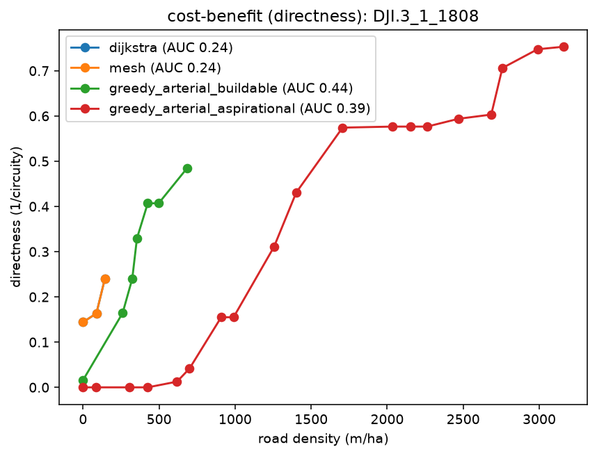

# Compare methods at a budget (cost-benefit curves)

Rank the reblockers by *efficiency* — how much benefit each buys per meter of road, across the whole
budget range (not just at full build, where they converge). Grades every method on three lenses:
`access`, `efficiency` (network E), and `directness` (1/circuity).

```bash
pixi run python -m reblock.compare data=dji eval=kcomplexity "block_ids=[[DJI.3_1_1808]]" \
  methods=[dijkstra,mesh,greedy_arterial_buildable,greedy_arterial_aspirational]
```

Writes, per metric, `auc_table_{metric}.csv` (mean AUC per method, higher = more benefit per meter)
and `curve_{metric}_{block}.png` (benefit vs road density, m/ha). `greedy_arterial_buildable` is the
navigability flagship — it leads on `directness` (several× dijkstra/mesh) at the cost of being slow
and trading a little access; `dijkstra` stays the fast access-first default.

`directness`/`efficiency` measure *internal circulation* — door-to-door trips between all parcel
pairs, including the walk-to-road legs, so directness is an honest circuity ratio in [0, 1]. On this
**compact** block that favours frontage-hugging roads: every parcel gets a short walk leg, so
`greedy_arterial_buildable` actually edges out `greedy_arterial_aspirational` (ideal straight chords,
not snapped to frontages). The ideal chord is **not** a universal ceiling — a straight road only pays
off where parcels are buried and there is room to shortcut across, i.e. a deep or elongated region,
which a compact block is not. Here, buildability costs nothing.

**Directness — arterial pulls ahead:**


