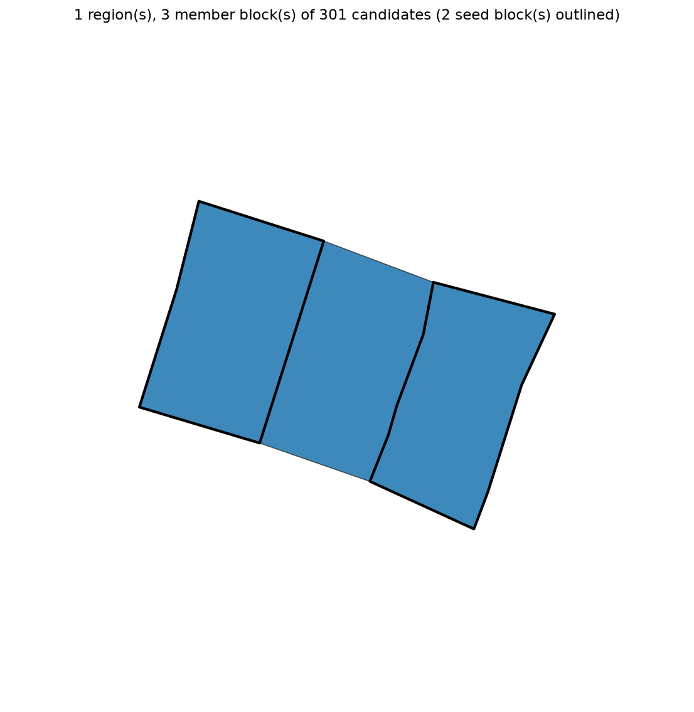
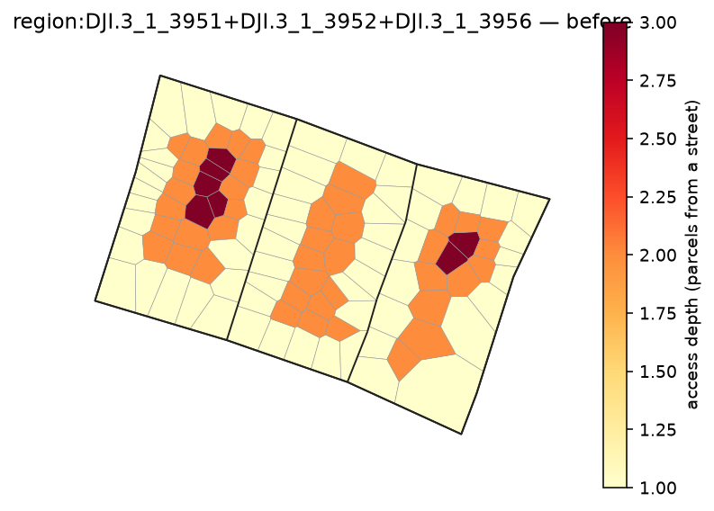
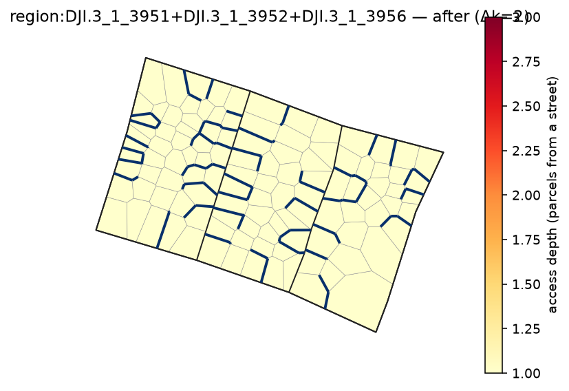

# convex_hull region builder

A pluggable `region_builder` expands each seed group before reblocking. `convex_hull` fills the
blocks inside a *disjoint* group's convex hull into one contiguous region — so two blocks that don't
touch become one region with the gap bridged.

```bash
pixi run python -m reblock.run data=dji method=dijkstra region_builder=convex_hull \
  "block_ids=[[DJI.3_1_3951,DJI.3_1_3956]]" eval=kcomplexity render.enabled=true region_map.enabled=true
```

`DJI.3_1_3951` and `DJI.3_1_3956` don't touch, so `identity` would reblock them separately; the hull
pulls in the bridging block `DJI.3_1_3952`, giving one 3-block region. In `region_map.png` the two
seed blocks are outlined in heavy black, the hull-filled block coloured as the same region.



| before | after |
|---|---|
|  |  |
