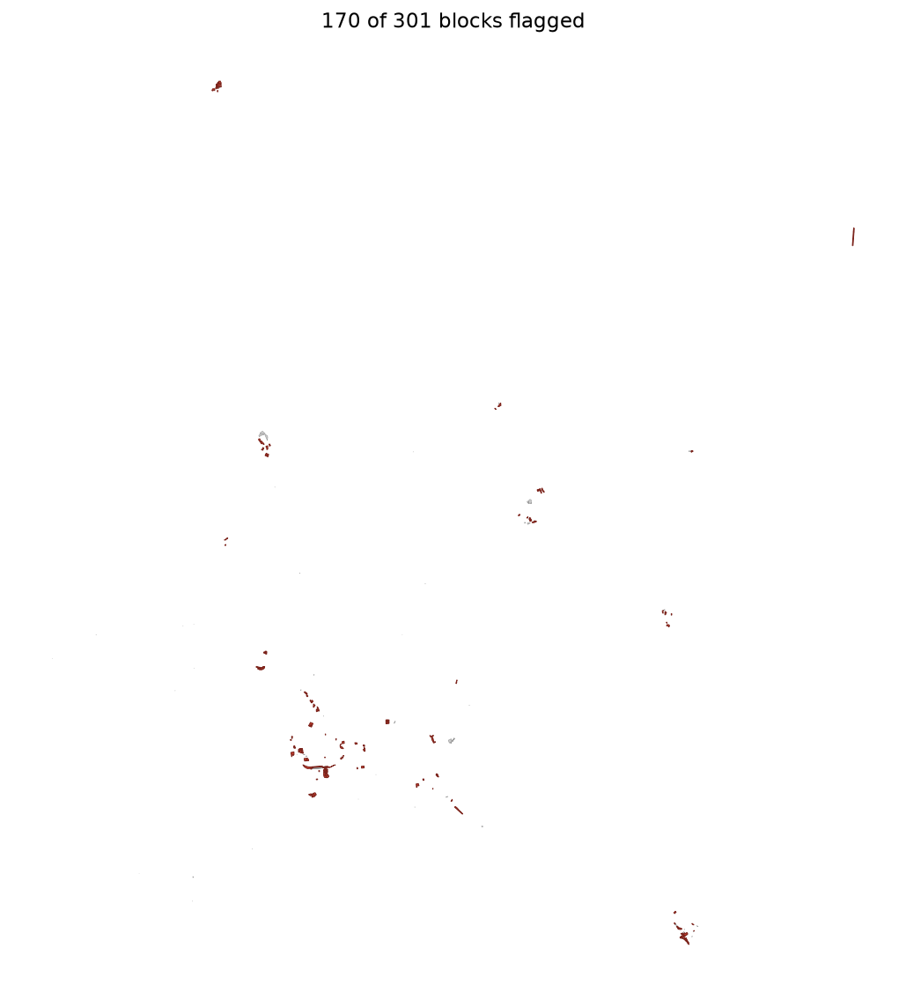
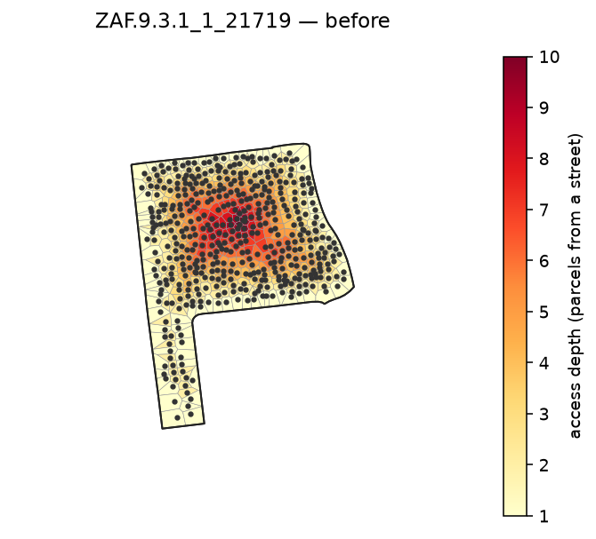
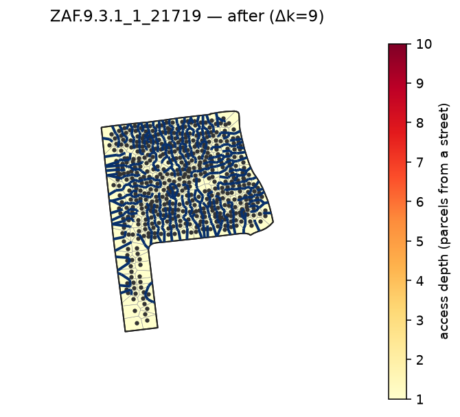

# Detect → reblock → visualize

Screen a city for its dense/compact informal blocks, reblock the worst survivors, and emit both the
city flagged-map and per-block before/after heatmaps — in one command.

```bash
pixi run python -m reblock.run data=capetown screen=dense_compact screen.density_min=35 \
  method=dijkstra eval=kcomplexity render.enabled=true flagged_map.enabled=true max_blocks=2
```

On the committed Cape Town sample this flags 170 blocks and reblocks the 2 worst (deepest-access).
`flagged_map.png` shows the whole metro with flagged blocks in red; the pair below is the
worst-access survivor `ZAF.9.3.1_1_21719`.



| before | after |
|---|---|
|  |  |
