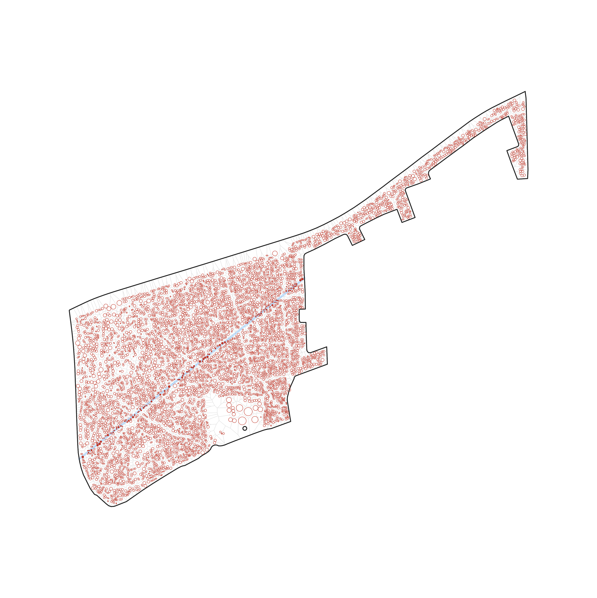

<!-- GENERATED by scripts/gen_displacement_field.py -- do not edit. Regenerate:
     pixi run python -m scripts.gen_displacement_field -->

# The displacement field

The figure set for the site's [Displacement](../../docs/_partials/displacement.md) section: the
model drawn literally — every building a disk of its own radius `rᵢ`, the road corridor beneath
them, each disk shaded by the share `cᵢ` of it the corridor takes.

`field.png` is the **boot state** of the site's interactive `DisplacementField` figure, and the
picture a reader with JavaScript off is left with: road 1 alone, at the floor width of
7 m. `field.json` is the payload that figure fetches — the same block's buildings,
parcels, boundary, streets and two default roads, plus the drawing encoding, so the widget and the
PNG above are one picture and not two. The bake also writes `web/src/field.d.ts`, which is what
makes a renamed field a TypeScript error rather than a blank panel.

**Provenance.** Block `ZAF.9.3.1_1_40972`, 263 buildings — the block
`conf/example/method_comparison.yaml` pins, so this is the same block every method page's
before/after uses, and the same one [`../perm-graph/`](../perm-graph/) draws. The two roads are
derived from the block by rule (`default_roads`), not taken from any method's output. Corridor
width is the reader's to change, in 0.5 m steps: floor 7 m, default
7 m, maximum 20 m.

**Reference cases.** `field.json` carries 6 road configurations, each with
the displacement Python computes for it. They are what `web/test/displacement-model.test.ts` holds
the TypeScript model to, what `tests/test_displacement_field_bundle.py` re-derives against live
Python, and where the site caption's numbers come from. Each moves exactly one variable against the
`road1` baseline — `_cases` in `scripts/gen_displacement_field.py` says which, and why no two of
them could pass for the same reason.

| case | roads | width | Σcᵢ | of 263 buildings |
|---|---|---|---|---|
| `road1` | 1 | 7 m | 32.026 | 12.2% |
| `apart` | 2 | 7 m, 7 m | 47.8436 | 18.2% |
| `coincident` | 2 | 7 m, 7 m | 32.026 | 12.2% |
| `widest` | 1 | 20 m | 68.1452 | 25.9% |
| `in_a_gap` | 1 | 7 m | 21.8509 | 8.3% |
| `outside` | 1 | 7 m | 0 | 0.0% |

Not one of the flagships in [`../README.md`](../README.md): those are walkthroughs that reproduce a
result from the CLI, and this is a figure set for one page.

Regenerate: `pixi run python -m scripts.gen_displacement_field`
