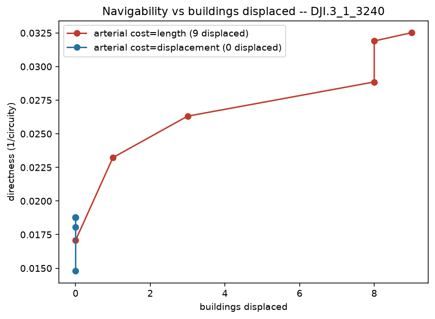

# Displacement-road reblocker (navigability vs homes cleared)

Lay *truly straight* roads and let the greedy trade navigability against the buildings a road
displaces (a building is displaced when its site lies in the road corridor). Benefit is measured on
the full settlement — nothing is removed; displacement is purely the cost axis.

The `greedy_arterial_displacement` method picks the straight road with the best Δbenefit **per
building displaced**. The shipped recipe grades methods on the buildings-displaced axis:

```bash
pixi run python -m reblock.compare data=dji eval=kcomplexity cost=displacement \
  "block_ids=[[DJI.3_1_1808,DJI.3_1_1809]]" methods=[dijkstra,mesh,greedy_arterial_displacement]
```

It writes `tradeoff_table_{metric}.csv` (terminal navigability + total buildings displaced — *not*
AUC, which inverts on this axis) and `curve_{metric}_{region}.png`.

The plot below makes the tradeoff explicit on a dense block (`DJI.3_1_3240`, 138 parcels) by
contrasting the arterial in its two cost modes — `cost=length` (buys directness by clearing homes,
red, climbing right) vs `cost=displacement` (refuses to clear anyone, blue, pinned at x=0). The gap
is the navigability you can *only* buy by displacing:



Reproduce the two-mode contrast:

```python
from reblock.data.kblock import KblockSource
from reblock.methods.arterial import GreedyArterialReblocker
from reblock.budget import displacement_count, cost_benefit_curve, directness_benefit
src = KblockSource("tests/data/kblock/blocks_dji_sample.parquet",
                   "tests/data/kblock/buildings_dji_sample.parquet", "dji", block_ids=["DJI.3_1_3240"])
block = next(iter(src.region().blocks))
for cost in ("length", "displacement"):
    m = GreedyArterialReblocker(mode="aspirational", objective="directness", cost=cost,
                                corridor_m=3.0, max_roads=6)
    roads = m.propose(block).roads
    curve = cost_benefit_curve(block, roads, benefit_fn=directness_benefit,
                               cost="displacement", corridor_m=3.0)
    print(cost, "displaced:", displacement_count(block.building_points, roads, 3.0),
          "terminal directness:", round(curve.benefit[-1], 3))
```
