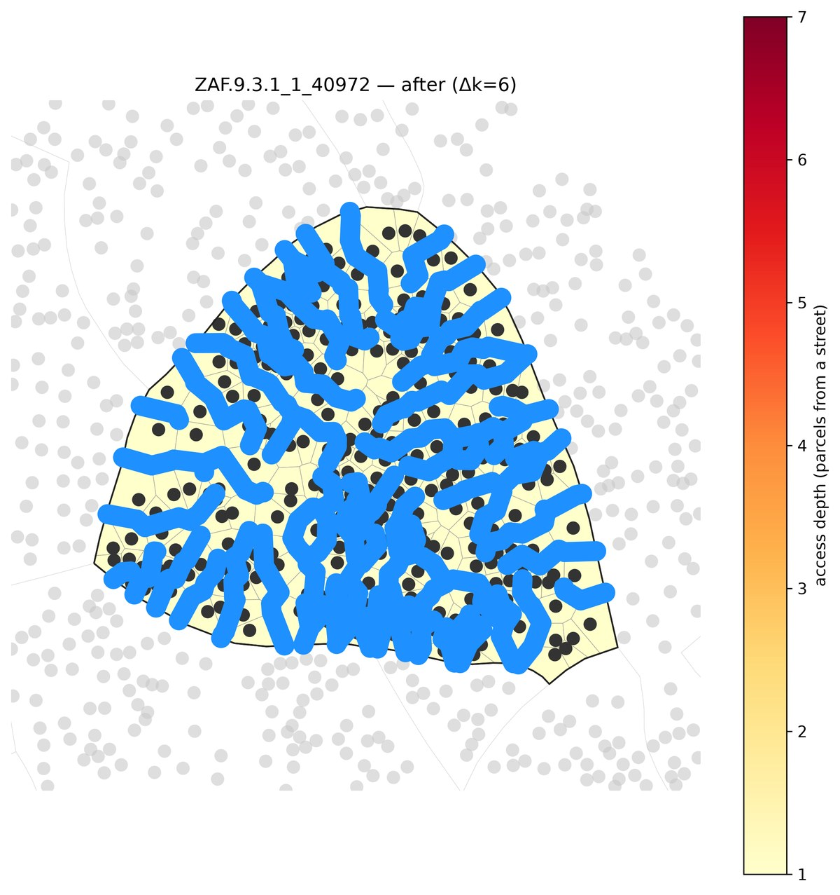
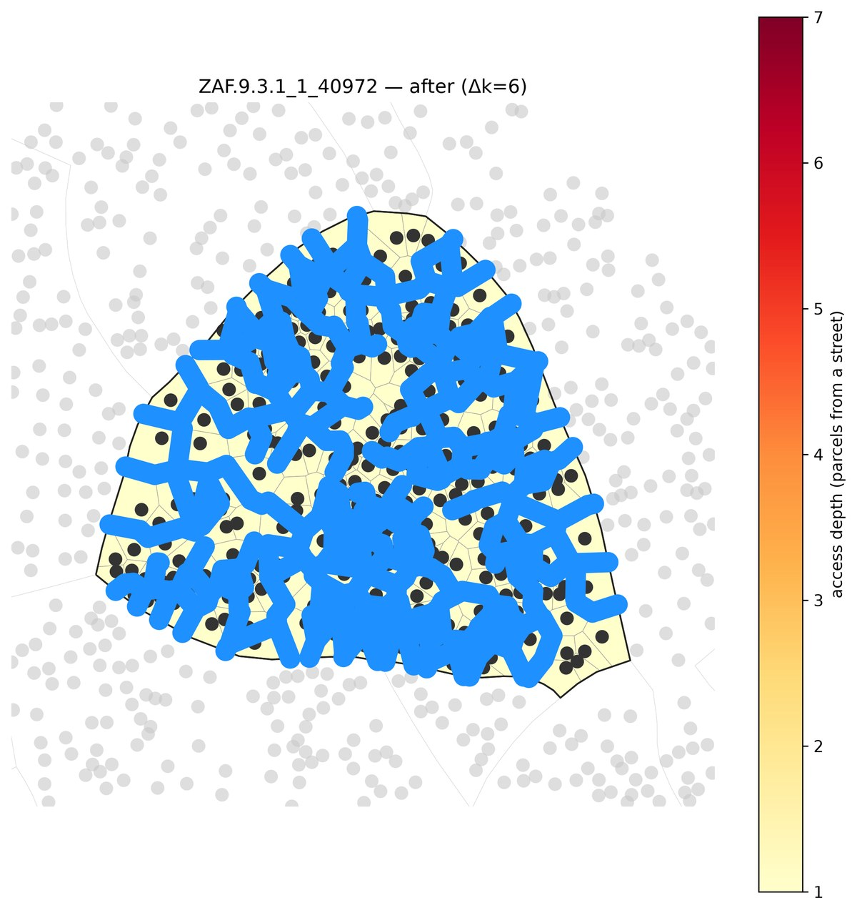
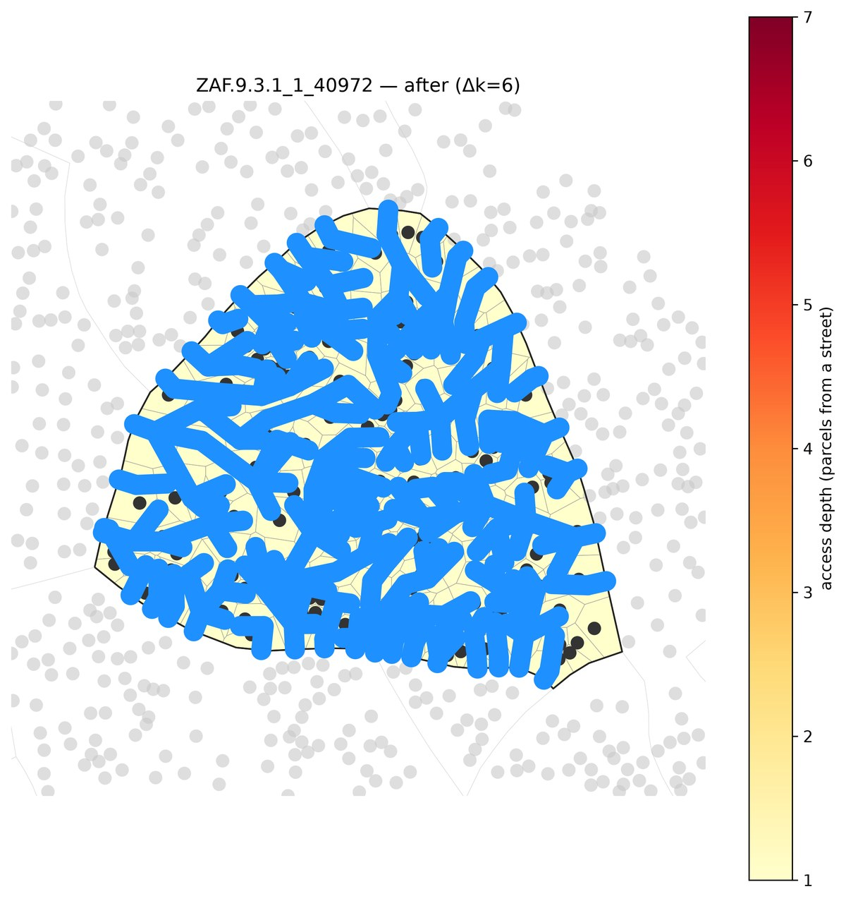

# Method comparison: every reblocker on one deep block

All six reblockers graded head-to-head on the four lenses, on a single deep informal block small
enough that *every* method runs — including the two that don't scale to a region (`topology`, which
is single-block-only, and `greedy_arterial`, which is ~55 s/road). The companion
[`multiblock`](../multiblock/) flagship runs the *scalable* methods on a whole settlement.

The block is **`ZAF.9.3.1_1_40972`** — the deepest block (by the depth proxy `√(n·A)/P`) in a
topology-tractable size window: **263 parcels, up to 7 deep**, auto-picked, no hand tuning.

## Reproduce (one command)

```bash
pixi run python -m reblock.compare data=capetown_full \
  "block_ids=[[ZAF.9.3.1_1_40972]]" \
  methods=[dijkstra,peel,topology,mesh,greedy_arterial_buildable,clearance] max_blocks=1 \
  all_methods.greedy_arterial_buildable.max_roads=8
```

One `reblock.compare` line grades all six methods on four lenses and writes the AUC tables + curves.
`greedy_arterial`'s budget is capped at 8 roads (`max_roads` is a first-class key; ~55 s/road, so
the cap keeps it to a couple minutes); the whole run is ~14 min, topology + arterial being the poles.

## The roads each method builds

Before — every parcel up to 7 deep (dark = deep):


After, per method (blue = added roads; black = building sites; the depth heatmap goes pale as roads
reach every parcel). The coverage methods blanket the fabric; `greedy_arterial`'s few through-roads
wind between the building clusters (tracing the gaps); `clearance` threads least-cost roads to the
deep interior:

| dijkstra (coverage) | mesh | topology (access-optimal) |
|---|---|---|
|  |  |  |
| **peel** (rough sketch) | **greedy_arterial** (directness) | **clearance** (least-cost) |
|  |  |  |

## The four lenses

Mean AUC per method (benefit per metre of road, integrated across the shared budget; higher = better):

| lens | dijkstra | peel | topology | mesh | arterial | clearance |
|---|---|---|---|---|---|---|
| access — burden removed | 0.82 | 0.77 | **0.84** | 0.82 | 0.69 | 0.79 |
| resistance — egress removed | **0.62** | 0.44 | 0.48 | 0.61 | 0.40 | 0.38 |
| directness — 1/circuity | 0.02 | 0.01 | 0.09 | 0.07 | **0.27** | 0.05 |
| efficiency — network E | 0.00 | 0.00 | 0.00 | 0.00 | 0.01 | 0.00 |

Each method earns its place on a *different* lens:

- **`topology` wins access** (0.84) — its whole-graph optimizer removes access-burden most
  efficiently per metre. But it's **single-block-only** (it crashes on a multi-block region: a gappy
  parcel graph gives it a disconnected source node).
- **`greedy_arterial` dominates directness** (0.27, ~3× the next method) — straight through-roads
  make interior trips direct. This is arterial's redemption: on a block small enough to actually run
  it and let it place its roads, its navigability edge is decisive. But at ~55 s/road it doesn't
  scale.
- **`dijkstra` wins resistance** (0.62) and ties for access — its frontage spanning tree gives the
  most redundant egress, fast (~1 s). `mesh` tracks it closely with a touch more directness.
- **`clearance`** is the balanced scalable option: near-dijkstra access, mid-pack directness, and
  the only one with a depth-target + repulsion knob (see [`multiblock`](../multiblock/)).
- **`peel`** is the fast, rough coverage sketch — decent access, low directness.

 
 

`efficiency` (network E, all-pairs mean 1/distance) is near-inert at every scale — the many
far-apart parcel pairs swamp it. The takeaway: **pick the method by the lens you care about** —
coverage/egress → dijkstra (fast); access-optimal on a single block → topology; navigability →
arterial (small block) or clearance (at scale).
