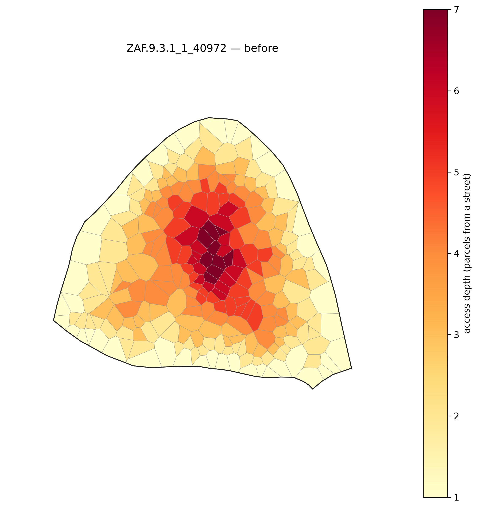
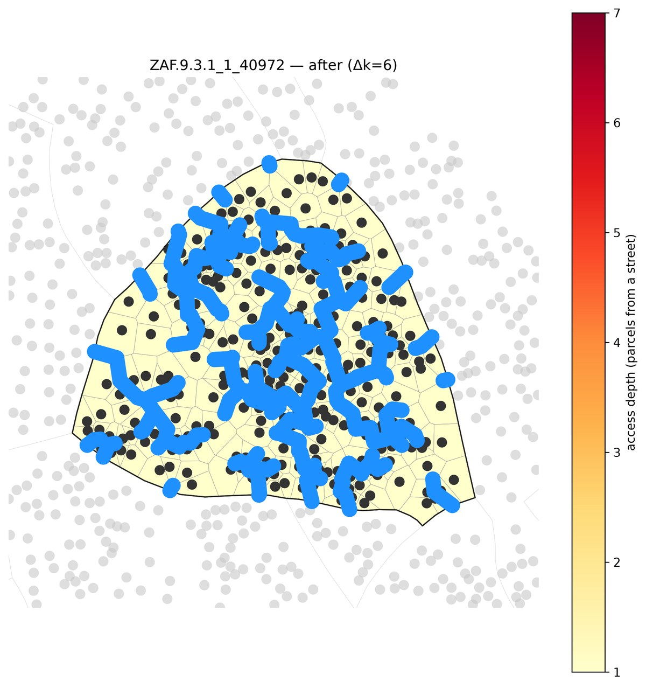
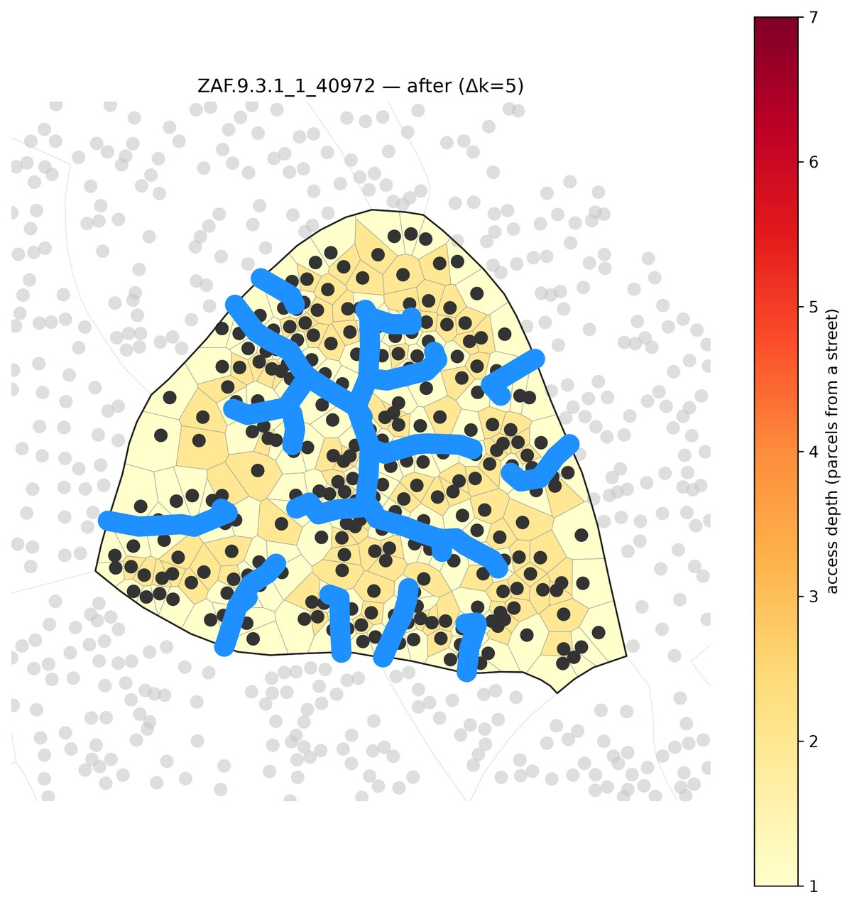
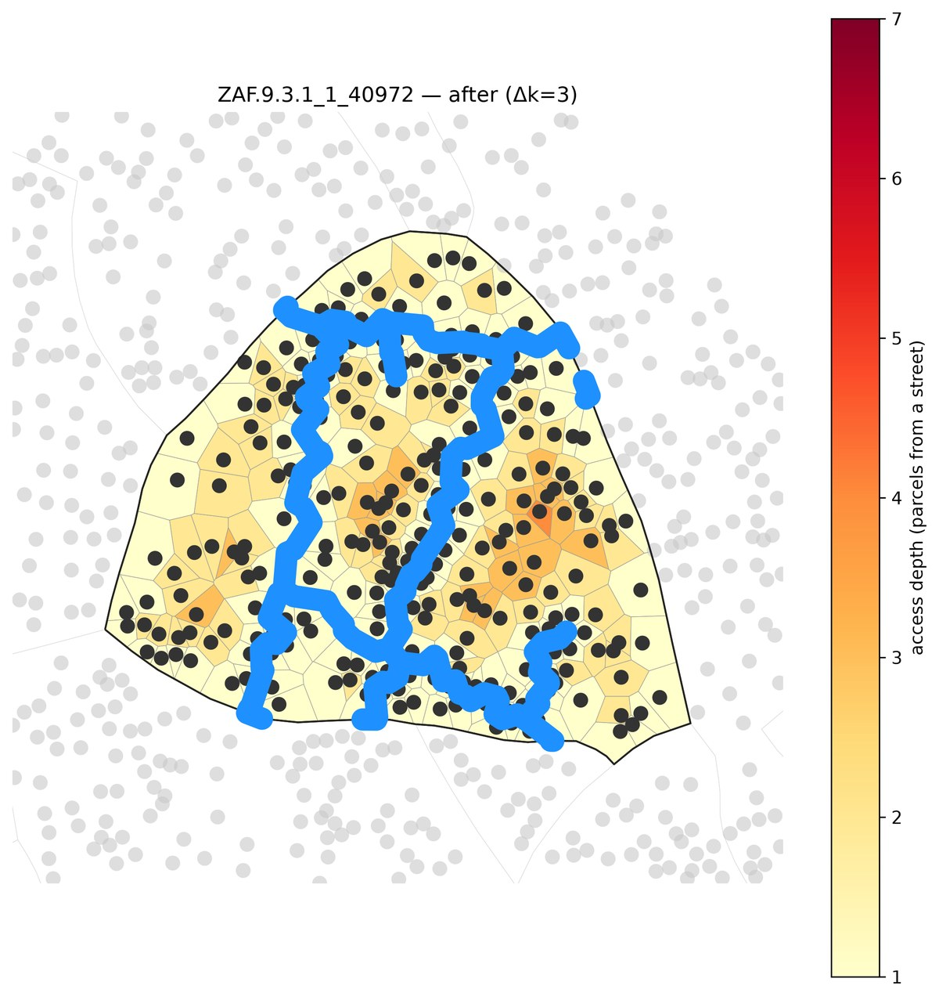
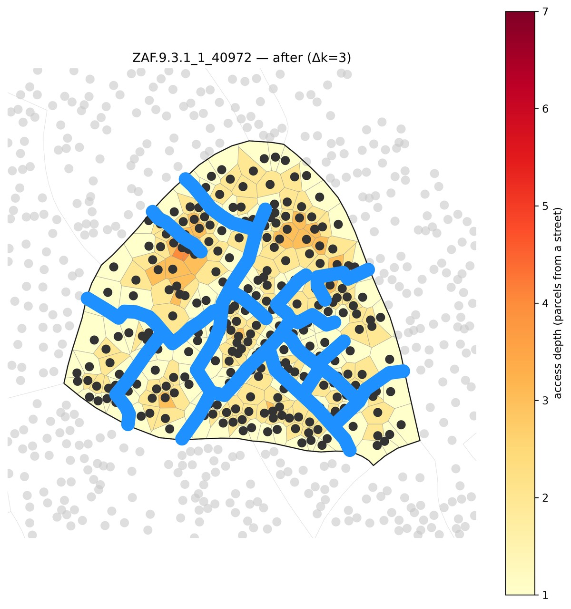
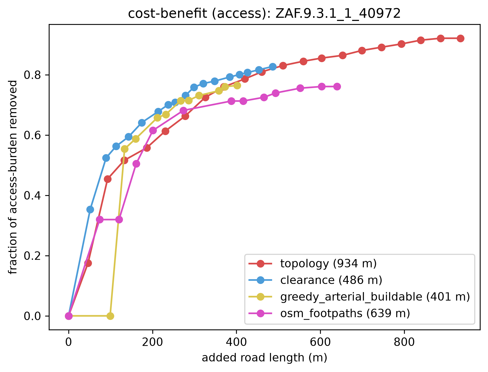
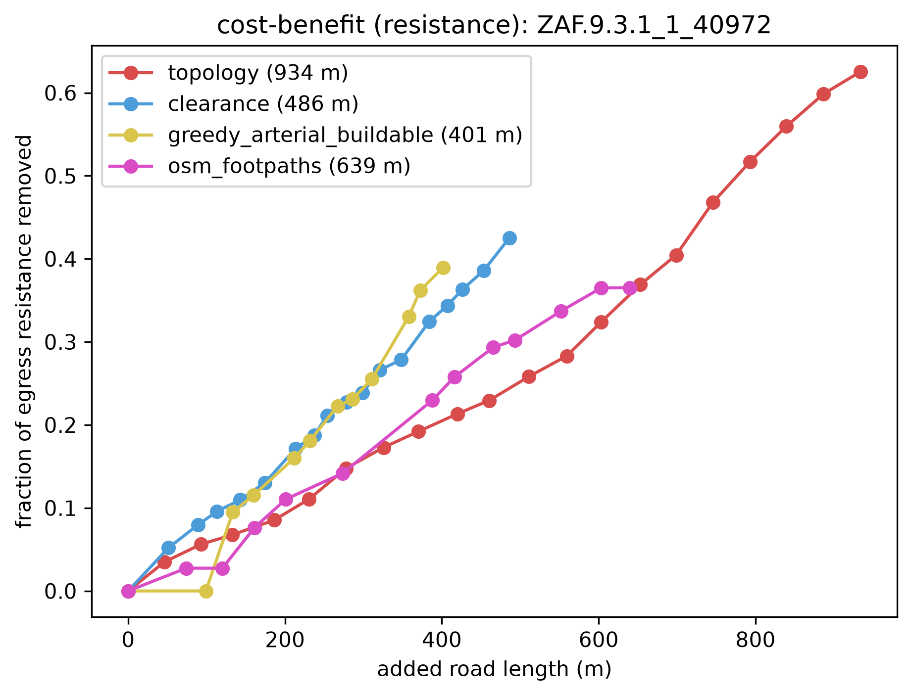
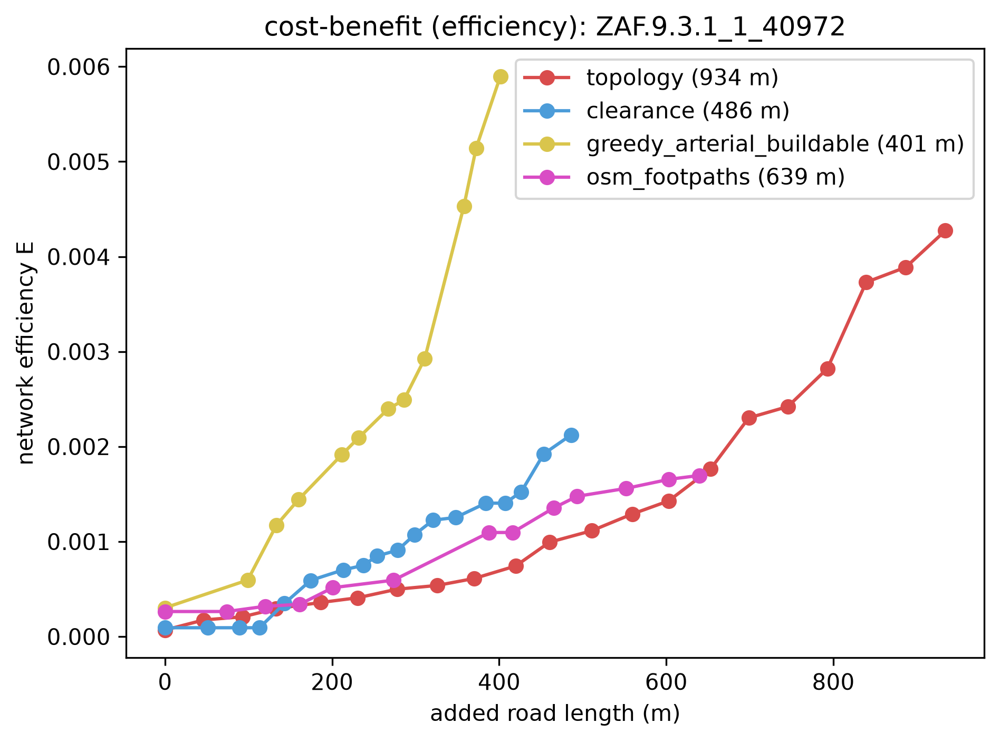
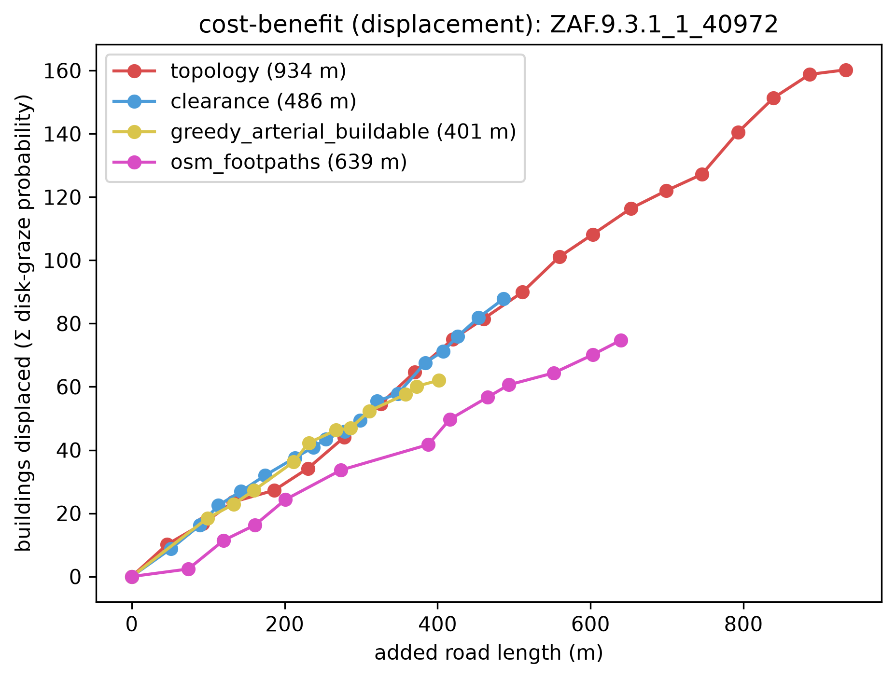

# Method comparison: four reblockers, head-to-head on one deep block

Four reblockers graded head-to-head on the four lenses, on a single deep informal block small enough
that even `topology` runs — it's **single-block-only** (it crashes on a multi-block region: a gappy
parcel graph gives it a disconnected source node). `greedy_arterial` now runs via **CELF/lazy**, so it
scales too — the companion [`multiblock`](../multiblock/) flagship runs the scalable methods,
*including arterial*, on a whole settlement.

The block is **`ZAF.9.3.1_1_40972`** — the deepest block (by the depth proxy `√(n·A)/P`) in a
topology-tractable size window: **263 parcels, up to 7 deep**, auto-picked, no hand tuning.
📍 [See it on Google Maps](https://www.google.com/maps/@-33.97795,18.58064,18z) (every run logs this
link for its selection).

## Reproduce

One run grades the four benefit lenses AND the displacement cost, both against **added road length**:
```bash
pixi run python -m reblock.compare data=capetown_full \
  "block_ids=[[ZAF.9.3.1_1_40972]]" \
  methods=[topology,clearance,greedy_arterial_buildable,osm_footpaths] max_blocks=1 \
  all_methods.greedy_arterial_buildable.max_roads=8 \
  desire_source.snapshot=examples/method-comparison/desire_lines_40972.geojson
```
`greedy_arterial_buildable` is configured `lazy: true` (CELF), so its 8 roads take seconds, not the
~14 min the exact greedy needed; `topology` is now the run's only slow pole. `osm_footpaths` loads a
committed OSM snapshot (`desire_lines_40972.geojson`, 22 mapped ways — see
`scripts/fetch_desire_lines_snapshot.py`) so it reproduces offline. The console output — each
selection's locator link plus the per-method frontier terminal points and displacement figures — is
captured in [`run.log`](run.log). (Displacement is now a curve emitted every run, not a separate
`cost=displacement` pass — see the displacement section below.)

## The roads each method builds

Before — every parcel up to 7 deep (dark = deep):



After, per method (blue = added roads; black = building sites; the depth heatmap goes pale as roads
reach every parcel). `topology`'s whole-graph optimizer blankets the fabric; `greedy_arterial`'s few
through-roads wind between the building clusters (tracing the gaps); `clearance` threads least-cost
roads to the deep interior; `osm_footpaths` is the real, unoptimized informal network people already
walk:

| topology (access-optimal) | clearance (least-cost) |
|---|---|
|  |  |
| **greedy_arterial** (directness) | **osm_footpaths** (as-built) |
|  |  |

## The four lenses

Each lens is read off the **frontier** — the full `(method, block, road_length_m, benefit)` curve
saved to `frontier_{metric}.csv` — rather than a single AUC scalar. An AUC (benefit integrated across
the shared road budget) rewards absolute benefit over benefit-per-road, so a road-efficient method
could rank *below* a pave-everything one; we dropped it. Instead, each method is described by its
**terminal point**: the benefit it reached, the **added road length** it spent (metres), and
`% paved`. Curve legend labels read `method (NNN m)` — the terminal road length, not an AUC. (The
x-axis is metres of added road, not m/ha density — the same budget both the benefit and displacement
curves are graded on.)

Terminal frontier point per method per lens (benefit @ added road length, % paved):

| lens | topology | clearance | greedy_arterial | osm_footpaths |
|---|---|---|---|---|
| access — burden removed | **0.921** @ 934 m | 0.827 @ 486 m | 0.764 @ 401 m | 0.761 @ 639 m |
| resistance — egress removed | **0.626** @ 934 m | 0.425 @ 486 m | 0.389 @ 401 m | 0.365 @ 639 m |
| directness — 1/circuity | 0.121 @ 934 m | 0.053 @ 486 m | **0.257** @ 401 m | 0.069 @ 639 m |
| efficiency — network E | ~0.00 | ~0.00 | ~0.01 | ~0.00 |
| **% paved** | **38.7%** | 20.4% | 16.2% | 25.2% |

Each method earns a different corner of the frontier:

- **`topology`** reaches the most access (0.921) and resistance (0.626), but at the heaviest paving
  (38.7%) — its whole-graph optimizer covers best but spends the most road. Single-block-only.
- **`greedy_arterial`** owns directness (0.257, ~2× the next) at the **least paving** (16.2%) and
  least displacement (62.0, see below) — straight through-roads, maximal navigability per metre. Runs
  via CELF/lazy here and now scales to the region (see [`multiblock`](../multiblock/)).
- **`osm_footpaths`** is the REAL informal network — the mapped OSM footpaths themselves, not an
  optimizer's output. On this small block the actual paths form a genuine, moderately-direct grid:
  directness 0.069 (it *beats* clearance's 0.053) and access 0.761, at 25.2% paved / 74.7 displaced. A
  striking reference — the worn paths people already use are a real reblock, just not an optimized
  one (see its render above).
- **`clearance`** is the balanced least-cost option: near-topology-free access (0.827) at 20.4%
  paved, with a depth-target + repulsion knob (see [`multiblock`](../multiblock/)).

 
 

`efficiency` (network E, all-pairs mean 1/distance) is near-inert at every scale for all four methods
(~0.00–0.01) — the many far-apart parcel pairs swamp it.

## Displacement: the homes each road costs

Displacement is now a **curve of its own**, plotted against the same added-road-length x-axis as the
benefit lenses (`displacement.png`, `displacement_vs_length.csv`) — a rising **cost**: as a method
lays road, how many homes does it destroy?

It's **extent-aware**. Rather than counting only buildings whose *centroid* falls in the road
corridor, each building is a disk (radius = half its nearest-neighbour distance), contributing its
**probability of being grazed**, `c = max(0, 1 − d/r)` (`d` = distance from the point to the road
corridor, `r` = the disk radius). Summed over all 263 buildings, that Σc is the "expected homes
displaced" — it catches roads that clip a footprint's *edge*, which a centroid test misses, so these
figures read higher than a raw centroid count.

Terminal displacement (Σ graze-probability at each method's full road) — a rising cost, so *lower is
better*:

| method | homes displaced | % of homes | terminal directness |
|---|---|---|---|
| **greedy_arterial** | **62.0** | **23.6%** | **0.257** |
| osm_footpaths | 74.7 | 28.4% | 0.069 |
| clearance | 87.8 | 33.4% | 0.053 |
| topology | 160.2 | 60.9% | 0.121 |

**Arterial displaces the fewest homes for its directness** — the most navigability per home moved.
`osm_footpaths`, the as-built network, comes next; `clearance` displaces more for its balanced access,
and `topology` the most (it paves the most road). Every curve rises from 0 with road, so you read the
tradeoff directly: benefit *and* homes-displaced both climb as road is added — pick the point you can
afford.



**The takeaway:** pick the method by the lens *and* the road you can afford — access/egress →
`topology` (single block); directness at minimal paving → `greedy_arterial`; the honest as-built
baseline → `osm_footpaths`; balanced least-cost → `clearance` (see [`multiblock`](../multiblock/)
for the region-scale run and its depth/repulsion knobs).
