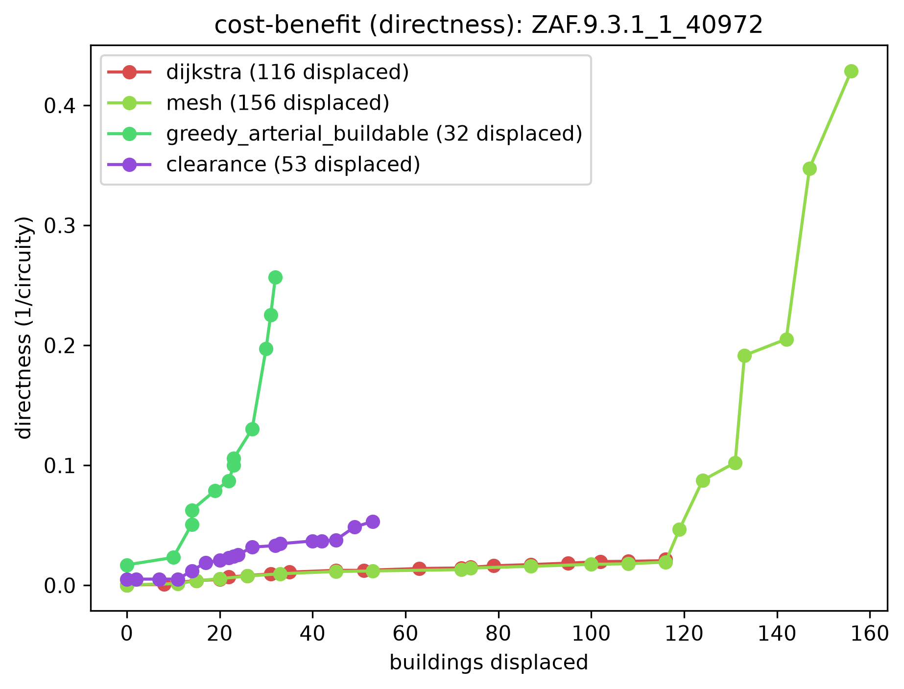

# Method comparison: five reblockers, head-to-head on one deep block

Five reblockers graded head-to-head on the four lenses, on a single deep informal block small enough
that even `topology` runs — it's **single-block-only** (it crashes on a multi-block region: a gappy
parcel graph gives it a disconnected source node). `greedy_arterial` now runs via **CELF/lazy**, so it
scales too — the companion [`multiblock`](../multiblock/) flagship runs the scalable methods,
*including arterial*, on a whole settlement.

The block is **`ZAF.9.3.1_1_40972`** — the deepest block (by the depth proxy `√(n·A)/P`) in a
topology-tractable size window: **263 parcels, up to 7 deep**, auto-picked, no hand tuning.
📍 [See it on Google Maps](https://www.google.com/maps/@-33.97795,18.58064,18z) (every run logs this
link for its selection).

## Reproduce

Length cost — the four lenses + `% paved`:
```bash
pixi run python -m reblock.compare data=capetown_full \
  "block_ids=[[ZAF.9.3.1_1_40972]]" \
  methods=[dijkstra,topology,mesh,greedy_arterial_buildable,clearance] max_blocks=1 \
  all_methods.greedy_arterial_buildable.max_roads=8
```
Displacement cost — buildings displaced + `% displaced` (topology dropped: it's the slow pole and a
frontage method):
```bash
pixi run python -m reblock.compare data=capetown_full \
  "block_ids=[[ZAF.9.3.1_1_40972]]" \
  methods=[dijkstra,mesh,greedy_arterial_buildable,clearance] max_blocks=1 \
  all_methods.greedy_arterial_buildable.max_roads=8 cost=displacement
```
`greedy_arterial_buildable` is configured `lazy: true` (CELF), so its 8 roads take seconds, not the
~14 min the exact greedy needed; `topology` is now the run's only slow pole. The console output of
both commands — each selection's locator link plus the per-method AUCs and displacement counts — is
captured in [`run.log`](run.log).

## The roads each method builds

Before — every parcel up to 7 deep (dark = deep):


After, per method (blue = added roads; black = building sites; the depth heatmap goes pale as roads
reach every parcel). The coverage methods blanket the fabric; `greedy_arterial`'s few through-roads
wind between the building clusters (tracing the gaps); `clearance` threads least-cost roads to the
deep interior:

| dijkstra (coverage) | mesh | topology (access-optimal) |
|---|---|---|
|  |  |  |
| **greedy_arterial** (directness) | **clearance** (least-cost) | |
|  |  | |

## The four lenses

Mean AUC per method (benefit per metre of road, integrated across the shared budget; higher =
better), with **`% paved`** = fraction of the block's area under the road corridor (raw road cost,
normalized):

| lens | dijkstra | topology | mesh | arterial | clearance |
|---|---|---|---|---|---|
| access — burden removed | 0.82 | **0.84** | 0.82 | 0.71 | 0.79 |
| resistance — egress removed | **0.62** | 0.48 | 0.61 | 0.35 | 0.38 |
| directness — 1/circuity | 0.02 | 0.09 | 0.07 | **0.23** | 0.05 |
| efficiency — network E | 0.00 | 0.00 | 0.00 | 0.01 | 0.00 |
| **% paved** | 62% | 39% | 70% | **16%** | 20% |

Each method earns its place on a *different* lens:

- **`topology` wins access** (0.84) — its whole-graph optimizer removes access-burden most
  efficiently per metre. Single-block-only.
- **`greedy_arterial` dominates directness** (0.23, ~2.6× the next method) at the **lowest paving**
  (16%) — straight through-roads make interior trips direct while touching the least fabric. It runs
  via **CELF/lazy** here and now scales to the region (see [`multiblock`](../multiblock/)).
- **`dijkstra` wins resistance** (0.62) and ties for access — its frontage spanning tree gives the
  most redundant egress, fast (~1 s), but paves 62%. `mesh` tracks it closely.
- **`clearance`** is the balanced scalable option: near-dijkstra access, sparse (20% paved), with a
  depth-target + repulsion knob (see [`multiblock`](../multiblock/)).

 
 

`efficiency` (network E, all-pairs mean 1/distance) is near-inert at every scale — the many
far-apart parcel pairs swamp it.

## Displacement: navigability per building moved

Re-graded on the **displacement** cost axis (x = buildings whose footprint falls inside the road
corridor). Displacement scales with how much road a method builds, so the sparse methods touch far
less fabric:

| method | terminal directness | buildings displaced | % displaced |
|---|---|---|---|
| **greedy_arterial** | 0.26 | **32** | **12%** |
| clearance | 0.05 | 53 | 20% |
| dijkstra | 0.02 | 116 | 44% |
| mesh | 0.43 | 156 | 59% |

**Arterial displaces the fewest buildings (32, 12%) for its directness** — the most navigability per
building moved. The dense frontage methods reach higher *absolute* terminal directness (mesh 0.43)
but displace ~5× more (mesh 156, dijkstra 116) — the coverage methods clear far more of the block
for their access. (AUC over the displacement axis is meaningless — a road-sparing method has no
curve width — so this is read from the terminal points, not an integral.)



**The takeaway:** pick the method by the lens *and* the road budget you can afford — coverage/egress
→ dijkstra (fast, dense); access-optimal on a single block → topology; navigability at minimal
paving/displacement → arterial (now scalable via CELF) or clearance.
