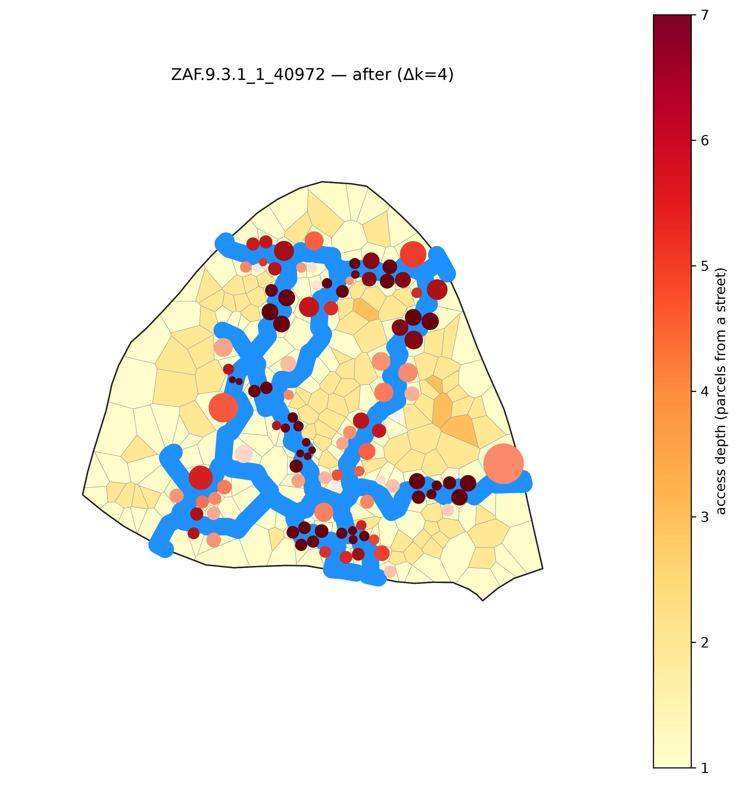
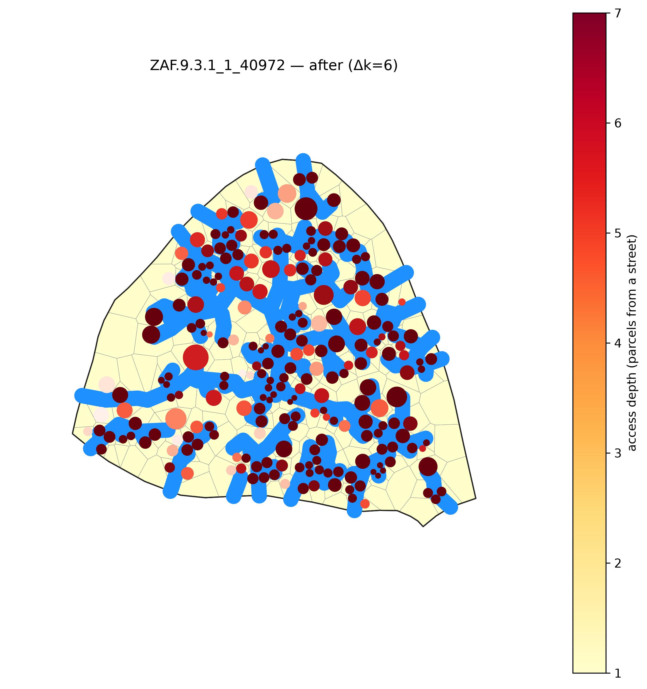
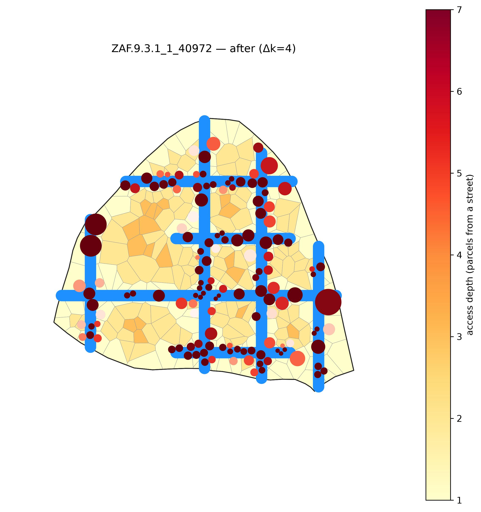
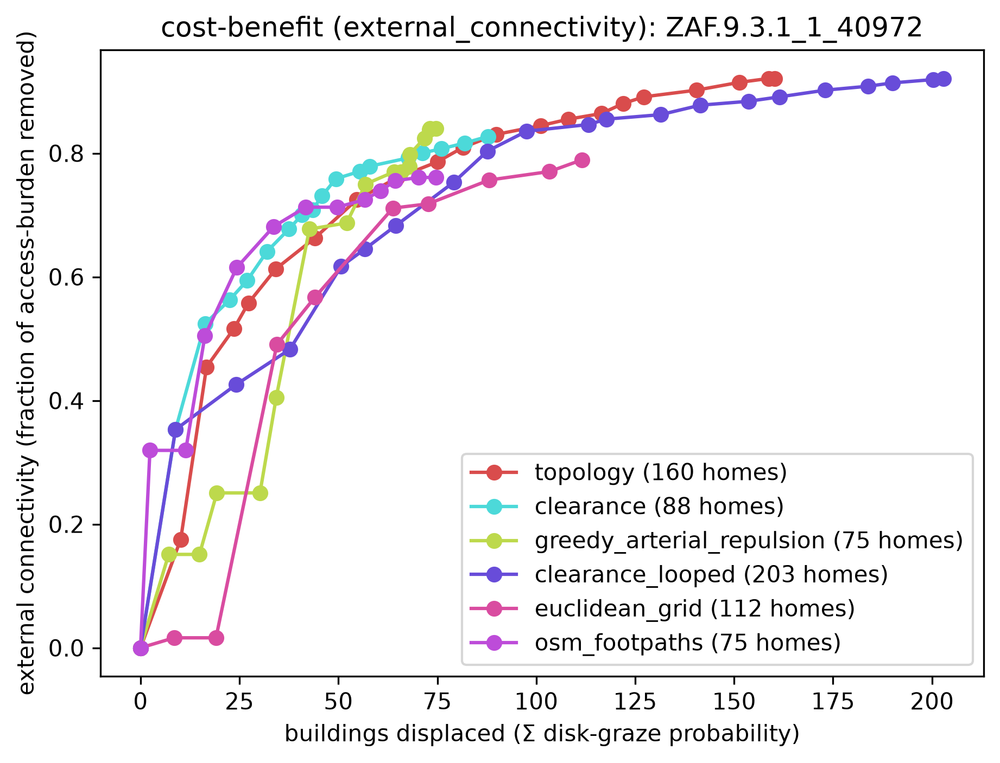
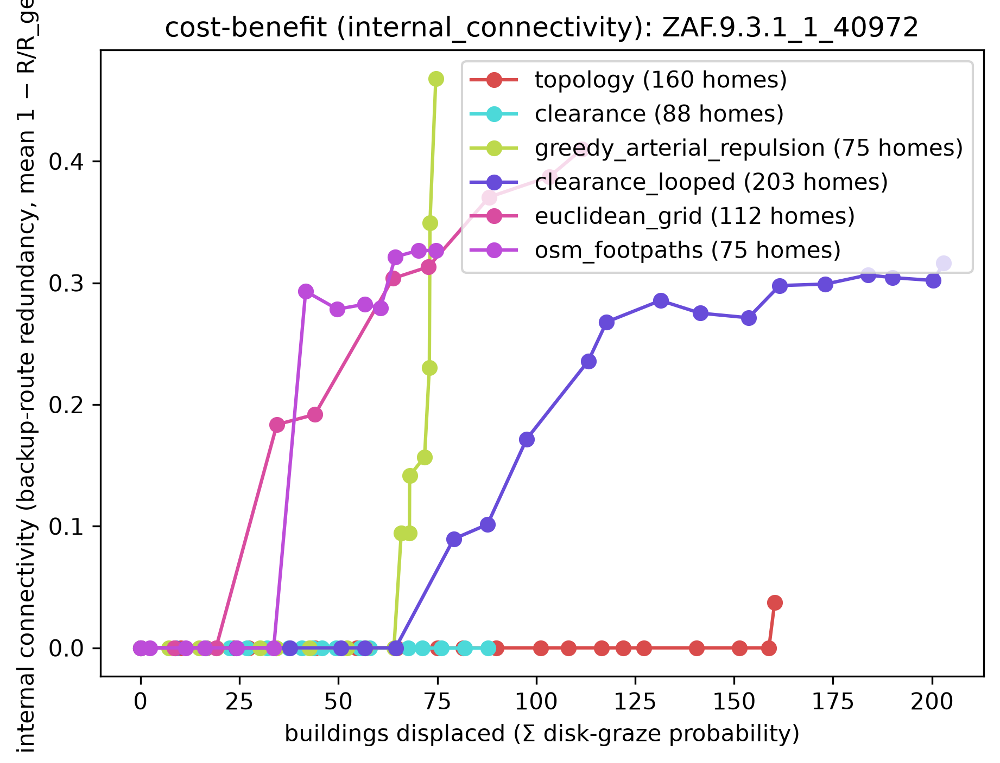
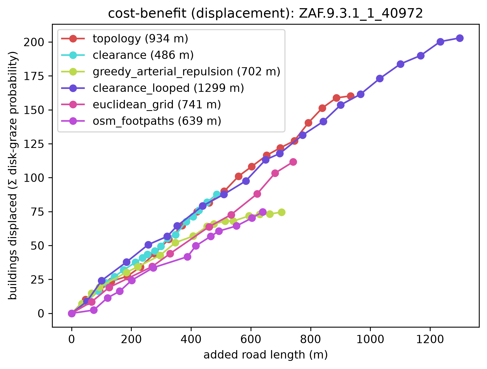

# Method comparison: six reblockers, head-to-head on one deep block

Six reblockers graded head-to-head on the **metric basis** — external connectivity, internal
connectivity, and displacement — on a single deep informal block small enough that even `topology`
runs (it's **single-block-only**: a multi-block region gives it a disconnected source node and it
crashes). The six span the families this project ships: whole-graph `topology`, least-cost
`clearance` and its loop-closing refinement `clearance_looped`, the repulsion-cost arterial
`greedy_arterial_repulsion` (it scores benefit **per home displaced** — a soft, never-zero proximity
cost — so it routes *around* homes, and runs via **CELF/lazy** so it scales), a Manhattan
`euclidean_grid`, and the real as-built `osm_footpaths`. The companion
[`multiblock_depth`](../multiblock_depth/) flagship runs the scalable methods on a whole settlement.

The block is **`ZAF.9.3.1_1_40972`** — the deepest block (by the depth proxy `√(n·A)/P`) in a
topology-tractable size window: **263 parcels, up to 7 deep**, auto-picked, no hand tuning.
📍 [See it on Google Maps](https://www.google.com/maps/@-33.97795,18.58064,18z) (every run logs this
link for its selection).

## Reproduce

One command reblocks all six methods and emits the curves, frontier CSVs, **and** every before/after
render — no hand-placed assets, the whole example reproduces offline:
```bash
pixi run python -m scripts.gen_method_comparison
```
It reblocks the pinned block with each method (from ONE propose each), renders a before-heatmap plus
one after-heatmap per method, and builds the three metric curves. `topology` is the slow pole
(~7 min); `greedy_arterial_repulsion` is capped to 8 roads and runs via CELF/lazy in seconds — its
`cost: repulsion` denominator (`Σ r²/(r²+d²)` over building points) is **constant per candidate**, so
lazy stays well-behaved. `osm_footpaths` loads a committed OSM snapshot (`desire_lines_40972.geojson`,
22 mapped ways — see `scripts/fetch_desire_lines_snapshot.py`). The console output — the locator link
plus the per-method frontier terminal points and displacement figures — is captured in
[`run.log`](run.log), the source of truth for the tables below.

## The roads each method builds

Before — every parcel up to 7 deep (dark = deep interior, pale = fronting a street):


After, per method (blue = added roads; disks = building sites shaded grey→red by displacement risk;
the depth heatmap goes pale as roads reach every parcel):

| topology (access-optimal) | clearance (least-cost) | greedy_arterial_repulsion (most redundancy) |
|---|---|---|
|  |  |  |
| **clearance_looped** (least-cost + loops) | **euclidean_grid** (Manhattan) | **osm_footpaths** (as-built, loopy) |
|  |  |  |

`topology`'s whole-graph optimizer blankets the fabric; the **repulsion arterial** threads its
through-roads along the gaps *between* building clusters — its cost is literally proximity to homes —
closing loops while grazing few footprints; `clearance` threads least-cost roads to the deep interior;
`clearance_looped` adds redundant connectors on top of a clearance base; `euclidean_grid` lays a fixed
orthogonal grid regardless of where the deep parcels are; `osm_footpaths` is the real, unoptimized
network people already walk.

## The metric basis

A spectral investigation (PCA over metric correlations across a diverse corpus of road networks — see
the [basis derivation](../../docs/superpowers/specs/2026-07-16-metric-basis-reporting-design.md) and
[ρ metric migration](../../docs/superpowers/specs/2026-07-17-redundancy-metric-and-refiner-design.md)
design docs) found road-structure quality is **two orthogonal axes** once road *quantity* is controlled
(quantity is the displacement/cost axis below). The five entangled lenses this example used to report
(access, efficiency, directness, resistance, displacement) collapse to that basis:

- **External connectivity** — reach/drainage of parcels to the *outside* street network (the fraction
  of access-burden removed). This is the former "access" metric, unchanged, just relabeled — egress
  `resistance` loaded on the same axis and is now subsumed by it.
- **Internal connectivity** — richness/redundancy of the network *itself*: backup-route redundancy,
  `commute_ratio` (mean 1 − R/R_geo, the effective-resistance ratio over the noded road∪street graph)
  — how many alternative routes a dwelling has, not just whether it has one. `directness`/`efficiency`
  (ρ=0.99 duplicates that straddled both axes) are retired from reporting in favour of this cleaner,
  orthogonal representative. (It replaced the earlier circuit-rank `cycle_density` representative,
  which was size-blind — it rewarded many tiny loops over a few big useful ones.)

Each axis is read off the **frontier** — the full `(method, block, road_length_m, benefit)` curve saved
to `frontier_{metric}.csv` — rather than a single AUC scalar. An AUC (benefit integrated across the
shared road budget) rewards absolute benefit over benefit-per-road, so a road-efficient method could
rank *below* a pave-everything one; we dropped it. Instead, each method is described by its **terminal
point**: the benefit it reached, the **added road length** it spent (metres), and `% paved`.

Terminal frontier point per method per axis (benefit @ added road length, % paved):

| axis | topology | clearance | greedy_arterial_repulsion | clearance_looped | euclidean_grid | osm_footpaths |
|---|---|---|---|---|---|---|
| external connectivity — access-burden removed | **0.921** @ 934 m | 0.827 @ 486 m | 0.840 @ 703 m | **0.921** @ 1300 m | 0.789 @ 741 m | 0.761 @ 639 m |
| internal connectivity — backup-route redundancy (mean 1 − R/R_geo) | 0.037 | 0.000 | **0.468** | 0.316 | 0.410 | 0.327 |
| % paved | 38.7% | **20.4%** | 26.7% | 46.7% | 28.7% | 25.2% |

The two connectivity **curves** are plotted against **cumulative displacement** (homes displaced) — not
road length — so you read **redundancy (or reach) per home displaced** directly; the displacement metric
itself is the rising cost, plotted against added road length. Curve legend labels read `method (NNN
homes)` — the terminal homes displaced. (The stored `frontier_*.csv` keep cumulative added road length
as the cost column regardless; only the plotted x-axis is re-based onto displacement.)

Each method earns a different corner of the frontier:

- **`greedy_arterial_repulsion`** wins the **most internal connectivity (0.468)** — the striking result:
  the *optimizer out-loops the as-built footpaths and the regular grid alike*. Because its cost is
  proximity to homes, it spends its 8 roads on longer through-corridors that thread the gaps and
  reconnect into the street perimeter, closing real loops instead of dead-ending. It also reaches the
  **second-highest external connectivity (0.840)**, behind only topology and clearance_looped, at 26.7%
  paved. Runs via CELF/lazy and scales to the region (see [`multiblock_depth`](../multiblock_depth/)).
- **`euclidean_grid`** takes **second on internal connectivity (0.410)** — a regular grid is loops by
  construction — but it bulldozes to get them: **42.4% of homes displaced** (111.6, third-highest) and
  the **lowest external connectivity of the six (0.789)**, because a blind grid ignores where the deep
  parcels actually are.
- **`osm_footpaths`** — the REAL informal network (mapped OSM footpaths, not an optimizer's output) — is
  the loopiest network people *actually walk* (internal 0.327, external 0.761 at 25.2% paved). It held
  the redundancy crown until the repulsion arterial beat it: the worn paths are a real, redundant
  reblock, just not an optimized one.
- **`clearance_looped`** ties topology for the **most external connectivity (0.921)** and adds genuine
  loops over its clearance base (internal 0.316 vs plain clearance's 0.000) — but it is a **region-scale**
  method, and on this single dense block its region-tuned defaults **over-build**: the heaviest paving
  (46.7%, 1300 m) and the most displacement (203 homes, 77.2%). See
  [`multiblock_depth`](../multiblock_depth/) for its intended region-scale run.
- **`topology`** reaches the most external connectivity (0.921) but at heavy paving (38.7%), with only
  middling internal connectivity (0.037): its whole-graph optimizer builds a reach-everywhere tree, not
  a mesh. Single-block-only.
- **`clearance`** is the balanced least-cost option — the **least paving (20.4%)** and near-topology
  external connectivity (0.827) — but the **least internal connectivity (0.000)**: a least-cost drainage
  tree has no backup routes *by construction* (every dwelling reaches the street exactly one way).

 

## Displacement: the homes each road costs

Displacement is a **curve of its own** (`displacement_ZAF.9.3.1_1_40972.png`,
`displacement_vs_length.csv`), plotted against added road length — a rising **cost**: as a method lays
road, how many homes does it destroy?

It's **extent-aware**. Rather than counting only buildings whose *centroid* falls in the road corridor,
each building is a disk (radius = half its nearest-neighbour distance), contributing its **probability of
being grazed**, `c = max(0, 1 − d/r)` (`d` = distance from the point to the road corridor, `r` = the disk
radius). Summed over all 263 buildings, that Σc is the "expected homes displaced" — it catches roads that
clip a footprint's *edge*, which a centroid test misses, so these figures read higher than a raw centroid
count.

Terminal displacement (Σ graze-probability at each method's full road) — a rising cost, so *lower is
better*:

| method | homes displaced | % of homes | terminal internal connectivity (backup-route redundancy) |
|---|---|---|---|
| **greedy_arterial_repulsion** | 74.6 | 28.4% | **0.468** |
| osm_footpaths | 74.7 | 28.4% | 0.327 |
| clearance | 87.8 | 33.4% | 0.000 |
| euclidean_grid | 111.6 | 42.4% | 0.410 |
| topology | 160.2 | 60.9% | 0.037 |
| clearance_looped | 203.0 | 77.2% | 0.316 |

**The repulsion arterial leads redundancy-per-home outright.** At the lowest displacement of any method
(74.6 homes, tied with the as-built footpaths), it delivers the most internal connectivity (0.468) —
≈**0.0063 redundancy per home displaced**, vs 0.0044 for `osm_footpaths` and 0.0037 for `euclidean_grid`
(0.410 at 111.6 homes). That's the payoff of scoring benefit-per-home-displaced instead of per-metre: the
optimizer routes through the gaps, so every road it lays buys loops at the fewest homes moved. `clearance`
(0.000) and `topology` (0.037) build trees, not meshes, so they add little redundancy however much road
they lay. Every curve rises from 0 with road, so you read the tradeoff directly.



**The takeaway:** pick the method by the axis *and* the road you can afford — most external connectivity →
`topology` (single block) or `clearance_looped` (region-scale, at a heavy displacement cost here);
**the most backup-route redundancy per home → `greedy_arterial_repulsion`**, which leads internal
connectivity outright, beating both the as-built footpaths and the regular grid at the lowest
displacement; balanced least-cost → `clearance`. See [`multiblock_depth`](../multiblock_depth/) for the
region-scale run of the scalable methods.
