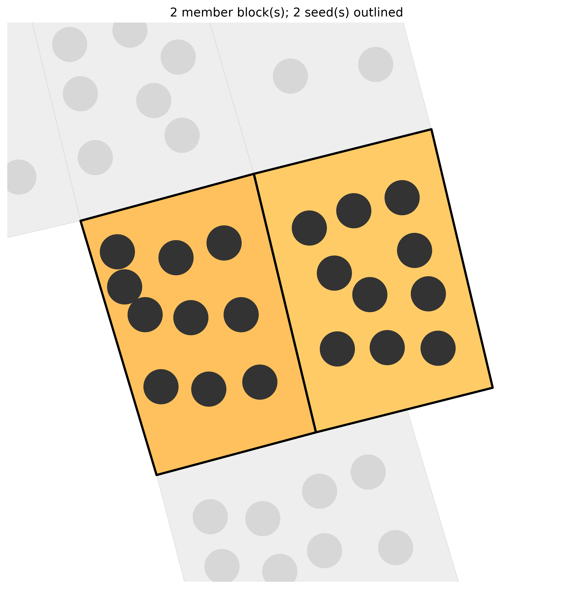
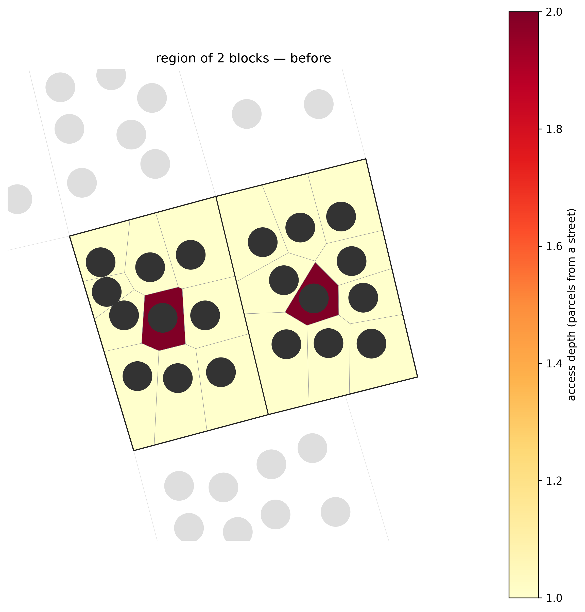
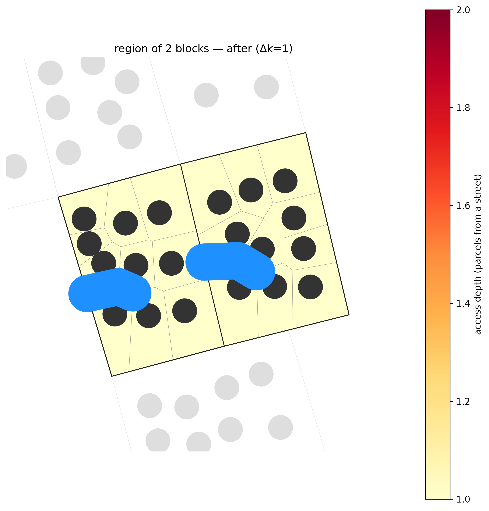

# Multi-block (region) reblocking

`block_ids` is a list of lists: each inner list is a *region* reblocked jointly, so roads can span
the old block boundaries. Existing inter-block streets are existing egress; the method adds
complementary roads. `region.png` shows which blocks were pulled into the region.

```bash
pixi run python -m reblock.run data=dji method=dijkstra \
  "block_ids=[[DJI.3_1_1808,DJI.3_1_1809]]" eval=kcomplexity render.enabled=true region_map.enabled=true
```

Two adjacent DJI blocks reblocked as one region. The inner inter-block street is drawn (existing
egress), and building points + dimmed neighbours are overlaid. Swap `method=greedy_arterial` for the
navigability flagship — on a region it adds long cross-block through-roads a tree method won't.



| before | after |
|---|---|
|  |  |
