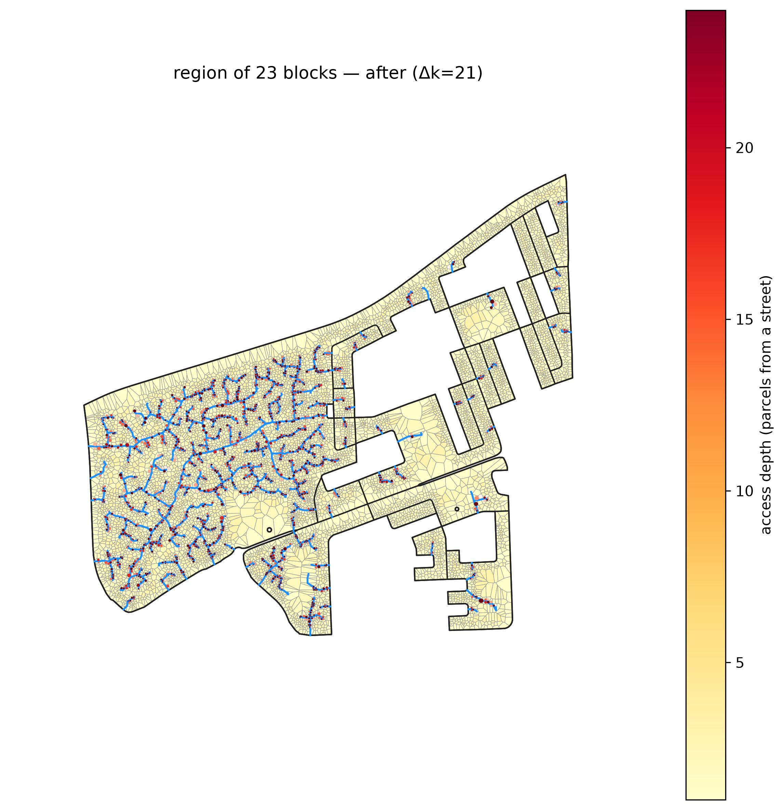
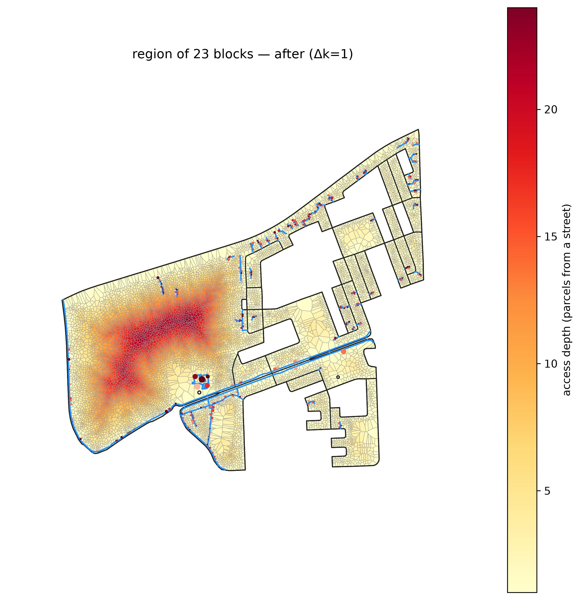
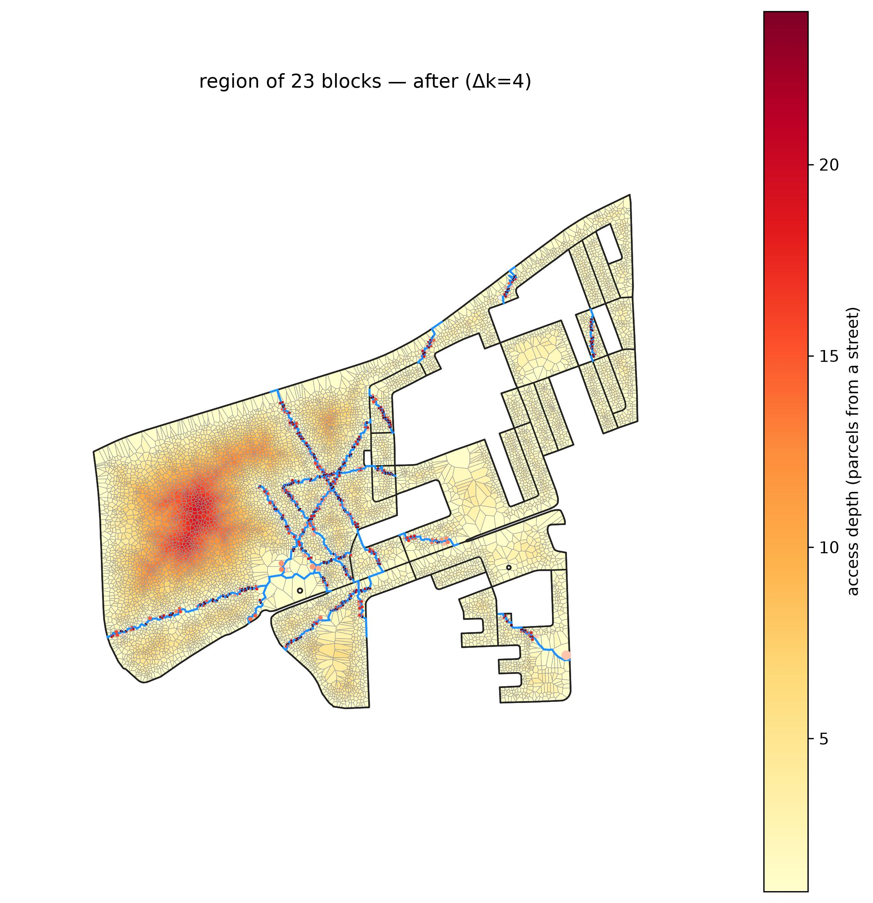
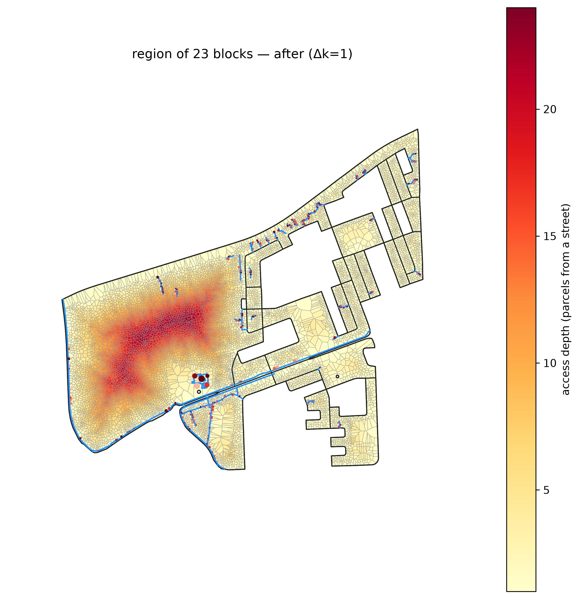

# Multiblock: a whole settlement reblocked, and the methods that scale to it

The headline demonstration that the substrate + screen work make **whole-settlement** reblocking
tractable: screen the entire Cape Town metro, grow its **deepest** informal core, then compare — on
that same 10,700-home region — the reblocking methods that actually run at this scale, under the
**two budgets that matter**: *hit a fixed access-depth* and *spend a fixed amount of road*.

Reproduces from **`capetown_full`** (the full metro, auto-downloaded to `~/.cache/reblock` on first
use) via plain CLI commands. For the *comprehensive* method bake-off — the scalable reblockers plus
`topology` (single-block-only) — see [`method-comparison`](../method-comparison/) on a single deep
block. (`greedy_arterial` used to be region-intractable; **CELF/lazy now brings it back** — it's in
the §3 comparison below.)

## 1. Screen the metro

`dense_compact` flags **13,906 of 83,192** blocks as deep informal fabric, ranked by max
access-depth. The cheap gate is a **depth proxy** — a closed-form estimate of how many parcel-rings
deep a block is, which ranks true access-depth ~5× better than building density (it's
frontage-starvation, not crowding, that buries parcels; see
[the note](../../docs/superpowers/notes/2026-07-14-depth-proxy-screen-gate.md) and the Nairobi
cross-check below). The whole ranked selection is memoized, so the one-time metro pass is 0.1 s on
every rerun.

**The formula, decomposed.** A block of `n` parcels over area `A` with perimeter `P` is roughly
`√(nA)/P` rings deep — divide the parcel count by the number of parcels that can front the perimeter
(`≈ P/√(A/n)`). Squaring that gives the clean decomposition the screen keys on:

> **depth² = n · (A/P²) = (building count) × (compactness)**

where `A/P²` is the block's **compactness** (the Polsby-Popper measure, up to a constant `4π`). Depth
grows with *how many* buildings a block holds **and** *how compact* — how far from the frontage — its
interior is. Density (`n/A`) alone is the wrong signal: 1,000 parcels in a tight disc and 1,000
spread thin are equally dense, but only the first is deep. On a fresh city (Nairobi) the proxy tracks
ground-truth k-complexity at **Spearman 0.72**, while density scores **−0.12**.

The screen choropleth below is colored by the **squared** proxy `n·A/P²` (`depth²`): squaring is
monotone, so the ranked/flagged set is identical to ranking by depth, but the color scale separates
informal fabric from the formal grid far more sharply (the un-squared proxy saturates most dense
fabric at one color).

The screen's deepest block is `ZAF.9.3.1_1_5810`, with parcels **24** deep.
📍 [See the region on Google Maps](https://www.google.com/maps/@-33.84130,18.74439,15z) (every run
logs this link for its selection).


## 2. Grow the deep core

`dense_cluster` grows that seed into its neighborhood by the **same depth proxy** (not density — so
growth follows the deep informal fabric instead of wandering into shallow formal housing). A
`max_buildings=3000` budget isolates a clean **23-block deep core** — **10,706 parcels / ~10,700
homes** — the densest, most buried fabric in the metro. The fine grain packed inside vs the sparse
formal grid around it is exactly what the screen is built to find.


## 3. Two budgets, three methods

There are two honest ways to ask "which reblocker is best," and they are different budgets:

- **Lens A — fix the *outcome*, measure the cost.** Demand that *every parcel* land within a target
  access-depth, and see what road, displacement, and compute each method spends to get there.
- **Lens B — fix the *cost*, measure the outcome.** Give every method the *same* road budget and see
  what connectivity it buys.

Both are slices of one object: the **benefit-vs-road-length frontier** each method traces
(`frontier_*.csv`, plotted at the end of this section). Lens A is a horizontal slice (fix the
benefit, read off the road); Lens B is a vertical slice (fix the road, read off the benefit).

The three methods that run at settlement scale: **`clearance`** (a drainage tree threaded through a
chord-diagonal substrate), **`greedy_arterial`** (a few long through-roads, chosen by CELF/lazy —
`candidate_policy=fixed` + `max_anchors=64` bound its candidate pass), and **`osm_footpaths`** —
whose "roads" are the **real** informal footpaths mapped from OpenStreetMap
([`desire_lines_5810.geojson`](desire_lines_5810.geojson), 154 mapped ways), not a synthetic
construction. The coverage baselines `dijkstra`/`mesh` (which pave everything) and `topology`
(single-block-only) are excluded at region scale; for the four-method bake-off on a small block see
[`method-comparison`](../method-comparison/).

The two connectivity axes (a spectral PCA across a diverse road-network corpus found these
orthogonal once road *quantity* is controlled; see the
[basis derivation](../../docs/superpowers/specs/2026-07-16-metric-basis-reporting-design.md) and
[ρ metric migration](../../docs/superpowers/specs/2026-07-17-redundancy-metric-and-refiner-design.md)):
**external connectivity** (reach/drainage to the outside street network) and **internal
connectivity** (backup-route redundancy, `commute_ratio` — mean `1 − R/R_geo`, the effective-
resistance ratio over the noded road∪street graph).

### Lens A — drive every parcel to depth ≤ 3

```bash
pixi run python -m scripts.compare_budgets examples/multiblock 3 \
  clearance,greedy_arterial_buildable,osm_footpaths \
  data=capetown_full region_builder=dense_cluster region_builder.max_buildings=3000 \
  "block_ids=[[ZAF.9.3.1_1_5810]]" \
  all_methods.clearance.max_roads=3000 all_methods.clearance.depth_target=3 \
  all_methods.greedy_arterial_buildable.candidate_policy=fixed \
  +all_methods.greedy_arterial_buildable.max_anchors=64 \
  desire_source.snapshot=examples/multiblock/desire_lines_5810.geojson
```

Each method is run overprovisioned, then its drainage-ordered road prefix is walked until the whole
region's **max access-depth first drops to ≤ 3** (`budget.prefix_to_depth`). The **propose time** is
the method's own cold-cache reblocking wall-clock (shared screen + grow is a separate one-time ~24 s,
memoized after). From [`lens_a_depth.csv`](lens_a_depth.csv):

| method | reaches depth 3? | road length | homes displaced | propose time |
|---|---|---|---|---|
| **clearance** | ✅ every parcel | 13,699 m | 1,614.8 (**15.1%**) | **5.5 s** |
| greedy_arterial | ❌ floor **depth 20** | 5,614 m | 499.6 (4.7%) | 86.3 s |
| osm_footpaths | ❌ floor **depth 23** | 6,122 m | 257.0 (2.4%) | 0.1 s |

**Only `clearance` can hit a coverage target.** It's the one method built to reach *every* parcel: a
drainage tree that threads 304 roads / 13,699 m into the deep core, taking depth 24 → 3 in **5.5 s**,
at the cost of displacing **15.1%** of homes. `greedy_arterial` and `osm_footpaths` cannot reach
depth 3 *at any prefix of their output* — arterial's few through-roads floor the region at **depth
20** (they close big loops, they don't cover the interior), and the as-built OSM footpaths floor it
at **depth 23**, barely below the untouched 24. That's the honest result: a fixed depth target is a
*coverage* question, and only the coverage method answers it — which is exactly why the second lens
exists.

`greedy_arterial` is also the slow one to *compute* (**86 s** — the CELF candidate evaluation over
the whole region, even bounded), while `clearance`'s substrate peel is **5.5 s** and `osm_footpaths`
just loads its snapshot (**0.1 s**).

| before (depth ≤ 24) | clearance → depth 3 | arterial (floor 20) | osm (floor 23) |
|---|---|---|---|
|  |  |  |  |

### Lens B — give every method the same 5,614 m of road

Truncate every method to the **same** added-road-length — the sparsest method's total, **5,614 m**
(arterial's) — so the comparison is fair: given identical road, what connectivity does each buy? From
[`lens_b_matched.csv`](lens_b_matched.csv):

| method | external connectivity | internal connectivity | homes displaced |
|---|---|---|---|
| **clearance** | **0.904** | 0.000 | 595.6 (5.6%) |
| greedy_arterial | 0.582 | **0.402** | 499.6 (4.7%) |
| osm_footpaths | 0.026 | 0.092 | 209.9 (2.0%) |

At an equal 5,614 m the trade-off is stark. **`clearance` dominates external connectivity** (0.904 —
most of its coverage lands in the first third of its road) but has **zero internal connectivity**: a
drainage *tree* has no backup routes by construction — every parcel reaches a street exactly one way.
**`greedy_arterial` wins internal connectivity** (0.402, ~4× osm) at similar displacement — its long
chords rejoin the perimeter at both ends, closing real loops. **`osm_footpaths` barely moves either
axis** (0.026 / 0.092): the mapped paths hug the edges and never reach the deep interior. (arterial's
full output *is* 5,614 m, so its Lens A and Lens B roads are the same set.)

| clearance | greedy_arterial | osm_footpaths |
|---|---|---|
|  |  |  |

### The frontier that contains both lenses

Run `reblock.compare` for the full benefit-vs-road-length curves (the backdrop both lenses slice) —
plus displacement, an extent-aware rising cost (each building is a disk of radius ½ its
nearest-neighbour distance; Σ of its probability of being grazed by the road corridor, so figures
read higher than a raw centroid count):

```bash
pixi run python -m reblock.compare \
  data=capetown_full region_builder=dense_cluster region_builder.max_buildings=3000 \
  "block_ids=[[ZAF.9.3.1_1_5810]]" \
  methods=[clearance,greedy_arterial_buildable,osm_footpaths] max_blocks=1 \
  all_methods.clearance.max_roads=3000 all_methods.clearance.depth_target=3 \
  all_methods.greedy_arterial_buildable.candidate_policy=fixed \
  +all_methods.greedy_arterial_buildable.max_anchors=64 \
  desire_source.snapshot=examples/multiblock/desire_lines_5810.geojson
```

Terminal frontier point per method (its full output): `clearance` reaches external **0.952** at its
full 13,699 m (internal ~0 throughout — the tree); `greedy_arterial` external 0.582 / internal
**0.402** at 5,614 m; `osm_footpaths` external 0.026 / internal 0.092 at 6,122 m.

 


Every command in this example logs its console output — each selection's locator link, the reblock
summary, and the per-method figures — to [`run.log`](run.log).

## 4. Why it's tractable — the scaling payoff

The whole settlement is reblockable at all because the **chord-diagonal substrate scales with the
fabric, not the area**. The routing graph the reblocker searches has **22,088 nodes** (one region of
parcel-boundary chords). A fixed `res = 1.5 m` grid over the settlement's **232 ha** bounding area
would be **≈ 1,033,034 nodes — 47× more** — and most of them empty space. That O(parcels) vs
O(area/res²) gap is why `clearance` threads 10,700 homes in **~5 s** on the chord substrate; a grid
at the same resolution would be intractable at this scale. `greedy_arterial`'s ~86 s is the price of
its CELF candidate search, not the substrate — it runs at region scale at all only because CELF/lazy
made the greedy tractable.
