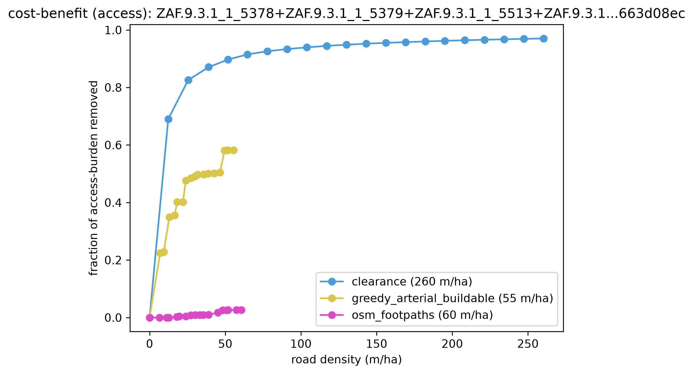
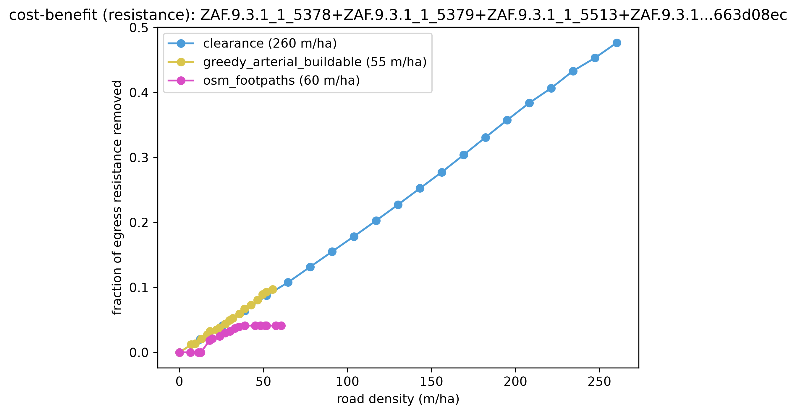
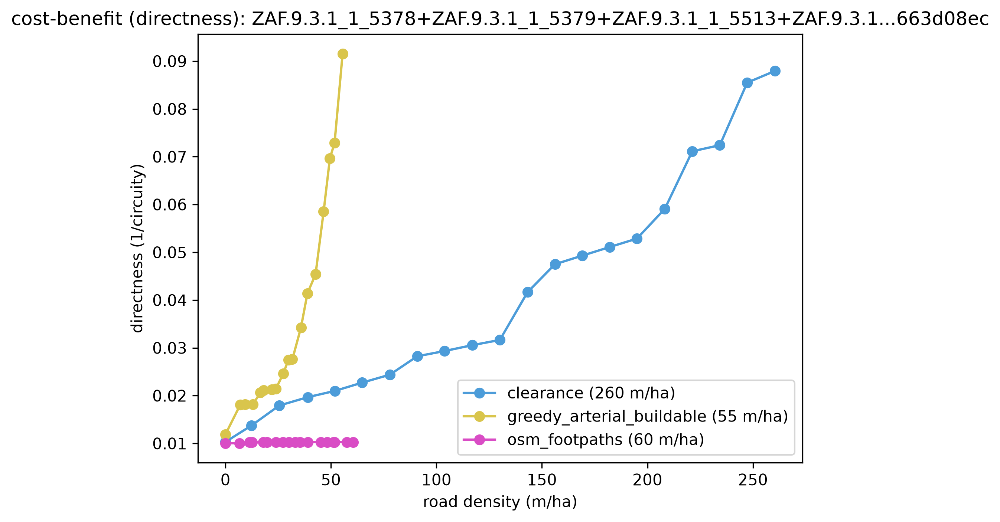
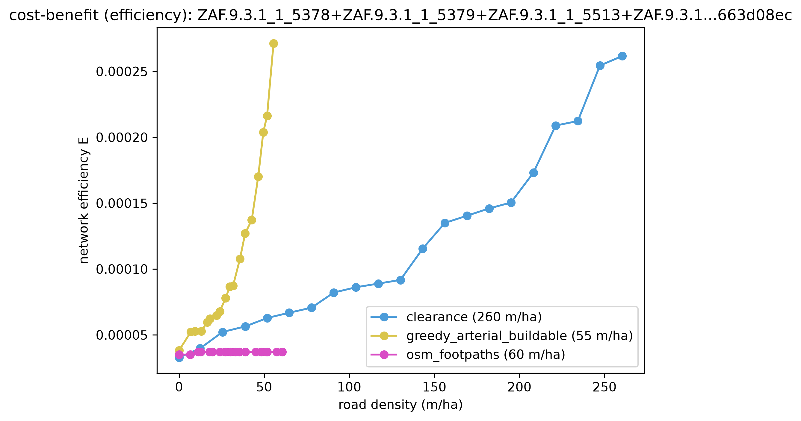
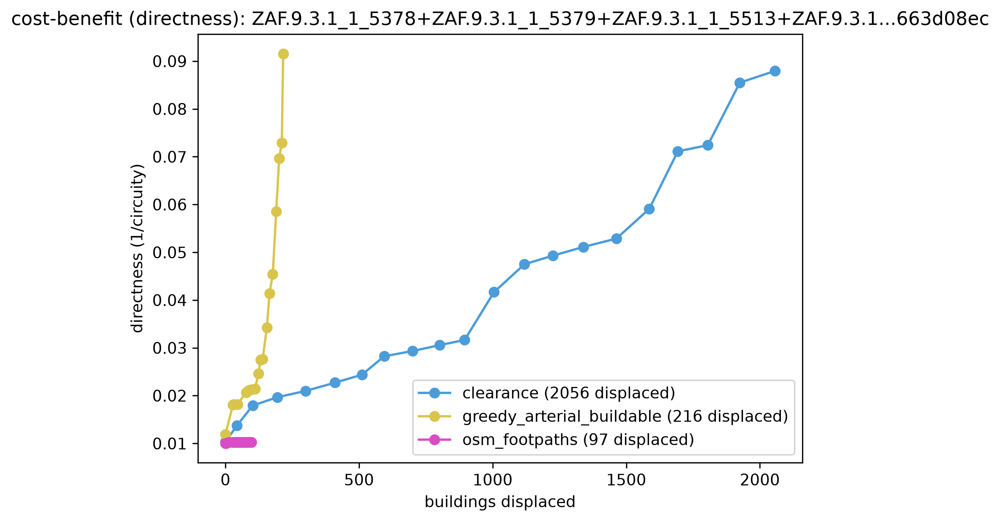
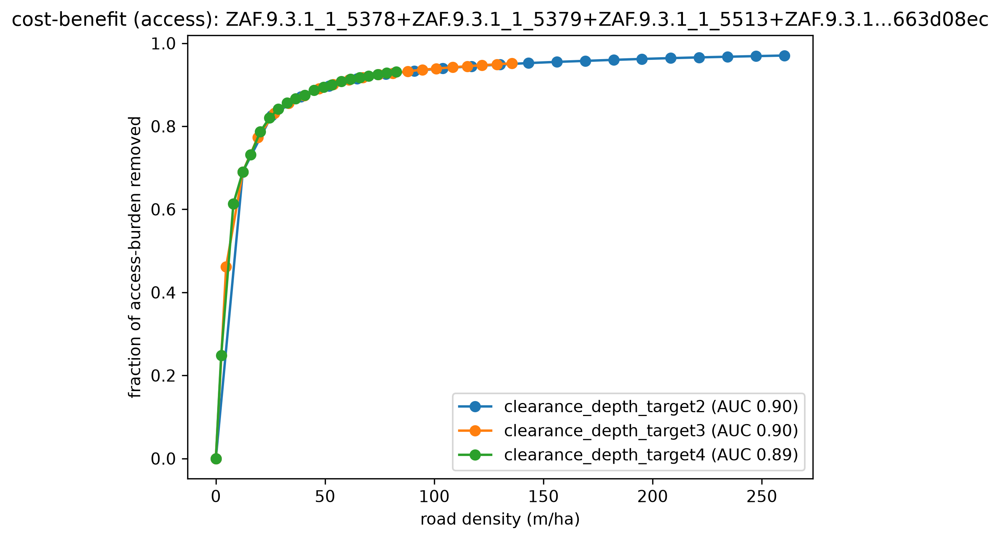
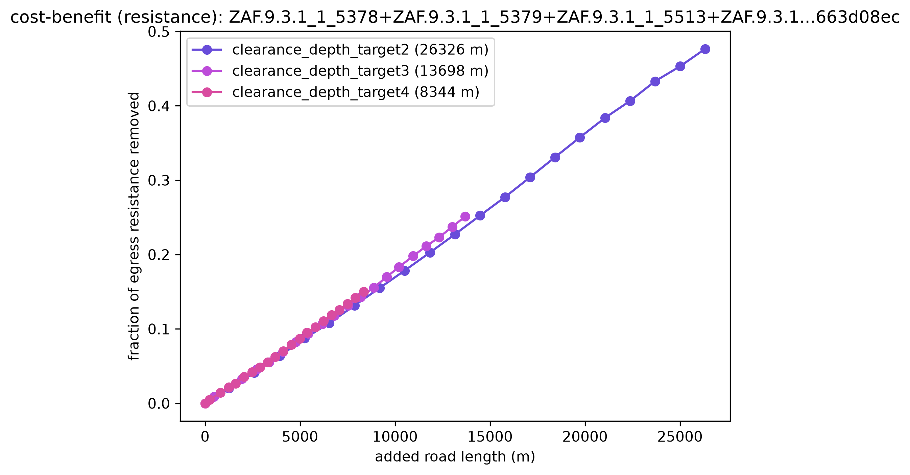
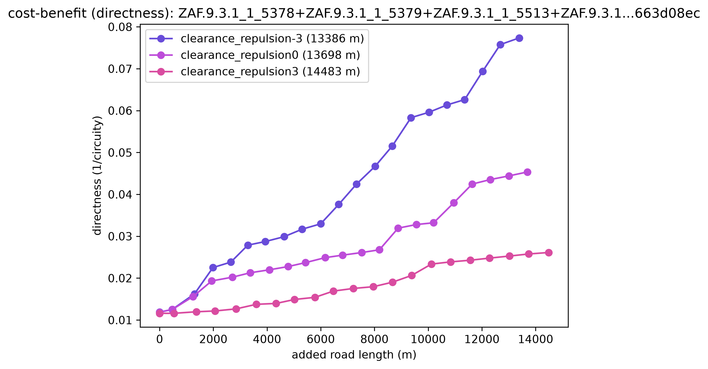

# Multiblock: a whole settlement reblocked, and the methods that scale to it

The headline demonstration that the substrate + screen work make **whole-settlement** reblocking
tractable: screen the entire Cape Town metro, grow its **deepest** informal core, thread roads
through it so every home lands within **3 parcels of a street** — then compare, on that same
10,700-home region, the methods that actually run at this scale, and show clearance's tuning knobs.

Reproduces from **`capetown_full`** (the full metro, auto-downloaded to `~/.cache/reblock` on first
use) via plain CLI commands. For the *comprehensive* method bake-off — the scalable reblockers plus
`topology` (single-block-only) — see [`method-comparison`](../method-comparison/) on a single deep
block. (`greedy_arterial` used to be region-intractable too; **CELF/lazy now brings it back** — it's
in the §4 comparison below.)

## 1. Screen the metro

`dense_compact` flags **13,906 of 83,192** blocks as deep informal fabric, ranked by max
access-depth. The cheap gate is the **depth proxy `√(n·A)/P`** (building count · block area ÷
perimeter) — a closed-form estimate of how many parcel-rings deep a block is, which ranks true depth
~5× better than building density (it's frontage-starvation, not crowding, that buries parcels; see
[the note](../../docs/superpowers/notes/2026-07-14-depth-proxy-screen-gate.md)). The whole ranked
selection is memoized, so the one-time metro pass is 0.1 s on every rerun.

The screen's deepest block is `ZAF.9.3.1_1_5810`, with parcels **24** deep.
📍 [See the region on Google Maps](https://www.google.com/maps/@-33.84130,18.74439,15z) (every run
logs this link for its selection).


## 2. Grow the deep core

`dense_cluster` grows that seed into its neighborhood by the **same depth proxy** (not density — so
growth follows the deep informal fabric instead of wandering into shallow formal housing). A
`max_buildings=3000` budget isolates a clean **23-block deep core** — **10,706 parcels / ~10,700
homes** — the densest, most buried fabric in the metro. The fine grain packed inside vs the sparse
formal grid around it is exactly what the screen is built to find.


## 3. Reblock to depth 3

```bash
pixi run python -m reblock.run \
  data=capetown_full screen=dense_compact max_blocks=1 \
  region_builder=dense_cluster region_builder.max_buildings=3000 \
  method=clearance method.depth_target=3 method.max_roads=2000 \
  eval=kcomplexity render.enabled=true region_map.enabled=true
```

One command: screen → grow → reblock → render. The clearance reblocker (chord-diagonal substrate)
threads **304 roads / 13,699 m** through the settlement, bringing every parcel from **depth 24 to
depth 3** and displacing **959** homes (sites inside a road corridor), in **~11 s**. `max_blocks=1`
takes the screen's deepest block as the seed; `region_map.enabled` writes `screen.png` + `region.png`
(shown above); `render.enabled` writes the before/after heatmaps below (as `region:…_before.png` /
`…_after.png`). The four dense maps are downsized to JPEG here for the gallery.

| before (depth ≤ 24) | after — depth 3 (304 roads, 959 displaced) |
|---|---|
|  |  |

## 4. Compare the methods that scale

The same 10,700-home region, graded on the four lenses for the methods that run at settlement scale:
**`clearance`**, **`greedy_arterial`** (rejoining via CELF/lazy — `candidate_policy=fixed` +
`max_anchors=64` bound its candidate pass, so its 15 through-roads take ~30 s on the whole region
instead of the ~48 min the uncapped greedy needed), and **`osm_footpaths`** — a reblocker whose
roads are the REAL informal footpaths mapped from OpenStreetMap, not a synthetic construction. The
coverage baselines `dijkstra`/`mesh` (which just pave everything) are dropped from this comparison;
only `topology` (single-block-only) stays excluded at region scale. For the four-method bake-off on a
small block, see [`method-comparison`](../method-comparison/).

```bash
pixi run python -m reblock.compare \
  data=capetown_full region_builder=dense_cluster region_builder.max_buildings=3000 \
  "block_ids=[[ZAF.9.3.1_1_5810]]" \
  methods=[clearance,greedy_arterial_buildable,osm_footpaths] max_blocks=1 \
  all_methods.clearance.max_roads=3000 \
  all_methods.greedy_arterial_buildable.candidate_policy=fixed \
  +all_methods.greedy_arterial_buildable.max_anchors=64 \
  desire_source.snapshot=examples/multiblock/desire_lines_5810.geojson
```

`osm_footpaths` loads the committed snapshot
[`desire_lines_5810.geojson`](desire_lines_5810.geojson) — 154 mapped OSM ways for the region (see
`scripts/fetch_desire_lines_snapshot.py`) — instead of synthesizing roads.

Every command in this example logs its console output — each selection's locator link, the reblock
summary, and the per-method frontier terminal points / displacement counts — to
[`run.log`](run.log).

Terminal frontier point per method per lens — benefit reached, and the road density (m/ha) plus
**`% paved`** (fraction of the region's area under the road corridor) it took to get there:

| lens | clearance | greedy_arterial | osm_footpaths |
|---|---|---|---|
| access — burden removed | **0.970** | 0.582 | 0.026 |
| resistance — egress removed | **0.477** | 0.097 | 0.041 |
| directness — 1/circuity | 0.088 | **0.092** | 0.010 |
| efficiency — network E | ~0.00 | ~0.00 | ~0.00 |
| road density | 260 m/ha | 56 m/ha | 61 m/ha |
| **% paved** | 15.5% | **3.3%** | 3.7% |

**`clearance` dominates coverage:** access 0.970 and resistance 0.477 at 15.5% paved — the best
all-round reblock at region scale.

**`greedy_arterial`** (CELF-scalable) **wins directness** (0.092, edging clearance's 0.088) at the
sparsest paving of all (3.3%) and low displacement (216 homes, see below) — a handful of straight
through-roads.

**`osm_footpaths` is the honest reality check.** Its roads are the mapped OSM footpaths that
ALREADY exist across the region. And they barely touch the deep interior: access **0.026** at 3.7%
paved, displacing just 97 homes. The real as-built paths are a thin skeleton that leaves almost the
whole 10,700-home fabric buried — which is precisely why reblocking is needed. (On a single small
block the same method does far better — see [`method-comparison`](../method-comparison/) — because a
small block's paths actually cover it; a deep 23-block core they do not.) This is a feature of the
example: it shows what's on the ground vs. what the synthetic methods achieve.

 
 

`efficiency` (network E) is near-inert at this scale for every method — the many far-apart parcel
pairs swamp it.

### Displacement at scale

Re-graded on the **displacement** cost axis (buildings whose footprint falls in the road corridor) —
the §4 compare with `cost=displacement` appended:

```bash
pixi run python -m reblock.compare \
  data=capetown_full region_builder=dense_cluster region_builder.max_buildings=3000 \
  "block_ids=[[ZAF.9.3.1_1_5810]]" \
  methods=[clearance,greedy_arterial_buildable,osm_footpaths] max_blocks=1 \
  all_methods.clearance.max_roads=3000 \
  all_methods.greedy_arterial_buildable.candidate_policy=fixed \
  +all_methods.greedy_arterial_buildable.max_anchors=64 \
  desire_source.snapshot=examples/multiblock/desire_lines_5810.geojson cost=displacement
```

Across a 10,700-home region:

| method | terminal directness | buildings displaced | % displaced |
|---|---|---|---|
| **osm_footpaths** | 0.010 | **97** | **0.9%** |
| greedy_arterial | 0.092 | 216 | 2.0% |
| clearance | 0.088 | 2,056 | 19.2% |

`osm_footpaths` displaces almost nothing (97 homes, 0.9%) — but that's the flip side of barely
helping: its footpaths never reach the deep interior (access 0.026 above), so there's little there
left to clear. `greedy_arterial` reaches near-clearance directness (0.092 vs 0.088) while displacing a
tenth as many homes (216 vs 2,056) — its handful of through-roads. `clearance`'s dense coverage
displaces 2,056 homes (19.2%) — the price of the access/resistance coverage it wins above.
Displacement tracks road footprint, not virtue on its own — read this table alongside the full
frontier table above, not in isolation.



## 5. The depth_target tradeoff — why 3

`depth_target` is the road-budget dial: the looser the target, the fewer roads. On the deep core,
each depth's terminal frontier point (benefit reached, road density spent, % paved):

| depth_target | road density | % paved | access | directness | resistance | displaced |
|---|---|---|---|---|---|---|
| 2 | 260 m/ha | 15.5% | **0.970** | 0.088 | **0.477** | 2,056 |
| **3** | **135 m/ha** | **8.0%** | 0.952 | 0.045 | 0.251 | **959** |
| 4 | 83 m/ha | 4.9% | 0.931 | 0.036 | 0.150 | 532 |

Depth 3 is the sweet spot: it reaches **0.952 access** — ≈98% of depth 2's 0.970 — at **HALF the
road** (135 vs 260 m/ha) and half the displacement (959 vs 2,056). Depth 2 just keeps paving to shave
the last two rings. Depth 4 saves more road still, but leaves parcels 4 deep.

 

## 6. The repulsion knob — displacement vs directness

At depth 3, `repulsion` (the logit knob steering roads toward gaps vs straight through buildings)
trades **homes displaced** against **route directness**:

| repulsion | road density | % paved | directness | access | displaced |
|---|---|---|---|---|---|
| −3 (seek clearance) | 132 m/ha | 7.8% | **0.077** | 0.951 | 1,035 |
| 0 (balanced) | 135 m/ha | 8.0% | 0.045 | 0.952 | 959 |
| +3 (repel buildings) | 143 m/ha | 8.6% | 0.026 | 0.951 | **543** |

Turning repulsion up **nearly halves displacement** (1,035 → 543) by routing roads around buildings
through the gaps — at the cost of less direct roads. Turning it down cuts straighter through the
fabric: more direct internal trips, but more homes cleared. Same coverage either way (access ≈ 0.95);
the knob is purely *how* the roads get there.



## 7. Why it's tractable — the scaling payoff

The whole settlement is reblockable at all because the **chord-diagonal substrate scales with the
fabric, not the area**. The routing graph the reblocker searches has **22,088 nodes** (one region of
parcel-boundary chords). A fixed `res = 1.5 m` grid over the settlement's **232 ha** bounding area
would be **≈ 1,033,034 nodes — 47× more** — and most of them empty space. That O(parcels) vs
O(area/res²) gap is why 10,700 homes reblock in ~11 s on the chord substrate; a grid at the same
resolution would be intractable at this scale.

## Reproduce the compare panels

```bash
# §5 depth_target tradeoff
pixi run python -m reblock.compare \
  data=capetown_full region_builder=dense_cluster region_builder.max_buildings=3000 \
  "block_ids=[[ZAF.9.3.1_1_5810]]" methods=[] max_blocks=1 all_methods.clearance.max_roads=3000 \
  'method_sweep={base: clearance, param: depth_target, values: [2, 3, 4]}'

# §6 repulsion knob (depth pinned to 3)
pixi run python -m reblock.compare \
  data=capetown_full region_builder=dense_cluster region_builder.max_buildings=3000 \
  "block_ids=[[ZAF.9.3.1_1_5810]]" methods=[] max_blocks=1 \
  all_methods.clearance.depth_target=3 all_methods.clearance.max_roads=2000 \
  'method_sweep={base: clearance, param: repulsion, values: [-3, 0, 3]}'
```

(These are raw frontier terminals — benefit at each variant's own road density, no normalization — so
they read directly across both sweeps; the depth sweep just spends more road at the tight end, since
depth 2 commits ~3× depth 4's road.)
