# Multiblock: a whole settlement reblocked, and the methods that scale to it

The headline demonstration that the substrate + screen work make **whole-settlement** reblocking
tractable: screen the entire Cape Town metro, grow its **deepest** informal core, thread roads
through it so every home lands within **3 parcels of a street** — then compare, on that same
10,700-home region, the methods that actually run at this scale, and show clearance's tuning knobs.

Reproduces from **`capetown_full`** (the full metro, auto-downloaded to `~/.cache/reblock` on first
use) via plain CLI commands. For the *comprehensive* method bake-off — the scalable reblockers plus
`topology` (single-block-only) — see [`method-comparison`](../method-comparison/) on a single deep
block. (`greedy_arterial` used to be region-intractable too; **CELF/lazy now brings it back** — it's
in the §4 comparison below.)

## 1. Screen the metro

`dense_compact` flags **13,906 of 83,192** blocks as deep informal fabric, ranked by max
access-depth. The cheap gate is the **depth proxy `√(n·A)/P`** (building count · block area ÷
perimeter) — a closed-form estimate of how many parcel-rings deep a block is, which ranks true depth
~5× better than building density (it's frontage-starvation, not crowding, that buries parcels; see
[the note](../../docs/superpowers/notes/2026-07-14-depth-proxy-screen-gate.md)). The whole ranked
selection is memoized, so the one-time metro pass is 0.1 s on every rerun.

The screen's deepest block is `ZAF.9.3.1_1_5810`, with parcels **24** deep.
📍 [See the region on Google Maps](https://www.google.com/maps/@-33.84130,18.74439,15z) (every run
logs this link for its selection).

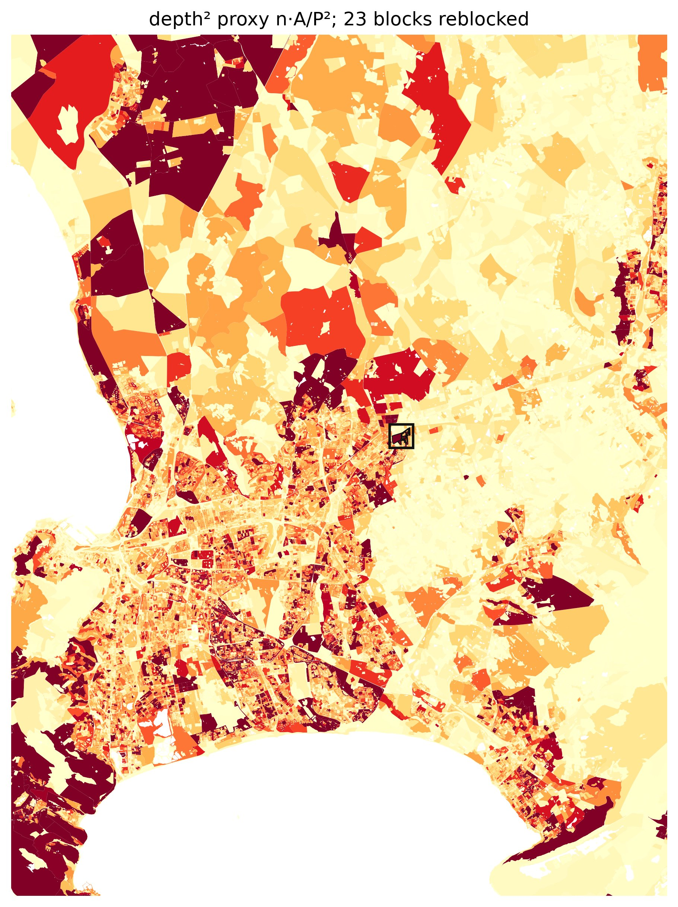

## 2. Grow the deep core

`dense_cluster` grows that seed into its neighborhood by the **same depth proxy** (not density — so
growth follows the deep informal fabric instead of wandering into shallow formal housing). A
`max_buildings=3000` budget isolates a clean **23-block deep core** — **10,706 parcels / ~10,700
homes** — the densest, most buried fabric in the metro. The fine grain packed inside vs the sparse
formal grid around it is exactly what the screen is built to find.

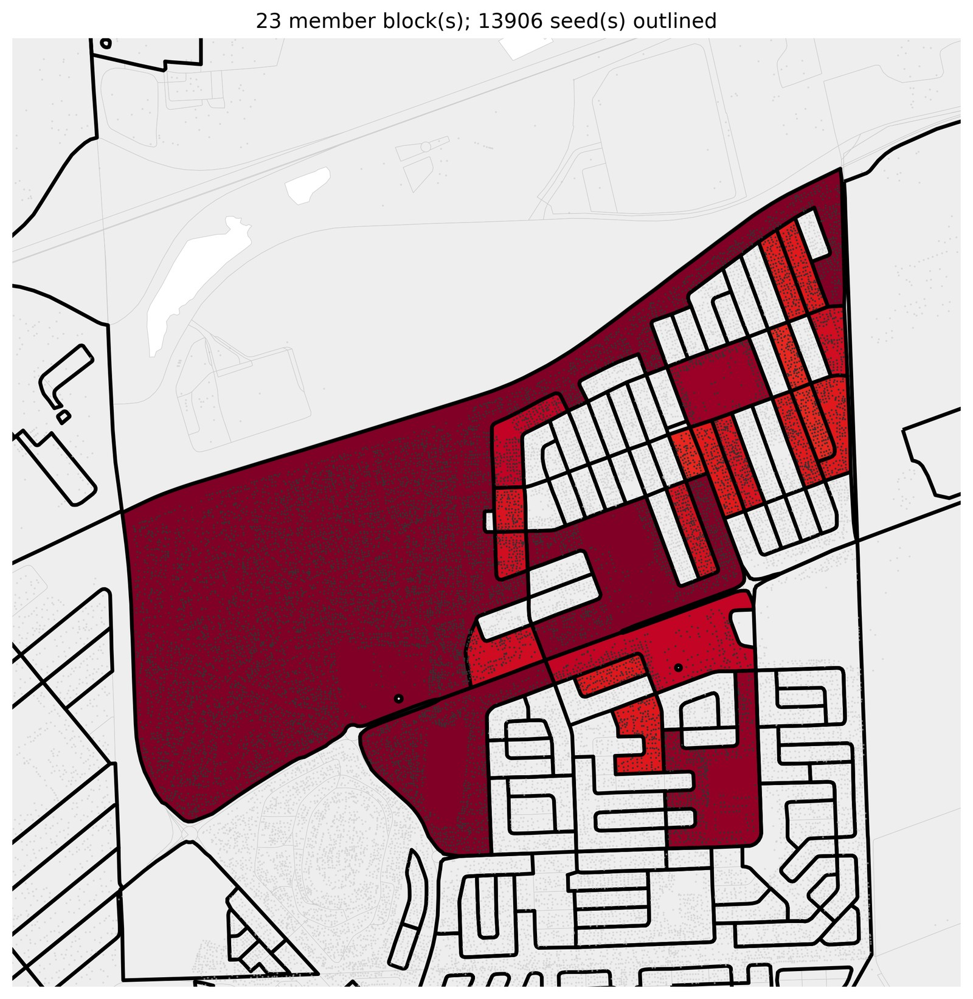

## 3. Reblock to depth 3

```bash
pixi run python -m reblock.run \
  data=capetown_full screen=dense_compact max_blocks=1 \
  region_builder=dense_cluster region_builder.max_buildings=3000 \
  method=clearance method.depth_target=3 method.max_roads=2000 \
  eval=kcomplexity render.enabled=true region_map.enabled=true
```

One command: screen → grow → reblock → render. The clearance reblocker (chord-diagonal substrate)
threads **304 roads / 13,699 m** through the settlement, bringing every parcel from **depth 24 to
depth 3** and displacing **959** homes (sites inside a road corridor), in **~11 s**. `max_blocks=1`
takes the screen's deepest block as the seed; `region_map.enabled` writes `screen.png` + `region.png`
(shown above); `render.enabled` writes the before/after heatmaps below (as `region:…_before.png` /
`…_after.png`). The four dense maps are downsized to JPEG here for the gallery.

| before (depth ≤ 24) | after — depth 3 (304 roads, 959 displaced) |
|---|---|
| 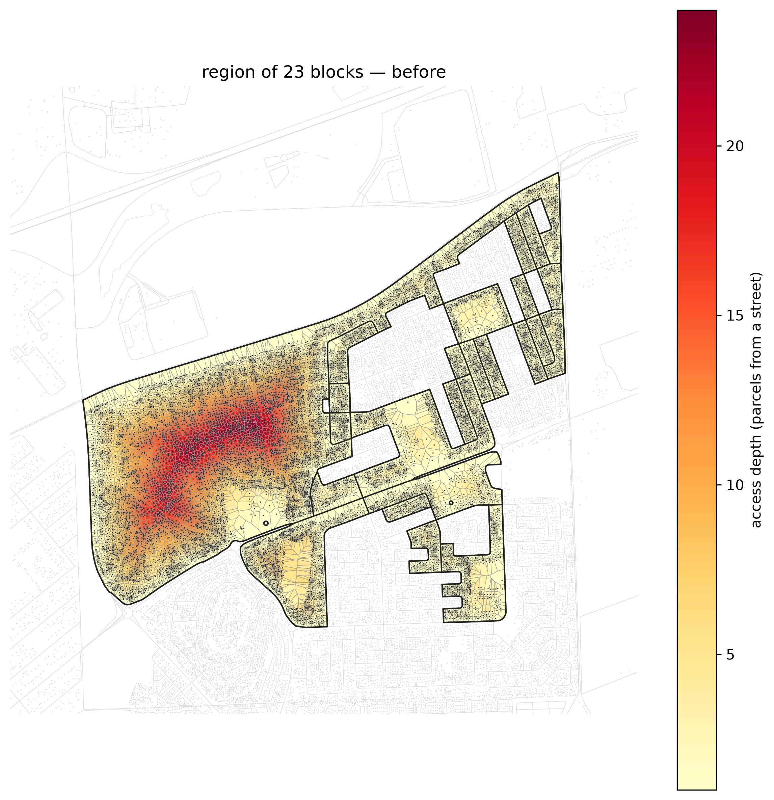 | 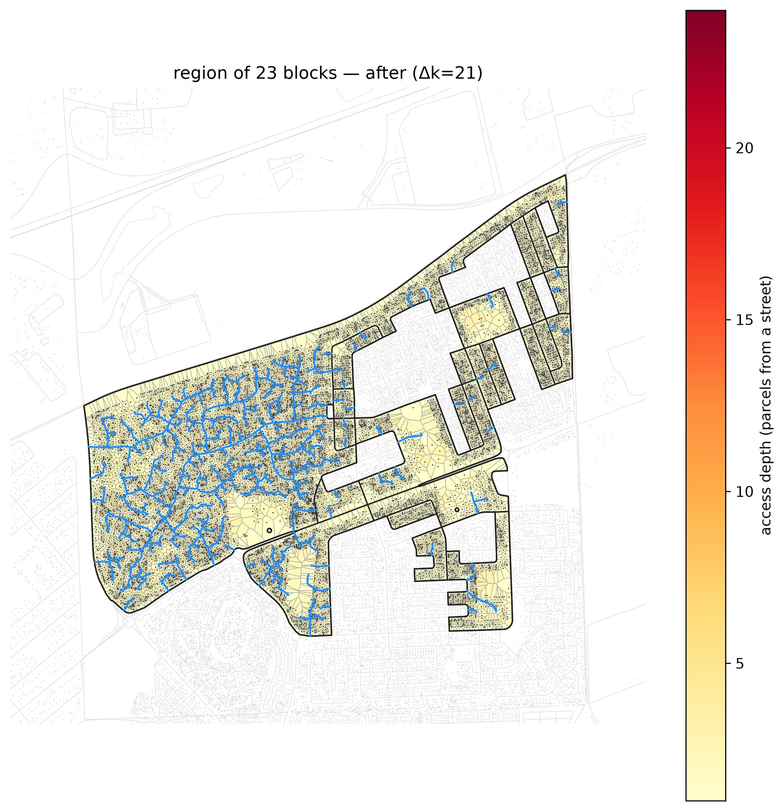 |

## 4. Compare the methods that scale

The same 10,700-home region, graded on the **metric basis** — external connectivity, internal
connectivity, displacement — for the methods that run at settlement scale: **`clearance`**,
**`greedy_arterial`** (rejoining via CELF/lazy — `candidate_policy=fixed` + `max_anchors=64` bound its
candidate pass, so its 15 through-roads take ~30 s on the whole region instead of the ~48 min the
uncapped greedy needed), and **`osm_footpaths`** — a reblocker whose roads are the REAL informal
footpaths mapped from OpenStreetMap, not a synthetic construction. The coverage baselines
`dijkstra`/`mesh` (which just pave everything) are dropped from this comparison; only `topology`
(single-block-only) stays excluded at region scale. For the four-method bake-off on a small block, see
[`method-comparison`](../method-comparison/).

Road-structure quality is **two orthogonal axes** (a spectral PCA across a diverse corpus of road
networks found this once road *quantity* is controlled — quantity is the displacement/cost axis; see
[the design doc](../../docs/superpowers/specs/2026-07-16-metric-basis-reporting-design.md)):
**external connectivity** (reach/drainage to the outside street network — the former "access" metric,
unchanged, just relabeled; the former egress-`resistance` lens loaded on this same axis and is now
subsumed by it) and **internal connectivity** (backup-route redundancy, `commute_ratio` — mean
1 − R/R_geo, the effective-resistance ratio over the noded road∪street graph — replacing the retired
`directness`/`efficiency` lenses and, more recently, the circuit-rank `cycle_density` representative;
the tables below predate that latest swap, see the note under the frontier table).

```bash
pixi run python -m reblock.compare \
  data=capetown_full region_builder=dense_cluster region_builder.max_buildings=3000 \
  "block_ids=[[ZAF.9.3.1_1_5810]]" \
  methods=[clearance,greedy_arterial_buildable,osm_footpaths] max_blocks=1 \
  all_methods.clearance.max_roads=3000 \
  all_methods.greedy_arterial_buildable.candidate_policy=fixed \
  +all_methods.greedy_arterial_buildable.max_anchors=64 \
  desire_source.snapshot=examples/multiblock/desire_lines_5810.geojson
```

`osm_footpaths` loads the committed snapshot
[`desire_lines_5810.geojson`](desire_lines_5810.geojson) — 154 mapped OSM ways for the region (see
`scripts/fetch_desire_lines_snapshot.py`) — instead of synthesizing roads.

Every command in this example logs its console output — each selection's locator link, the reblock
summary, and the per-method frontier terminal points / displacement figures — to
[`run.log`](run.log).

Terminal frontier point per method per axis — benefit reached, and the **added road length** (metres)
plus **`% paved`** (fraction of the region's area under the road corridor) it took to get there:

| axis | clearance | greedy_arterial | osm_footpaths |
|---|---|---|---|
| external connectivity — access-burden removed | **0.970** | 0.582 | 0.026 |
| internal connectivity — backup-route redundancy (mean 1 − R/R_geo) | 0.0030 | **0.0072** | 0.0035 |
| added road length | 26,326 m | 5,614 m | 6,122 m |
| **% paved** | 15.5% | **3.3%** | 3.7% |

> **Stale (cycle-era):** the internal-connectivity row's numbers above were measured under the
> retired circuit-rank `cycle_density` metric, not the current `commute_ratio` (ρ). Every other row
> is unaffected (unchanged metric). Regenerate on next `compare` run.

**`clearance` dominates external connectivity:** 0.970 at 15.5% paved — the best coverage at region
scale, though its own internal connectivity (0.0030, cycle-era; see note above) is the lowest of the
three: a dense drainage *tree* into the deep core, not a mesh.

**`greedy_arterial`** (CELF-scalable) **wins internal connectivity** (0.0072, ~2× the others;
cycle-era, see note above) at the sparsest paving of all (3.3%) and low displacement (~500 homes, see
below) — its handful of through-roads reconnect into the existing street perimeter at both ends,
closing real loops instead of dead-ending.

**`osm_footpaths` is the honest reality check.** Its roads are the mapped OSM footpaths that
ALREADY exist across the region. And they barely touch the deep interior: external connectivity
**0.026** at 3.7% paved, displacing ~257 homes. The real as-built paths are a thin skeleton that leaves
almost the whole 10,700-home fabric buried — which is precisely why reblocking is needed. (On a single
small block the same method does far better — see [`method-comparison`](../method-comparison/) —
because a small block's paths actually cover it; a deep 23-block core they do not.) This is a feature
of the example: it shows what's on the ground vs. what the synthetic methods achieve.

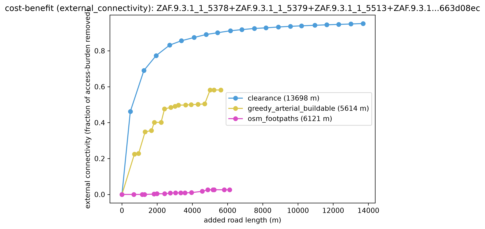 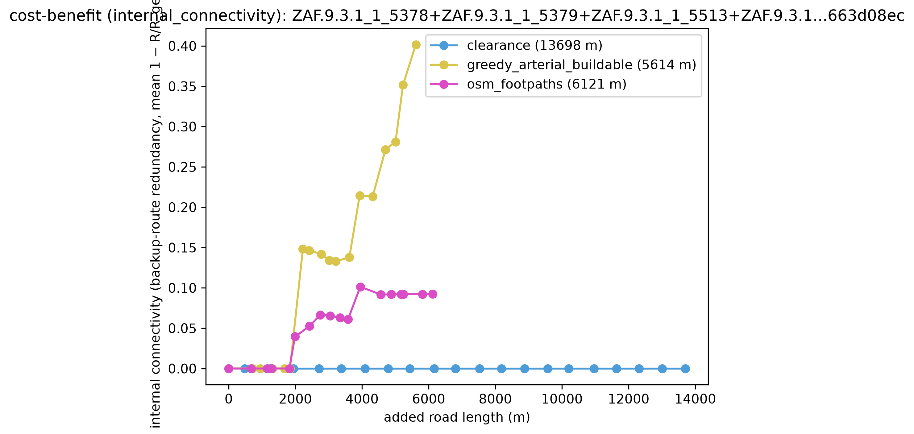

### Where each method puts its roads — matched budget

One after-render per method, every method's roads truncated to the **same** added-road-length budget —
the sparsest method's total, **5,614 m** (arterial's) — so the comparison is fair: given the same
road, where does each put it? (Building disks are shaded grey→red by displacement probability; see
below.) Generated by `scripts/render_methods_matched.py`.

| clearance | greedy_arterial | osm_footpaths |
|---|---|---|
| 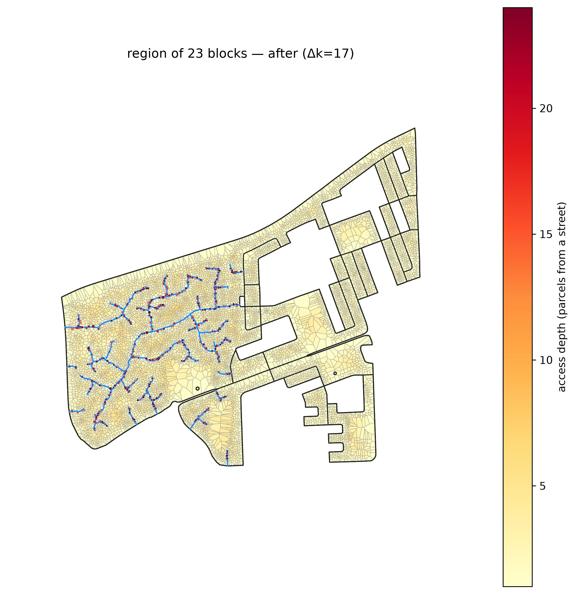 |  |  |

At an equal 5,614 m, clearance spends its budget on a drainage backbone into the deepest core, arterial
lays a few straight through-roads, and osm_footpaths traces the (thin, edge-hugging) mapped paths.

### Displacement at scale

Displacement is a **rising cost curve** vs added road length (`displacement.png`), extent-aware: each
building is a disk (radius = ½ its nearest-neighbour distance) contributing its **probability of being
grazed** by the road corridor, `c = max(0, 1 − d/r)`; Σc is the "expected homes displaced" — it catches
footprint-edge clips a centroid test misses, so figures read higher than a raw count.

| method | homes displaced | % of homes | terminal internal connectivity (backup-route redundancy) |
|---|---|---|---|
| **osm_footpaths** | **257.0** | **2.4%** | 0.0035 |
| greedy_arterial | 499.6 | 4.7% | **0.0072** |
| clearance | 3,305.7 | 30.9% | 0.0030 |

(Internal-connectivity column is cycle-era; see the note under the frontier table above — regenerate
on next `compare` run.)

`osm_footpaths` displaces the least (257 homes, 2.4%) — the flip side of barely helping: its footpaths
never reach the deep interior (external connectivity 0.026 above), so there's little there to clear.
`greedy_arterial` reaches the highest internal connectivity of the three (0.0072, cycle-era) while displacing a
seventh as many homes as clearance (500 vs 3,306) — its handful of through-roads. `clearance`'s dense
coverage displaces 3,306 homes (30.9%) — the price of the external-connectivity coverage it wins above.
Read this alongside the frontier table above, not in isolation.

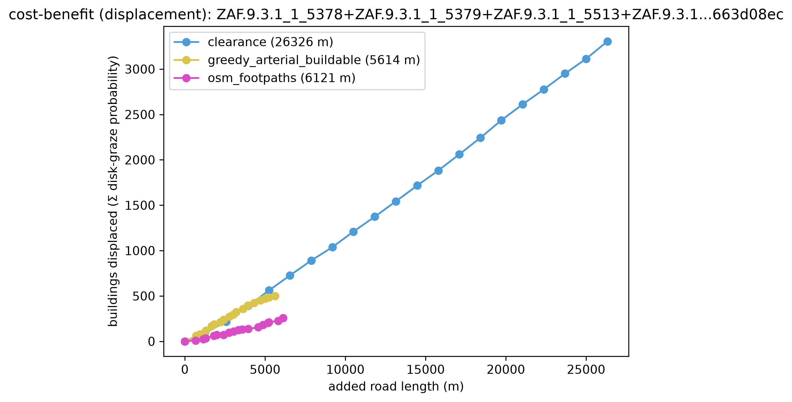

## 5. The depth_target tradeoff — why 3

`depth_target` is the road-budget dial: the looser the target, the fewer roads. On the deep core,
each depth's terminal frontier point (benefit reached, added road length spent, % paved; `displaced`
is the extent-aware Σ graze-probability of §4):

| depth_target | added road length | % paved | external connectivity | internal connectivity (backup-route redundancy) | displaced |
|---|---|---|---|---|---|
| 2 | 26,326 m | 15.5% | **0.970** | 0.0030 | 3,305.7 |
| **3** | **13,699 m** | **8.0%** | 0.952 | 0.0030 | **1,614.8** |
| 4 | 8,345 m | 4.9% | 0.931 | 0.0030 | 938.1 |

(Internal-connectivity column is cycle-era; see the note under the §4 frontier table above —
regenerate on next `compare` run.)

Depth 3 is the sweet spot: it reaches **0.952 external connectivity** — ≈98% of depth 2's 0.970 — at
**HALF the road** (13,699 vs 26,326 m) and half the displacement (1,615 vs 3,306). Depth 2 just keeps
paving to shave the last two rings. Depth 4 saves more road still, but leaves parcels 4 deep. Internal
connectivity reads **flat at 0.0030 across all three depths** (cycle-era number) — `depth_target` only
trades road (and thus external connectivity and displacement) against how far clearance's drainage
tree reaches; it never changes the network's loop count, which is pinned by the region's existing
street topology, not by clearance's own (tree-shaped, non-looping) added roads.

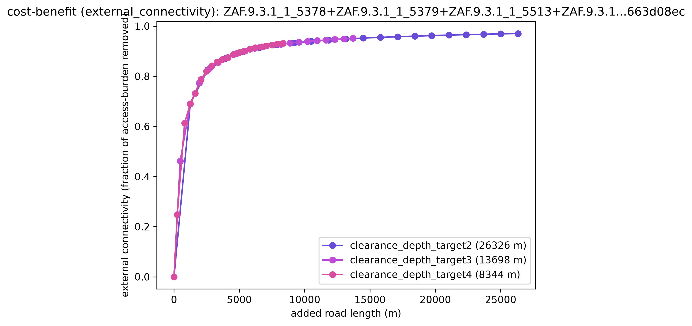 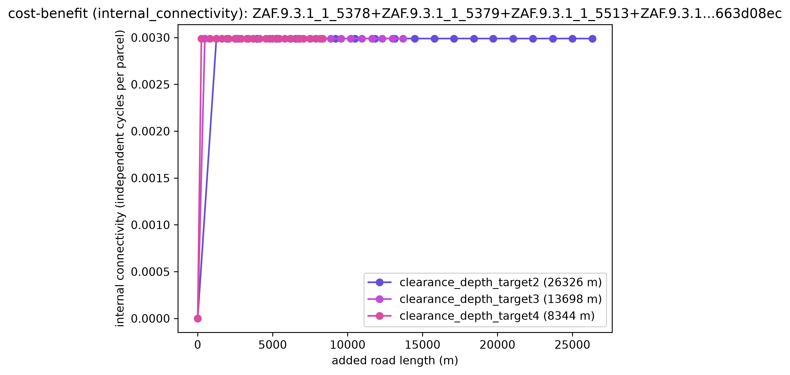

## 6. The repulsion knob — displacement, for free

At depth 3, `repulsion` (the logit knob steering roads toward gaps vs straight through buildings)
trades **homes displaced** — for nothing on either connectivity axis:

| repulsion | added road length | % paved | external connectivity | internal connectivity (backup-route redundancy) | displaced |
|---|---|---|---|---|---|
| −3 (seek clearance) | 13,387 m | 7.8% | 0.951 | 0.0030 | 1,670.7 |
| 0 (balanced) | 13,699 m | 8.0% | 0.952 | 0.0030 | 1,614.8 |
| +3 (repel buildings) | 14,484 m | 8.6% | 0.951 | 0.0030 | **1,232.3** |

(Internal-connectivity column is cycle-era; see the note under the §4 frontier table above —
regenerate on next `compare` run.)

Turning repulsion up **cuts displacement ~26%** (1,671 → 1,232) by routing roads around buildings
through the gaps — at essentially **no cost on either connectivity axis**: external connectivity stays
in a tight 0.951–0.952 band and internal connectivity reads flat at 0.0030 across all three settings
(cycle-era number).
(Under the old five-lens basis this looked like a displacement-for-directness tradeoff; under the
validated orthogonal basis, `directness` wasn't a real independent quality axis — repulsion changes
*how* the roads route, not how well-connected the result is on either axis that matters.) Under the
extent-aware disk measure the displacement drop is gentler than a bare centroid count would show: a
road that dodges a building's *centre* still often grazes its *footprint*, so the disks keep it partly
displaced.

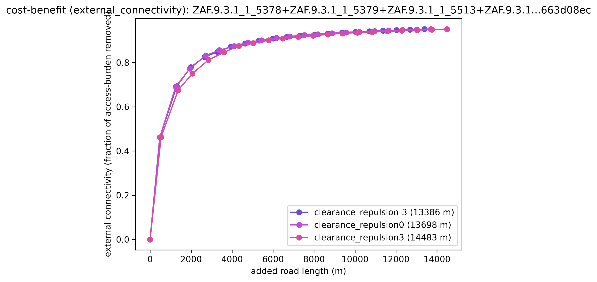 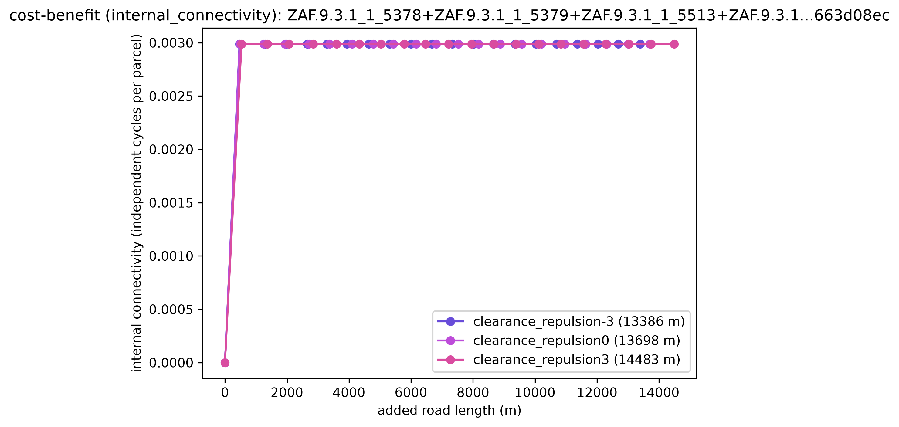

## 7. Why it's tractable — the scaling payoff

The whole settlement is reblockable at all because the **chord-diagonal substrate scales with the
fabric, not the area**. The routing graph the reblocker searches has **22,088 nodes** (one region of
parcel-boundary chords). A fixed `res = 1.5 m` grid over the settlement's **232 ha** bounding area
would be **≈ 1,033,034 nodes — 47× more** — and most of them empty space. That O(parcels) vs
O(area/res²) gap is why 10,700 homes reblock in ~11 s on the chord substrate; a grid at the same
resolution would be intractable at this scale.

## Reproduce the compare panels

```bash
# §5 depth_target tradeoff
pixi run python -m reblock.compare \
  data=capetown_full region_builder=dense_cluster region_builder.max_buildings=3000 \
  "block_ids=[[ZAF.9.3.1_1_5810]]" methods=[] max_blocks=1 all_methods.clearance.max_roads=3000 \
  'method_sweep={base: clearance, param: depth_target, values: [2, 3, 4]}'

# §6 repulsion knob (depth pinned to 3)
pixi run python -m reblock.compare \
  data=capetown_full region_builder=dense_cluster region_builder.max_buildings=3000 \
  "block_ids=[[ZAF.9.3.1_1_5810]]" methods=[] max_blocks=1 \
  all_methods.clearance.depth_target=3 all_methods.clearance.max_roads=2000 \
  'method_sweep={base: clearance, param: repulsion, values: [-3, 0, 3]}'
```

(These are raw frontier terminals — benefit at each variant's own added road length, no normalization
— so they read directly across both sweeps; the depth sweep just spends more road at the tight end,
since depth 2 commits ~3× depth 4's road.)
