# Multiblock, screened by `density_compactness`

*Dense and compact from geometry alone — the tightest, most built-up blocks by building count per perimeter², found without ever peeling a single parcel ring.*

**Metric:** `density × compactness = n/P²  —  dense, compact fabric (no peel)` — one metric drives the screen, region growth, and colouring end to end.

## 1. Screen the metro

`density_compactness` flagged **8,293 of 83,192** blocks. Top-scoring: `ZAF.9.3.1_1_44531` (peel depth 4).

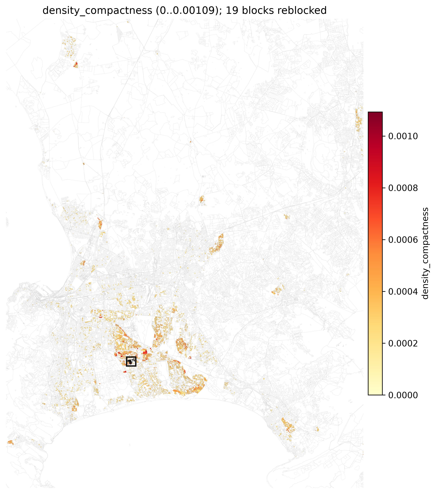

**Location:** [see the grown region on Google Maps](https://www.google.com/maps/@-34.01690,18.58833,16z).

## 2. Grow the region

The metric grows a **19-block** region (**4,677 parcels**), mean depth 5.1 rings, mean density 142 bldg/ha.

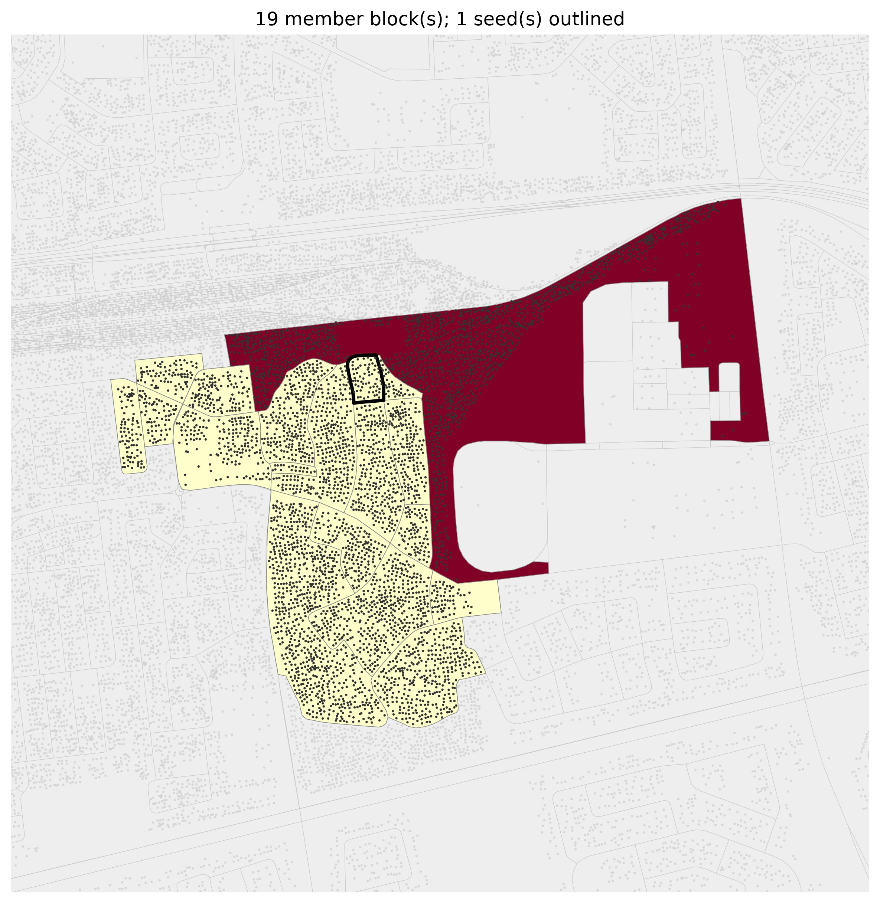

## 3. The method frontier (benefit vs added road)

How far each method's road drives the region's **max access depth** — a dot marks where it first reaches each new integer depth. `clearance` is **continued past its depth target** (a full-drainage run) out to the longest method's road, so every method is compared at the same budget: the as-built `osm_footpaths` network plateaus at its floor while `clearance` reaches the same depth for a fraction of the road:

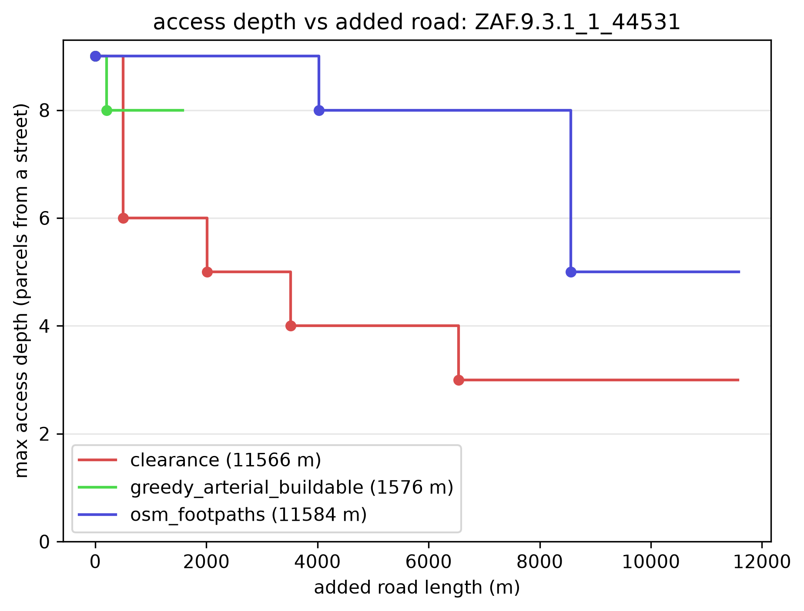

Each method's benefit as cumulative added road grows — the full trade-off whose fixed-depth and matched-budget slices are tabulated in `lens_a_depth.csv` and `lens_b_matched.csv` (this dir). External connectivity (access burden removed), internal connectivity (backup-route redundancy), and displacement (a rising cost):

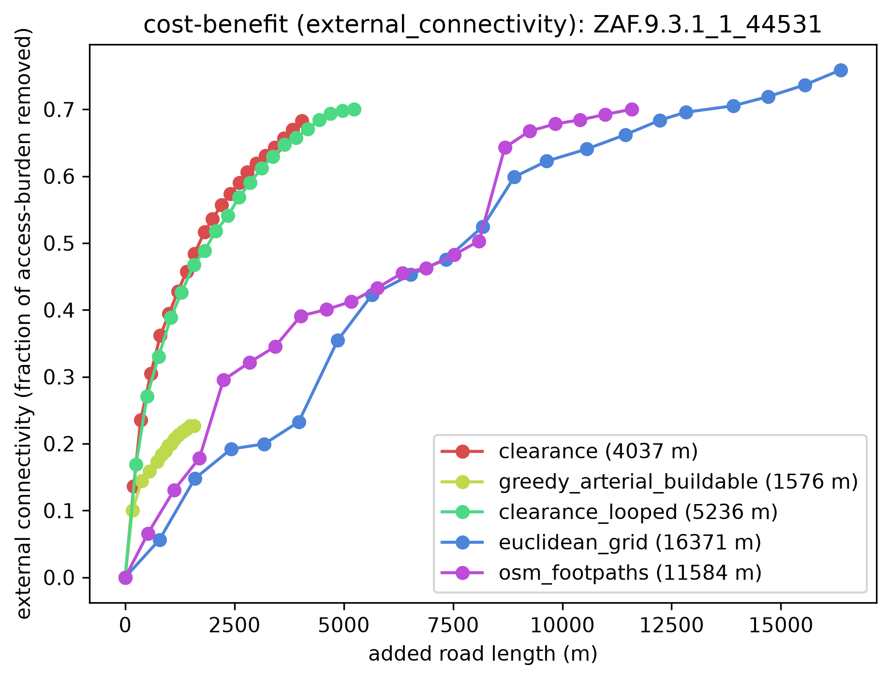

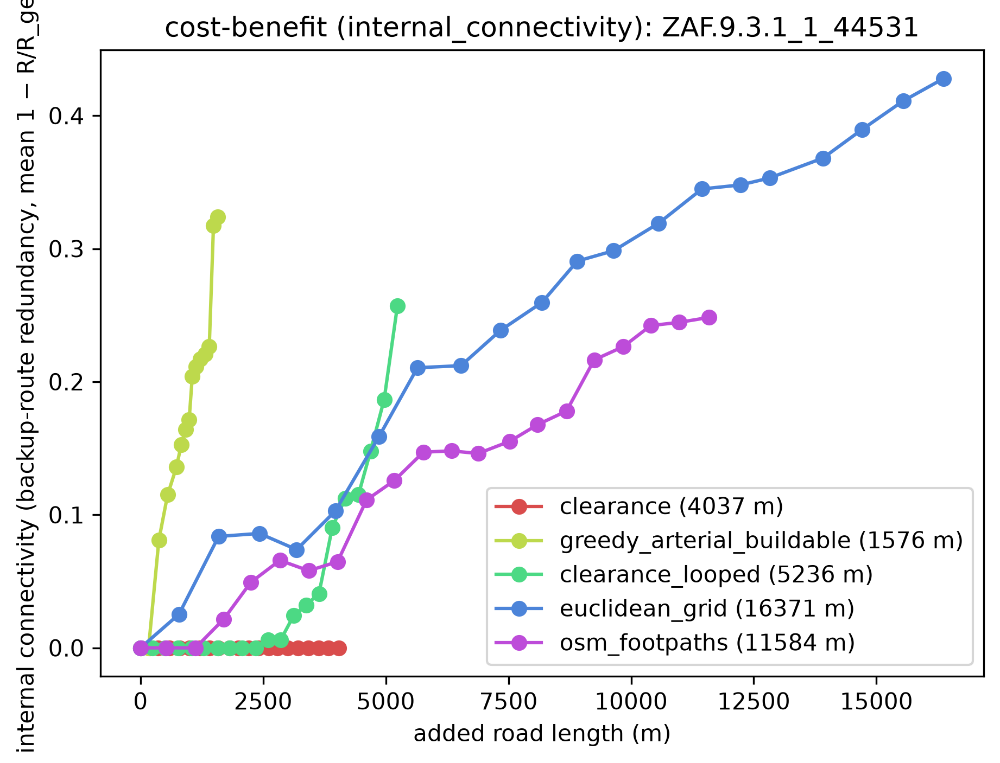

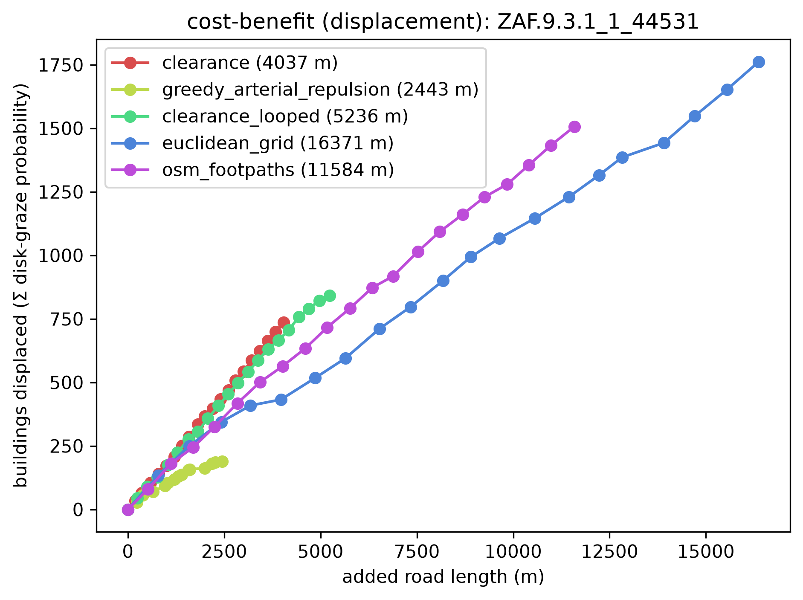

## 4. Each method on the ground

The same region on the same access-depth colour scale (blue = at a street, red = deep) with displaced buildings marked — so the maps are directly comparable across methods.

**Watch each method reblock** — its full road set added in drainage order, the deep interior draining as the network reaches in:

| clearance | greedy_arterial_buildable | osm_footpaths |
|---|---|---|
| 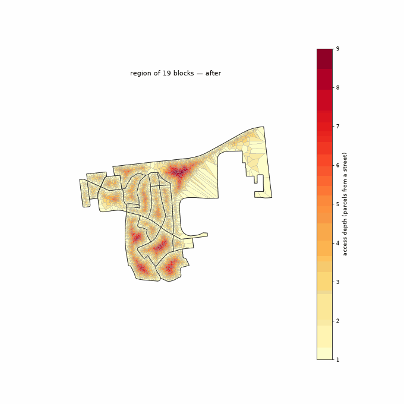 |  |  |

**Matched road budget** — every method truncated to the same total added road, so this compares the access each *buys for the same cost*:

| clearance | greedy_arterial_buildable | osm_footpaths |
|---|---|---|
| 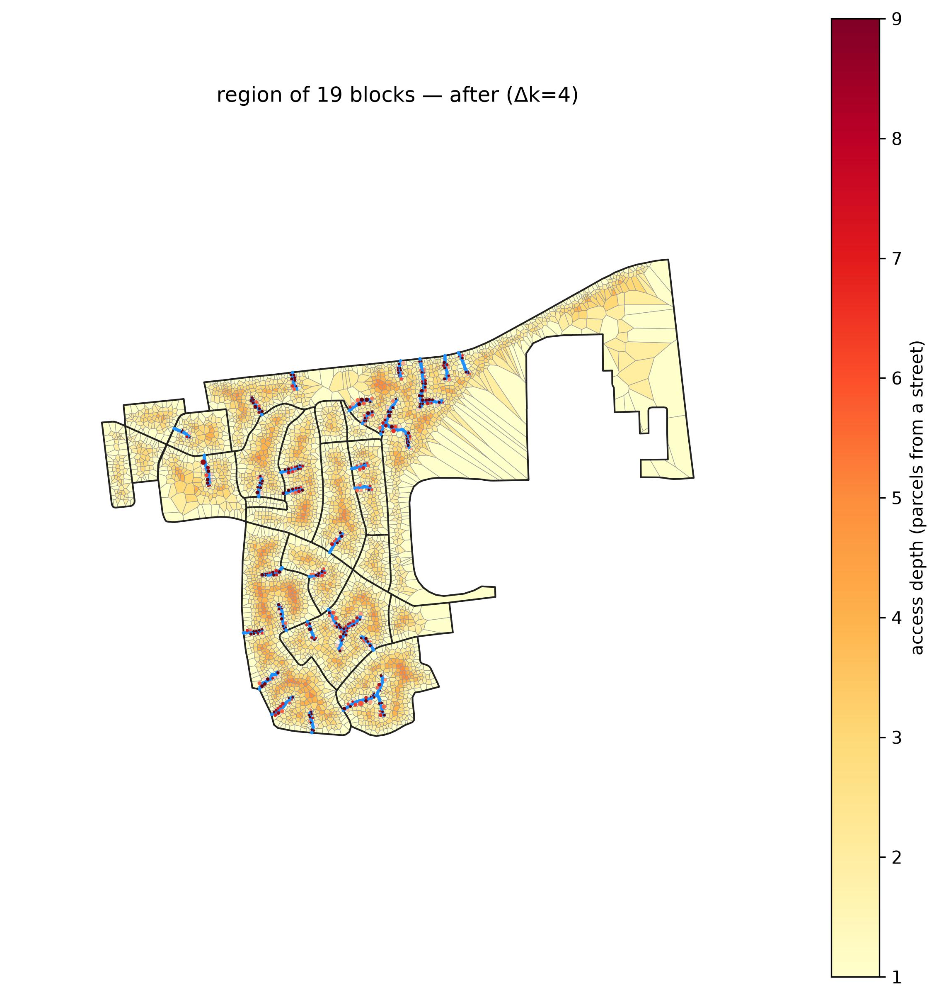 |  | 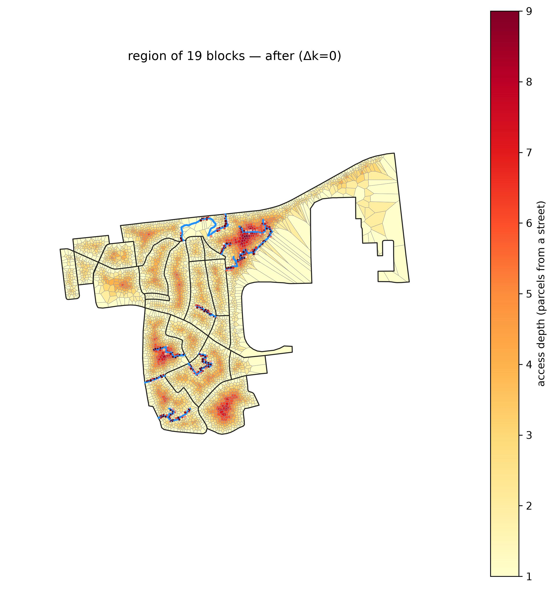 |

**Matched access target** — every method truncated where access-depth reaches the target, so this compares the *road each takes* for the same outcome:

| clearance | greedy_arterial_buildable | osm_footpaths |
|---|---|---|
| 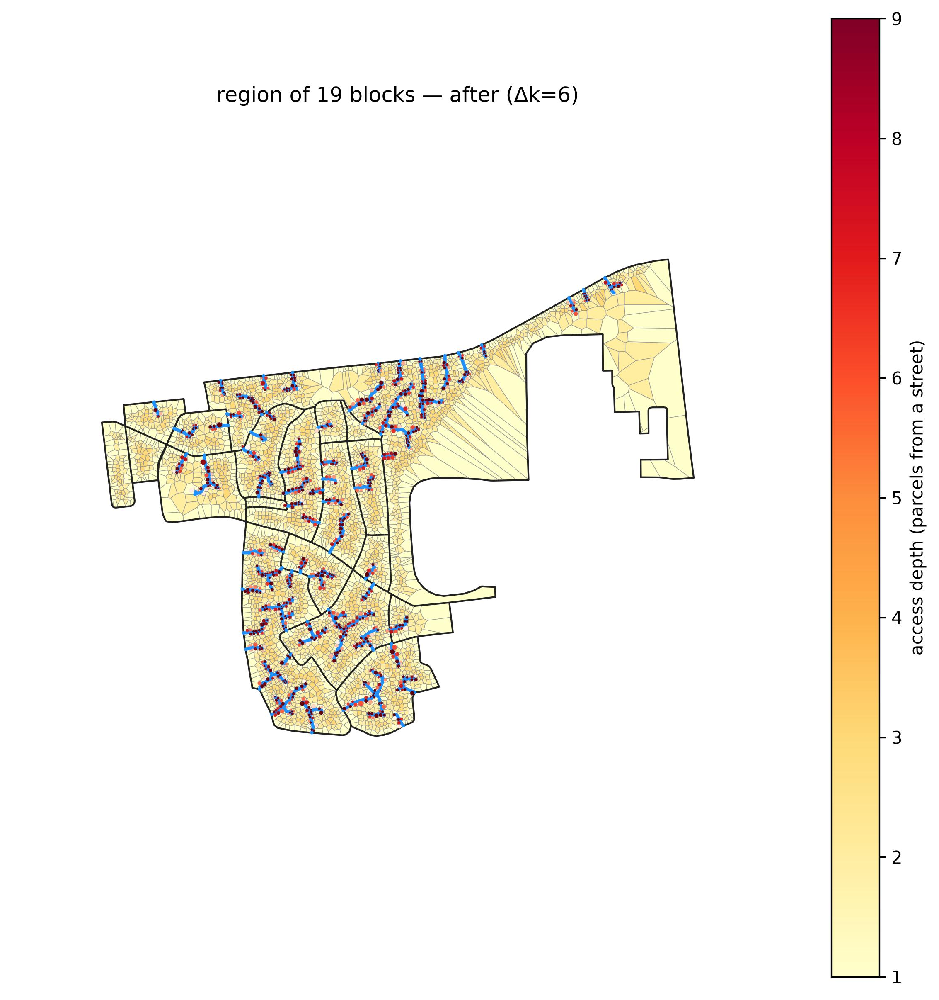 | 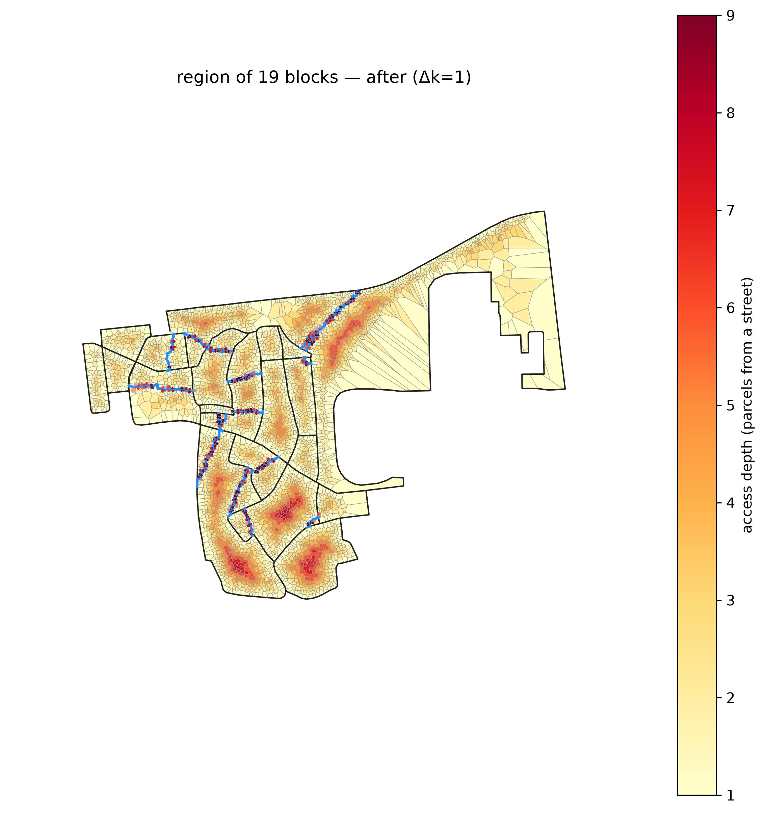 | 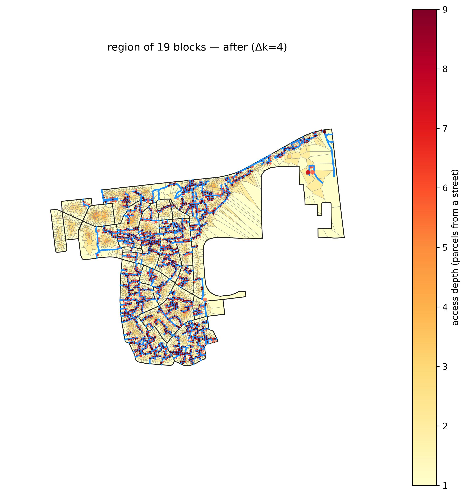 |

