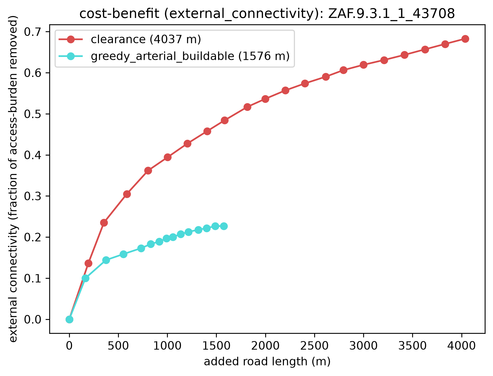
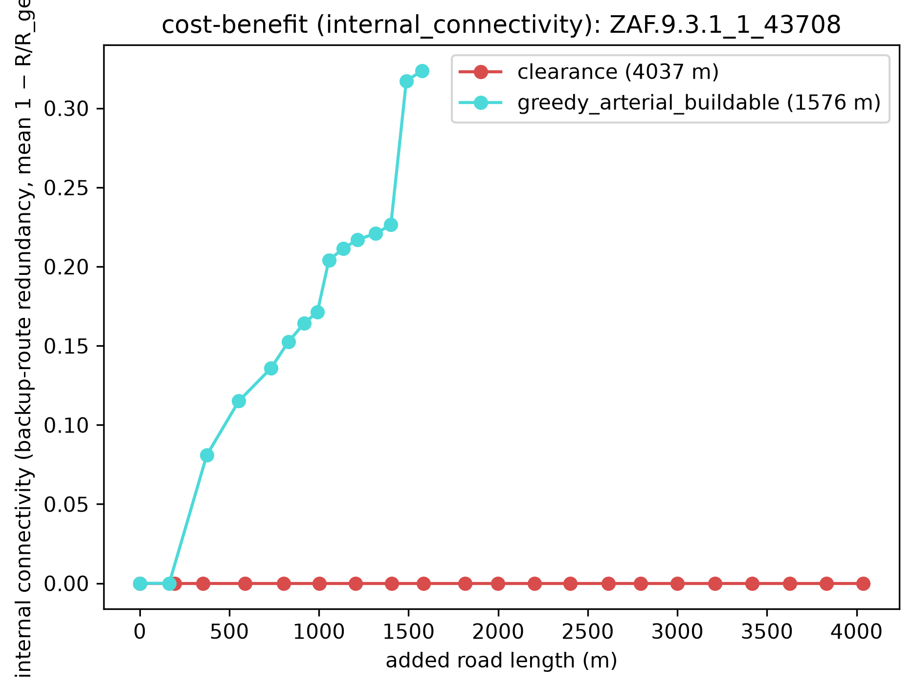
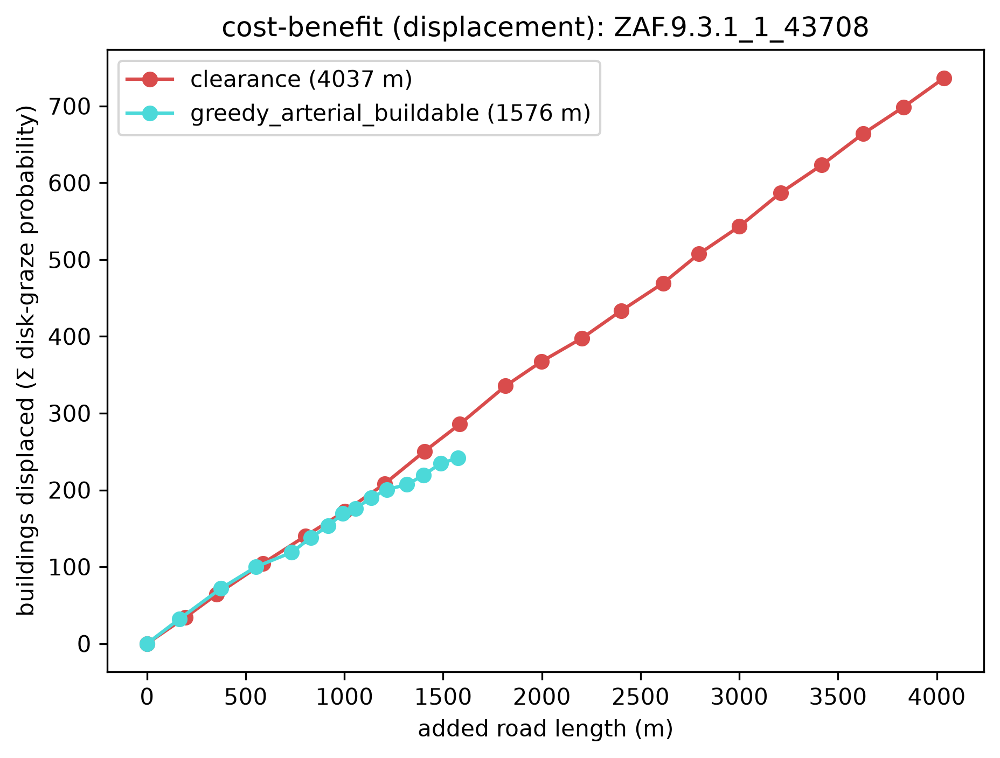

# Multiblock, screened by `density_compactness`

*Dense and compact from geometry alone — the tightest, most built-up blocks by building count per perimeter², found without ever peeling a single parcel ring.*

**Metric:** `density × compactness = n/P²  —  dense, compact fabric (no peel)` — one metric drives the screen, region growth, and colouring end to end.

## 1. Screen the metro

`density_compactness` flagged **8,293 of 83,192** blocks. Top-scoring: `ZAF.9.3.1_1_44531` (peel depth 4).

**Location:** [see the grown region on Google Maps](https://www.google.com/maps/@-34.01690,18.58833,16z).

## 2. Grow the region

The metric grows a **19-block** region (**4,677 parcels**), mean depth 5.1 rings, mean density 142 bldg/ha.

## 3. The method frontier (benefit vs added road)

Each method's benefit as cumulative added road grows — the full trade-off whose fixed-depth and matched-budget slices are tabulated in `lens_a_depth.csv` and `lens_b_matched.csv` (this dir). External connectivity (access burden removed), internal connectivity (backup-route redundancy), and displacement (a rising cost):

