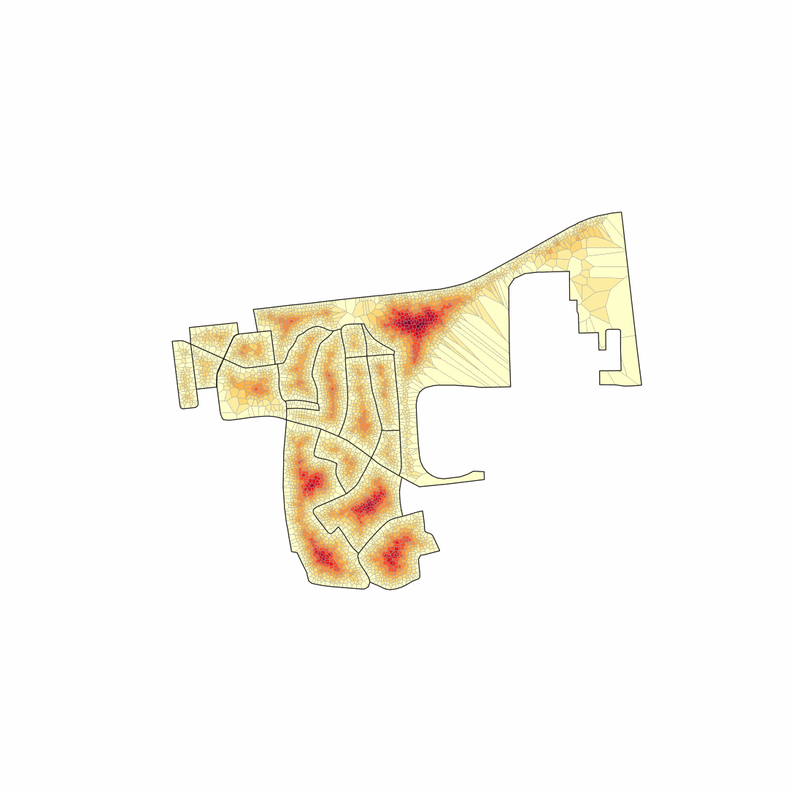
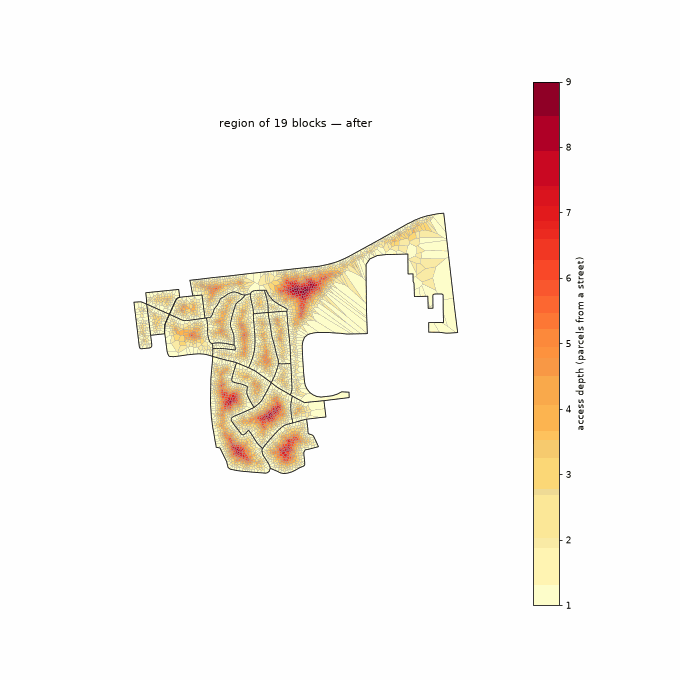
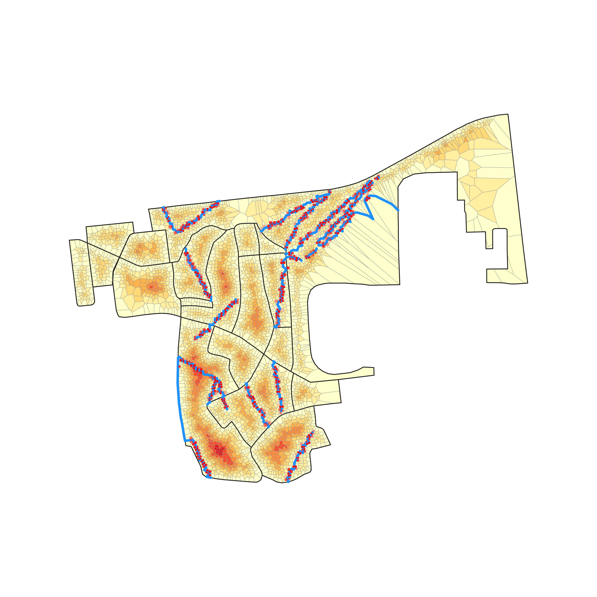
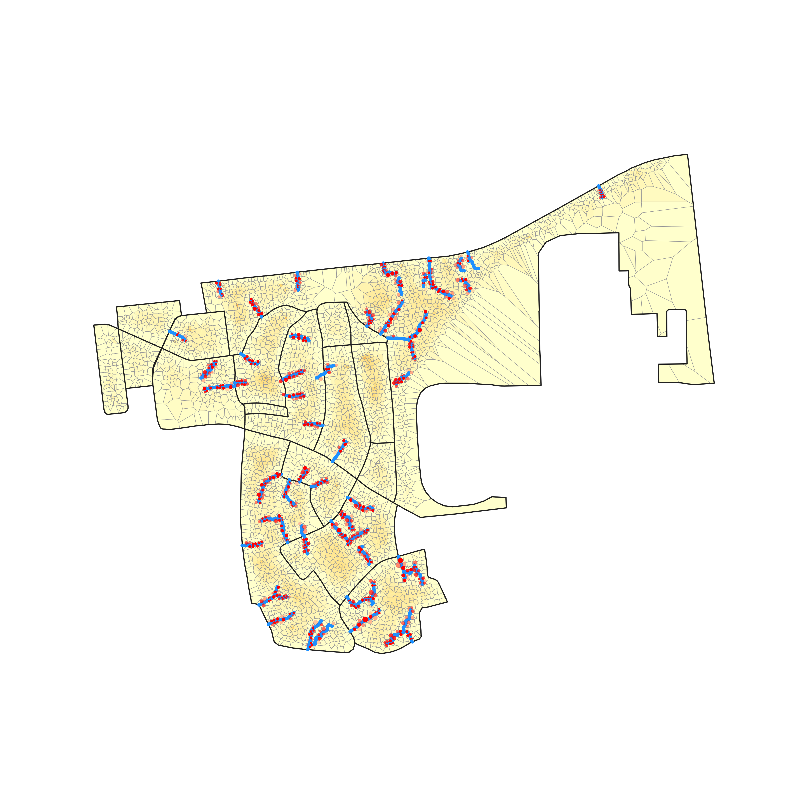
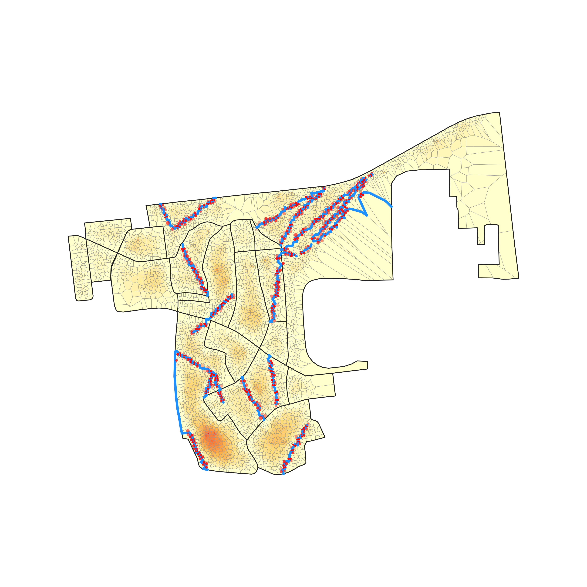
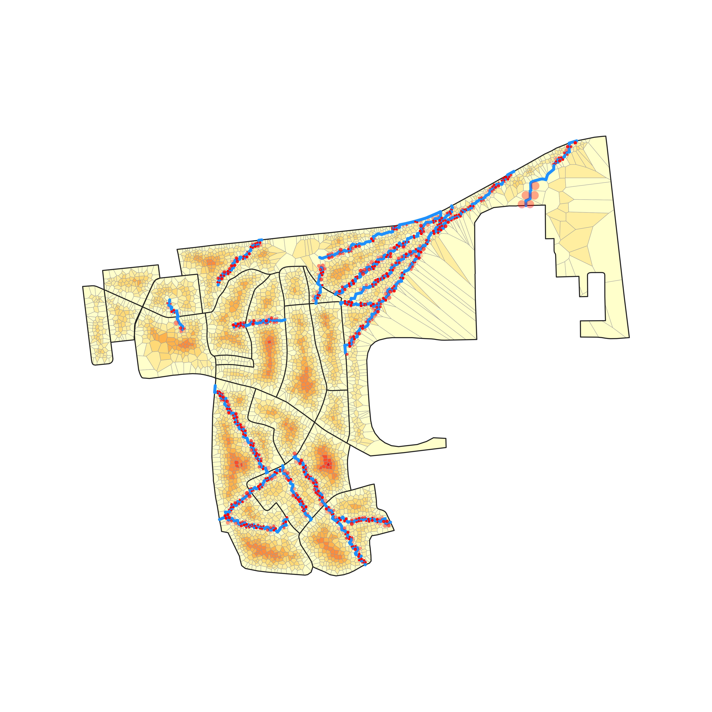
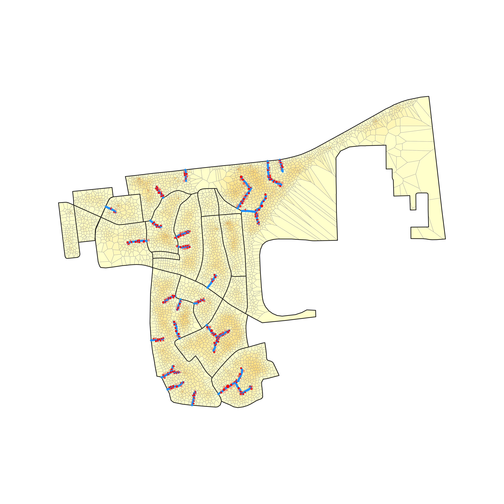
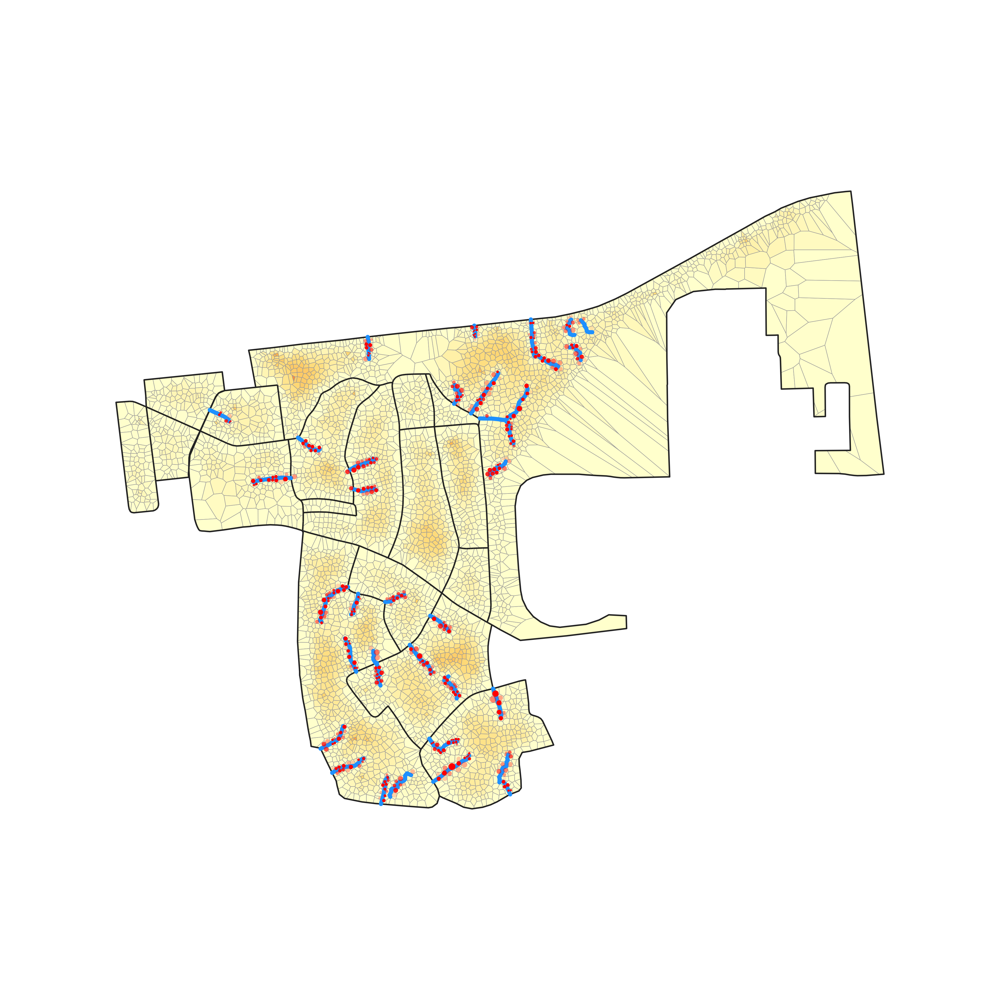
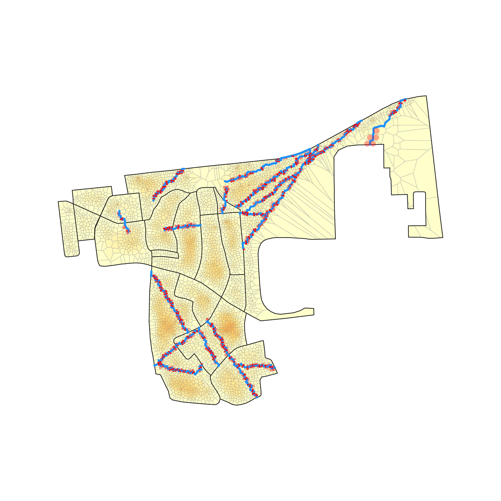

# Multiblock, screened by `density_compactness`

*Dense and compact from geometry alone — the tightest, most built-up blocks by building count per perimeter², found without ever peeling a single parcel ring.*

**Metric:** `density × compactness = n/P²  —  dense, compact fabric (no peel)` — one metric drives the screen, region growth, and colouring end to end.

## 1. Screen the metro

`density_compactness` flagged **2,865 of 83,192** blocks. Top-scoring: `ZAF.9.3.1_1_44531` (peel depth 4).


**Location:** [see the grown region on Google Maps](https://www.google.com/maps/@-34.01690,18.58833,16z).


<a href="https://www.google.com/maps/@-34.01690,18.58833,16z"></a>

## 2. Grow the region

The metric grows a **18-block** region (**4,615 parcels**), mean depth 5.1 rings, mean density 146 bldg/ha.


## 3. The permeability frontier (benefit vs added road)

The frontier is the whole trade-off: **permeability** (benefit — the only benefit axis) on the y-axis against **displacement** (cost — the only cost axis) on the x-axis, one line per method. Pareto-dominance — which method buys more permeability for less displacement — reads straight off it (raw per-method samples are in `frontier_permeability.csv`, this dir):


**Before any road is added**, the same region in both colorings: access-depth (blue = at a street, red = deep interior) vs permeability potential (dark = hard to escape, light = easy):

| access-depth | permeability potential |
|---|---|
|  |  |

## 4. Each method on the ground

**Watch each method reblock** — its full road set added in drainage order, the deep interior draining as the network reaches in:

| Looped Tree | Looped Tree (cheap loops) | Desire-Line Tree | Plain Tree | Looped Plain Tree | Grid | Worn Paths | Throughways | OSM Footpaths |
|---|---|---|---|---|---|---|---|---|
|  |  |  |  |  |  |  |  |  |

### Matched displacement

Every method truncated to the same displacement %, so this compares the **permeability each buys for the same home-cost**:

| Method | Road | Displacement | Permeability | Note |
|---|---|---|---|---|
| Looped Tree (cheap loops) | 2,698 m | 10.1% | 74.6% |  |
| Looped Tree | 2,750 m | 10.1% | 74.3% |  |
| Desire-Line Tree | 2,830 m | 10.1% | 73.6% |  |
| Plain Tree | 2,433 m | 10.1% | 72.7% |  |
| Looped Plain Tree | 2,442 m | 10.0% | 71.7% |  |
| Grid | 3,945 m | 10.1% | 61.9% |  |
| Worn Paths | 2,976 m | 10.0% | 67.2% |  |
| Throughways | 3,158 m | 10.0% | 54.9% |  |
| OSM Footpaths | 3,196 m | 10.0% | 66.5% |  |

Access-depth coloring:

| Looped Tree (cheap loops) | Looped Tree | Desire-Line Tree | Plain Tree | Looped Plain Tree | Grid | Worn Paths | Throughways | OSM Footpaths |
|---|---|---|---|---|---|---|---|---|
|  |  |  |  |  |  |  |  |  |

Permeability-potential coloring:

| Looped Tree (cheap loops) | Looped Tree | Desire-Line Tree | Plain Tree | Looped Plain Tree | Grid | Worn Paths | Throughways | OSM Footpaths |
|---|---|---|---|---|---|---|---|---|
|  |  |  |  |  |  |  |  |  |

### Matched permeability

Every method truncated where permeability first reaches the standard target, so this compares the **displacement each spends** for the same permeability outcome:

| Method | Road | Displacement | Permeability | Note |
|---|---|---|---|---|
| Looped Tree (cheap loops) | 1,434 m | 5.5% | 60.2% |  |
| Looped Tree | 1,474 m | 5.6% | 60.3% |  |
| Desire-Line Tree | 1,788 m | 6.2% | 60.9% |  |
| Plain Tree | 1,401 m | 5.6% | 60.8% |  |
| Looped Plain Tree | 1,549 m | 6.3% | 60.3% |  |
| Grid | 3,678 m | 9.3% | 60.4% |  |
| Worn Paths | 2,403 m | 7.9% | 60.1% |  |
| Throughways | 3,809 m | 11.8% | 60.5% |  |
| OSM Footpaths | 2,460 m | 7.8% | 60.6% |  |

Access-depth coloring:

| Looped Tree (cheap loops) | Looped Tree | Desire-Line Tree | Plain Tree | Looped Plain Tree | Grid | Worn Paths | Throughways | OSM Footpaths |
|---|---|---|---|---|---|---|---|---|
|  |  |  |  |  |  |  |  |  |

Permeability-potential coloring:

| Looped Tree (cheap loops) | Looped Tree | Desire-Line Tree | Plain Tree | Looped Plain Tree | Grid | Worn Paths | Throughways | OSM Footpaths |
|---|---|---|---|---|---|---|---|---|
|  |  |  |  |  |  |  |  |  |


## How this was generated

This example is machine-generated — one self-logging command emits the data, maps, curves, and this README:

```bash
pixi run python -m scripts.gen_multiblock_example density_compactness
```
The full run log is in [`run.log`](run.log).

