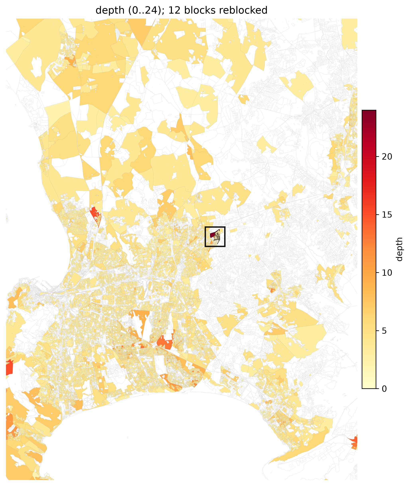
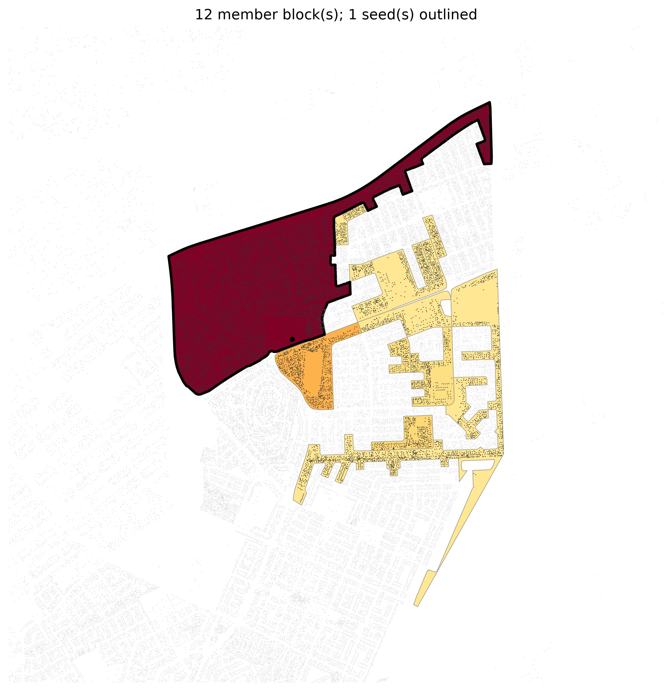

# Multiblock, screened by `depth`

*The deepest street-access fabric: how many parcels a home sits from a street, regardless of crowding.*

**Metric:** `depth = √(n·A)/P  →  true peel rings from a street` — one metric drives the screen, region growth, and colouring end to end.

## 1. Screen the metro

`depth` flagged **13,793 of 83,192** blocks. Top-scoring: `ZAF.9.3.1_1_5810` (peel depth 24).

## 2. Grow the region

The metric grows a **12-block** region (**11,006 parcels**), mean depth 6.4 rings, mean density 99 bldg/ha.

## 3. Compare the methods (two lenses)

**Lens A — every parcel to the depth target:**

| method | target_depth | reached | reached_depth | road_length_m | displacement | pct_displaced | propose_seconds |
|---|---|---|---|---|---|---|---|
| clearance | 3 | True | 3 | 13903.4 | 1647.4 | 0.1498 | 5.4 |
| greedy_arterial_buildable | 3 | False | 14 | 8078.0 | 647.7 | 0.0589 | 72.1 |

**Lens B — matched road budget:**

| method | budget_m | external_connectivity | internal_connectivity | displacement | pct_displaced |
|---|---|---|---|---|---|
| clearance | 8078.0 | 0.925238 | 1.85974e-14 | 892.0 | 0.0811 |
| greedy_arterial_buildable | 8078.0 | 0.806889 | 0.438818 | 647.7 | 0.0589 |

