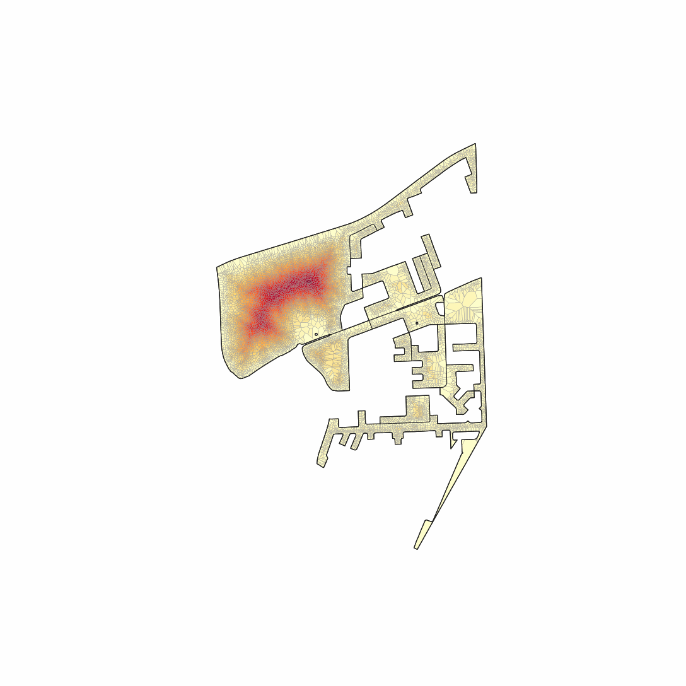
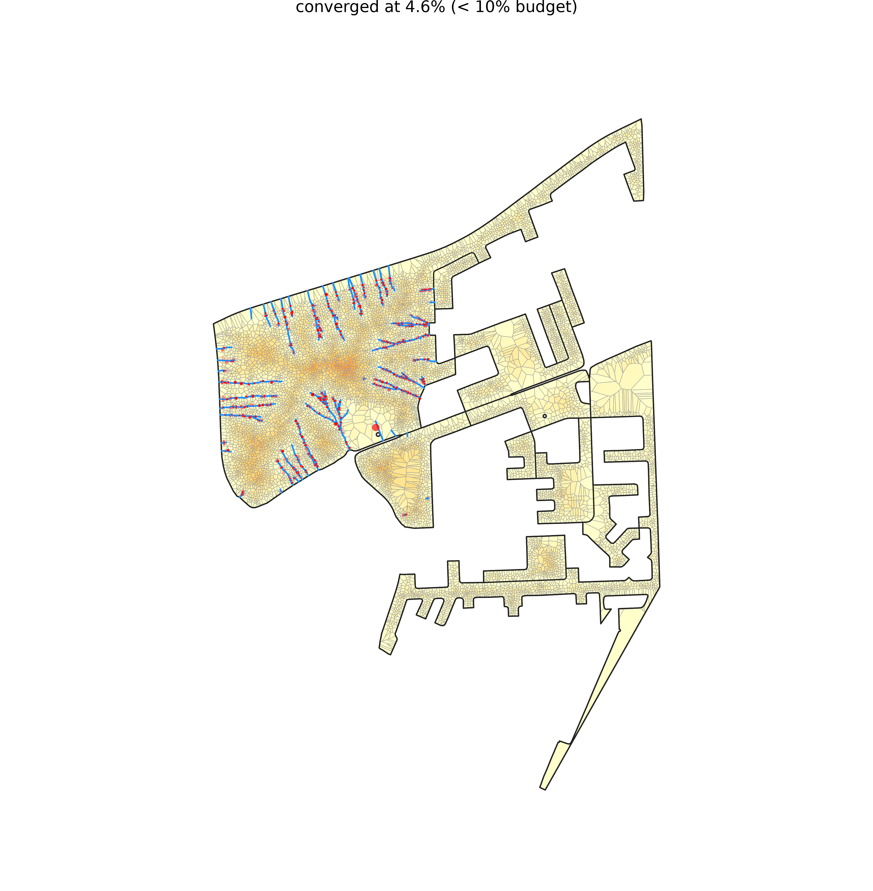
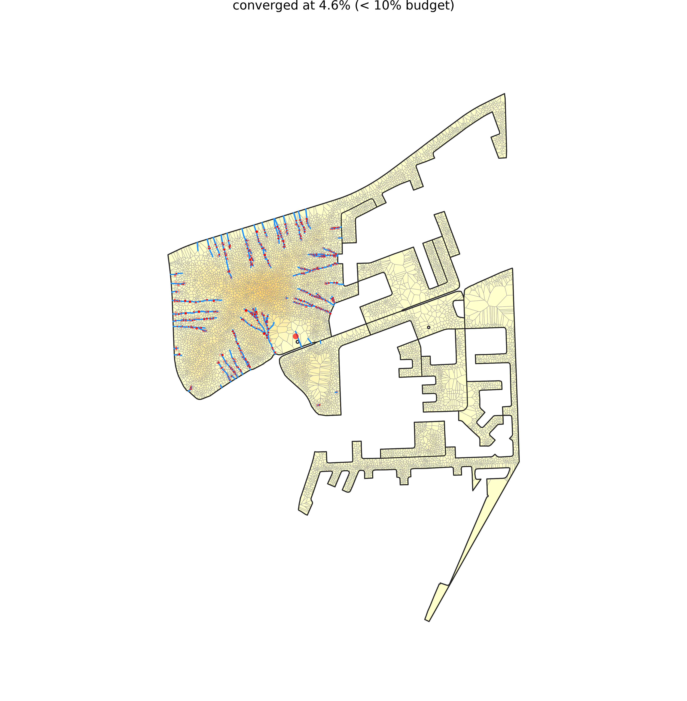

# Multiblock, screened by `depth`

*The deepest street-access fabric: how many parcels a home sits from a street, regardless of crowding.*

**Metric:** `depth = √(n·A)/P  →  true peel rings from a street` — one metric drives the screen, region growth, and colouring end to end.

## 1. Screen the metro

`depth` flagged **13,793 of 83,192** blocks. Top-scoring: `ZAF.9.3.1_1_5810` (peel depth 24).


**Location:** [see the grown region on Google Maps](https://www.google.com/maps/@-33.84562,18.74451,15z).


<a href="https://www.google.com/maps/@-33.84562,18.74451,15z"></a>

## 2. Grow the region

The metric grows a **12-block** region (**11,006 parcels**), mean depth 6.4 rings, mean density 99 bldg/ha.


## 3. The permeability frontier (benefit vs added road)

The frontier is the whole trade-off: **permeability** (benefit — the only benefit axis) on the y-axis against **displacement** (cost — the only cost axis) on the x-axis, one line per method. Pareto-dominance — which method buys more permeability for less displacement — reads straight off it (raw per-method samples are in `frontier_permeability.csv`, this dir):


**Before any road is added**, the same region in both colorings: access-depth (blue = at a street, red = deep interior) vs permeability potential (dark = hard to escape, light = easy):

| access-depth | permeability potential |
|---|---|
|  |  |

## 4. Each method on the ground

**Watch each method reblock** — its full road set added in drainage order, the deep interior draining as the network reaches in:

| Looped Tree | Grid | Worn Paths | Throughways | OSM Footpaths | Direct Objective (LP) |
|---|---|---|---|---|---|
|  |  |  |  |  |  |

### Matched displacement

Every method truncated to the same displacement %, so this compares the **permeability each buys for the same home-cost**:

| Method | Road | Displacement | Permeability | Note |
|---|---|---|---|---|
| Looped Tree | 9,878 m | 10.1% | 78.3% |  |
| Grid | 12,194 m | 10.2% | 87.8% |  |
| Worn Paths | 5,635 m | 4.6% | 82.2% | converged below budget |
| Throughways | 11,437 m | 5.7% | 72.3% | converged below budget |
| OSM Footpaths | 7,674 m | 3.5% | 20.5% | converged below budget |
| Direct Objective (LP) | 42,937 m | 10.0% | 95.5% |  |

Access-depth coloring:

| Looped Tree | Grid | Worn Paths | Throughways | OSM Footpaths | Direct Objective (LP) |
|---|---|---|---|---|---|
|  |  |  |  |  |  |

Permeability-potential coloring:

| Looped Tree | Grid | Worn Paths | Throughways | OSM Footpaths | Direct Objective (LP) |
|---|---|---|---|---|---|
|  |  |  |  |  |  |

### Matched permeability

Every method truncated where permeability first reaches the standard target, so this compares the **displacement each spends** for the same permeability outcome:

| Method | Road | Displacement | Permeability | Note |
|---|---|---|---|---|
| Looped Tree | 2,804 m | 2.5% | 60.1% |  |
| Grid | 3,163 m | 2.8% | 61.6% |  |
| Worn Paths | 2,088 m | 1.7% | 60.2% |  |
| Throughways | 3,589 m | 2.7% | 60.1% |  |
| OSM Footpaths | 7,674 m | 3.5% | 20.5% | unreached |
| Direct Objective (LP) | 1,951 m | 0.7% | 60.3% |  |

Access-depth coloring:

| Looped Tree | Grid | Worn Paths | Throughways | OSM Footpaths | Direct Objective (LP) |
|---|---|---|---|---|---|
|  |  |  |  |  |  |

Permeability-potential coloring:

| Looped Tree | Grid | Worn Paths | Throughways | OSM Footpaths | Direct Objective (LP) |
|---|---|---|---|---|---|
|  |  |  |  |  |  |


## How this was generated

This example is machine-generated — one self-logging command emits the data, maps, curves, and this README:

```bash
pixi run python -m scripts.gen_multiblock_example depth
```
The full run log is in [`run.log`](run.log).

