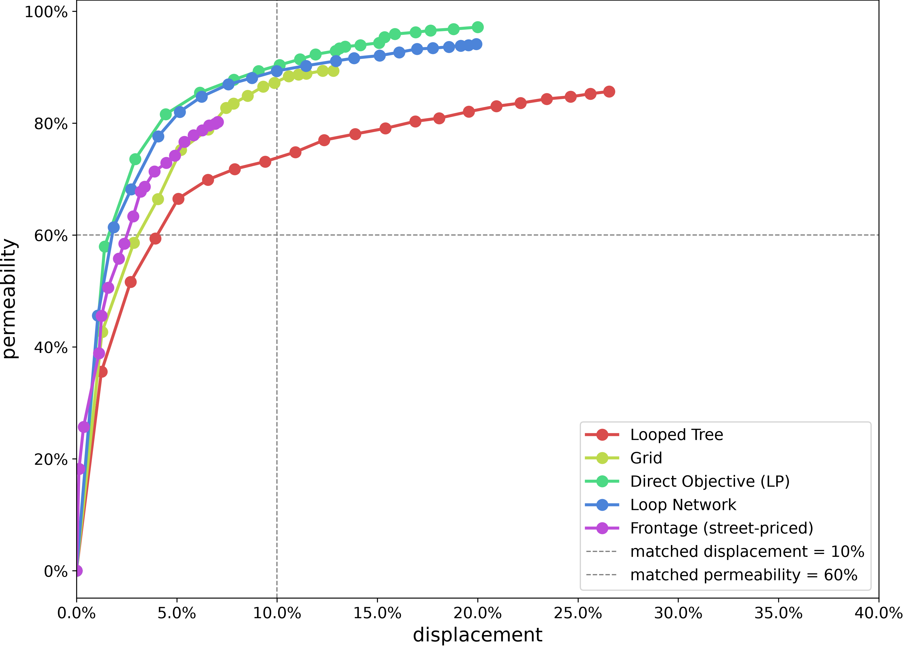
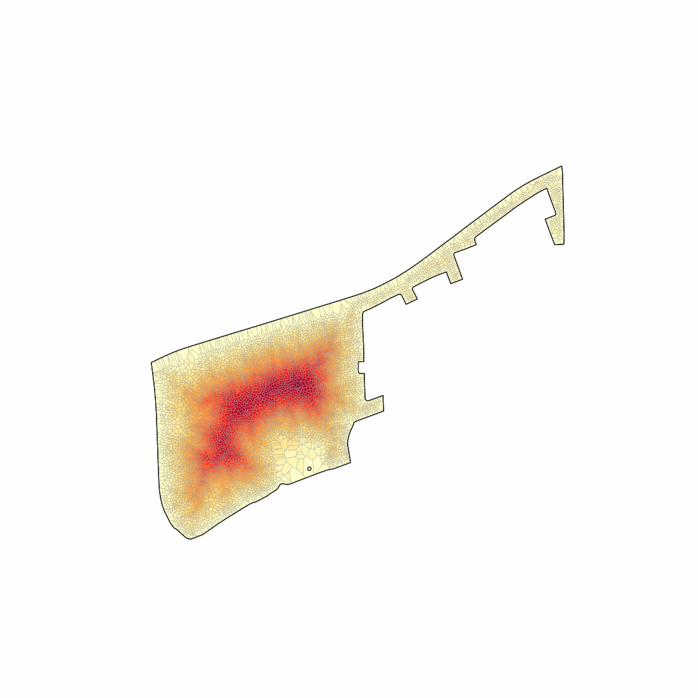
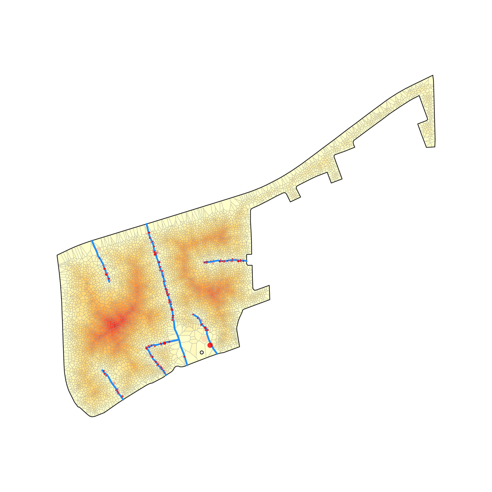
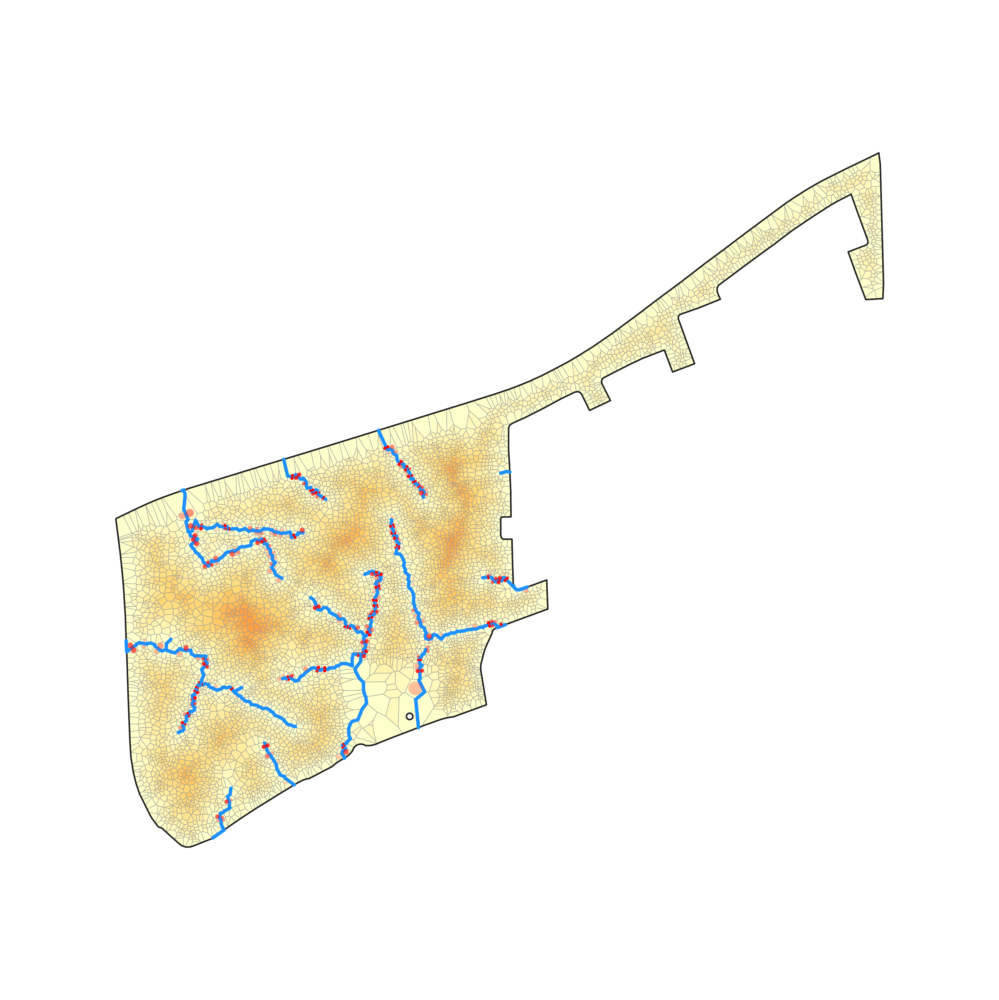
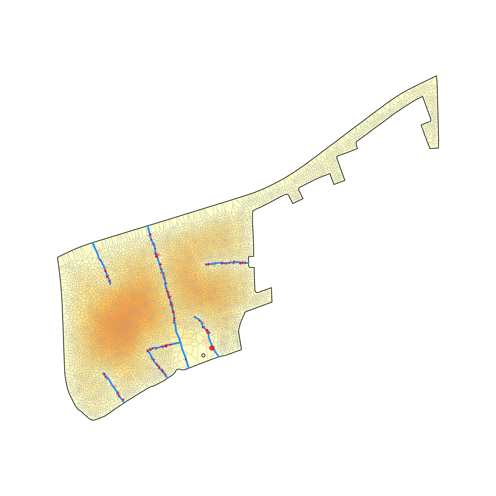
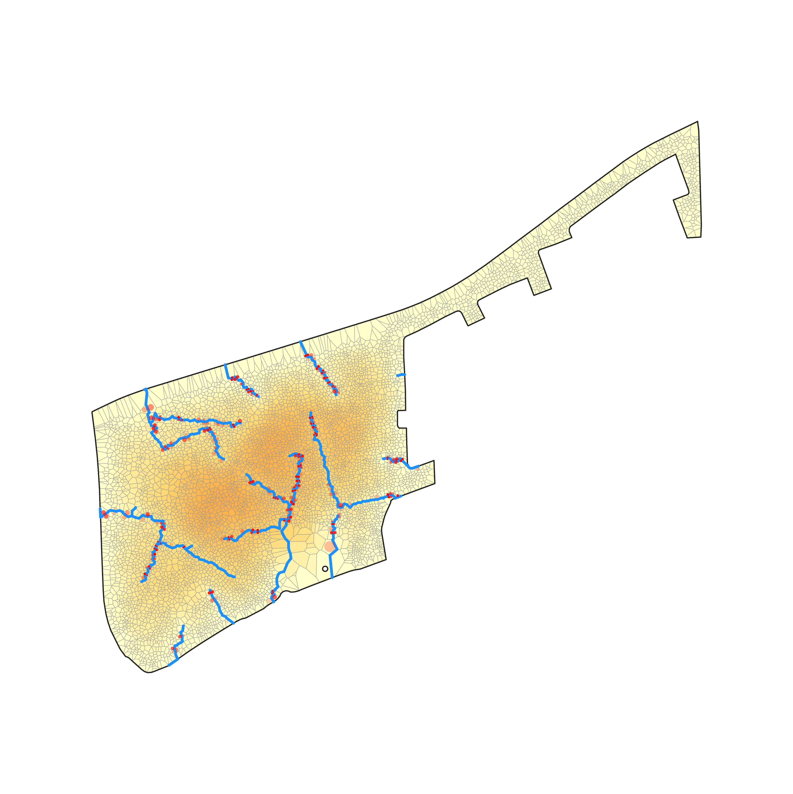
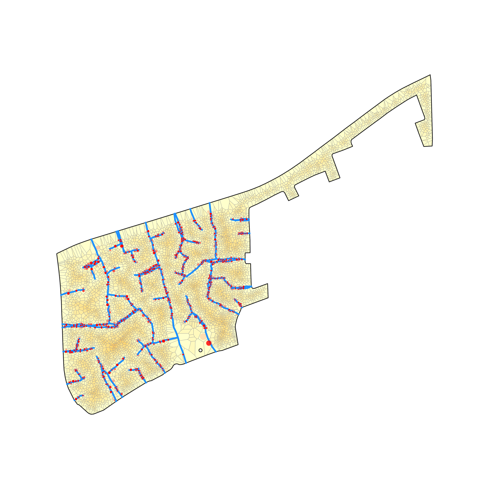
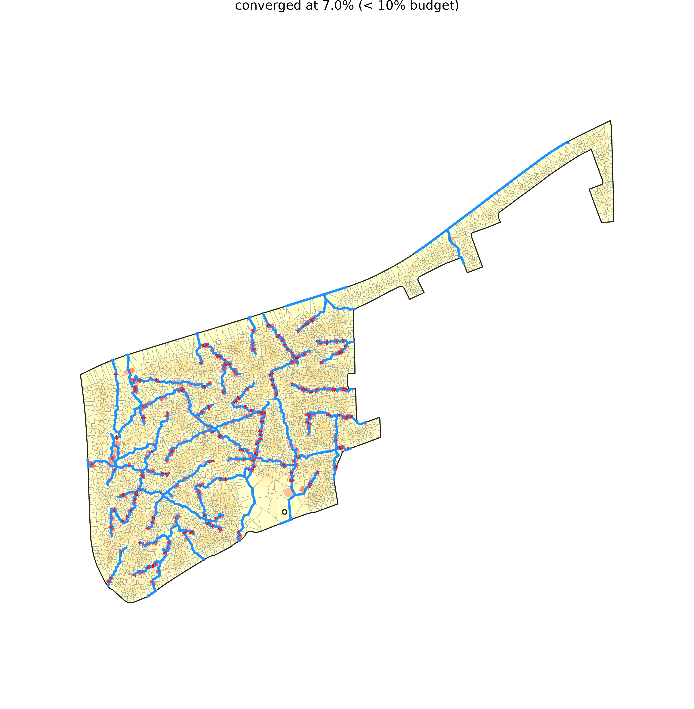
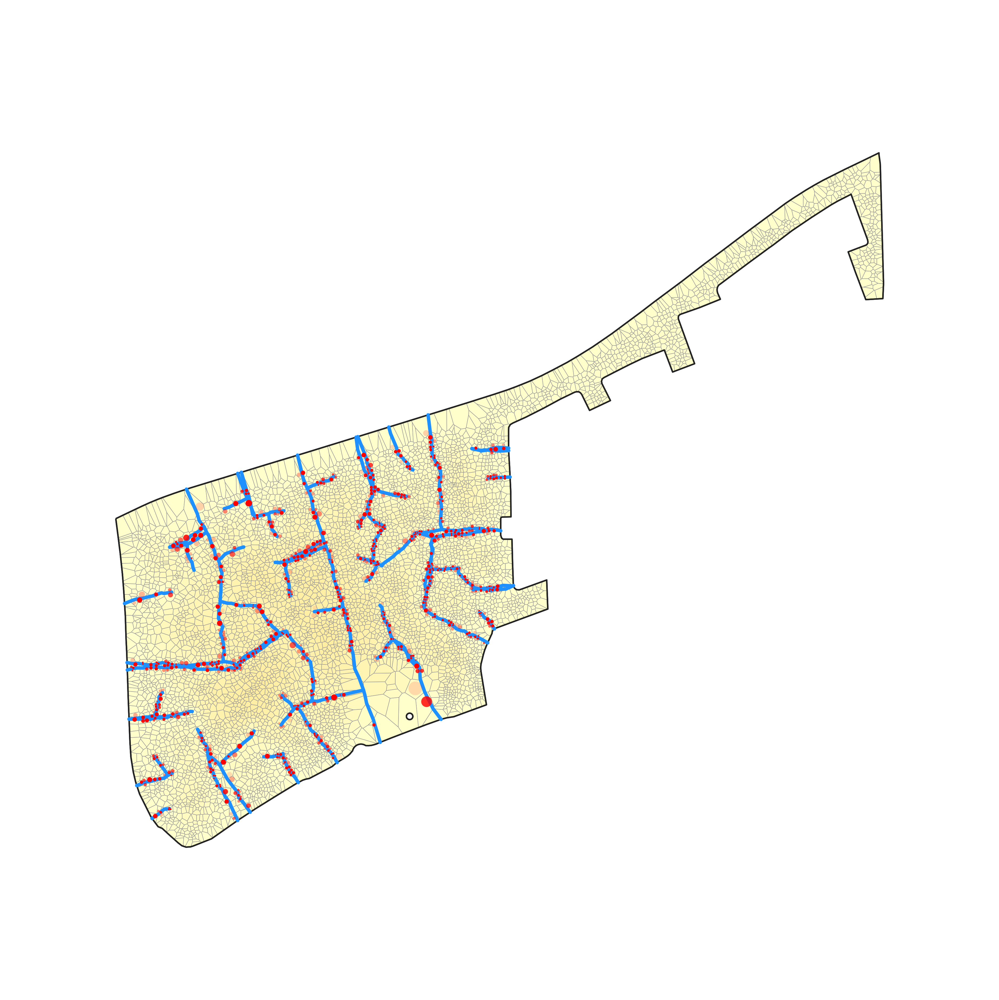
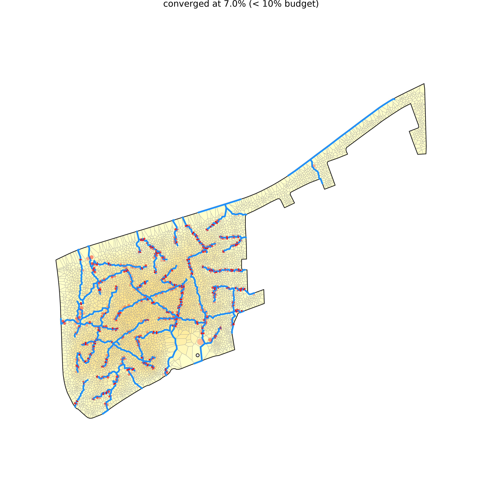

# Multiblock, screened by `depth_density`

*Deep and crowded at once — the metric that isolates the genuine informal settlements and fades the deep-but-sparse blocks.*

**Metric:** `depth × density  —  deep AND crowded` — one metric drives the screen, region growth, and colouring end to end.

## 1. Screen the metro

`depth_density` flagged **1,000 of 83,192** blocks. Top-scoring: `ZAF.9.3.1_1_5810` (peel depth 24).


**Location:** [see the grown region on Google Maps](https://www.google.com/maps/@-33.84091,18.74436,15z).


<a href="https://www.google.com/maps/@-33.84091,18.74436,15z"></a>

## 2. Grow the region

The metric grows a **1-block** region (**6,619 parcels**), mean depth 24.0 rings, mean density 115 bldg/ha.


## 3. The permeability frontier (benefit vs added road)

The frontier is the whole trade-off: **permeability** (benefit — the only benefit axis) on the y-axis against **displacement** (cost — the only cost axis) on the x-axis, one line per method. Pareto-dominance — which method buys more permeability for less displacement — reads straight off it (raw per-method samples are in `frontier_permeability.csv`, this dir):




**Before any road is added**, the same region in both colorings: access-depth (blue = at a street, red = deep interior) vs permeability potential (dark = hard to escape, light = easy):

| access-depth | permeability potential |
|---|---|
|  |  |

## 4. Each method on the ground

**Watch each method reblock** — roads added busiest-first, each preceded by whatever it needs to reach the street, so every frame is a network you could actually build. Every animation stops where its network first reaches the matched-permeability standard, so they end at the same benefit and you can read the disruption each one spent getting there; a method that never reaches it runs to its own full network. The deep interior drains as the network reaches in:

| Looped Tree | Loop Network | Grid | Frontage (street-priced) | Direct Objective (LP) |
|---|---|---|---|---|
|  |  |  |  |  |

### Matched permeability (primary)

Every method truncated where permeability first reaches the standard target, so this compares **what each spends to get there** — in homes displaced and in metres of road. Pinning the benefit and comparing costs is the sounder direction: both costs appear in their own units, so no exchange rate between homes and metres is needed.

| Method | Road | Displacement | Permeability | Note |
|---|---|---|---|---|
| Looped Tree | 2,297 m | 4.2% | 60.3% |  |
| Loop Network | 1,605 m | 1.8% | 61.4% |  |
| Grid | 2,113 m | 4.1% | 66.4% |  |
| Frontage (street-priced) | 3,631 m | 2.6% | 60.7% |  |
| Direct Objective (LP) | 1,866 m | 1.6% | 60.1% |  |


Access-depth coloring:

| Looped Tree | Loop Network | Grid | Frontage (street-priced) | Direct Objective (LP) |
|---|---|---|---|---|
|  |  |  |  |  |

Permeability-potential coloring:

| Looped Tree | Loop Network | Grid | Frontage (street-priced) | Direct Objective (LP) |
|---|---|---|---|---|
|  |  |  |  |  |

### Matched displacement (secondary)

Every method truncated to the same displacement %, so this compares the **permeability each buys for the same home-cost**. This lens budgets homes but **not road length**, and the two are not proportional — a metre through a gap displaces far less than a metre through the dense interior. So read `road_m` beside `permeability`: a method showing a higher number at several times the road length has not been shown to be better, only more expensive. Prefer the matched-permeability lens above, which prices both costs.

| Method | Road | Displacement | Permeability | Note |
|---|---|---|---|---|
| Looped Tree | 5,377 m | 10.0% | 74.2% |  |
| Loop Network | 7,279 m | 10.1% | 89.3% |  |
| Grid | 5,544 m | 10.3% | 87.4% |  |
| Frontage (street-priced) | 9,713 m | 7.0% | 80.2% | converged below budget |
| Direct Objective (LP) | 11,928 m | 10.0% | 90.3% |  |


Access-depth coloring:

| Looped Tree | Loop Network | Grid | Frontage (street-priced) | Direct Objective (LP) |
|---|---|---|---|---|
|  |  |  |  |  |

Permeability-potential coloring:

| Looped Tree | Loop Network | Grid | Frontage (street-priced) | Direct Objective (LP) |
|---|---|---|---|---|
|  |  |  |  |  |


## How this was generated

This example is machine-generated — one self-logging command emits the data, maps, curves, and this README:

```bash
pixi run python -m scripts.gen_example depth_density
```
The full run log is in [`run.log`](run.log).

