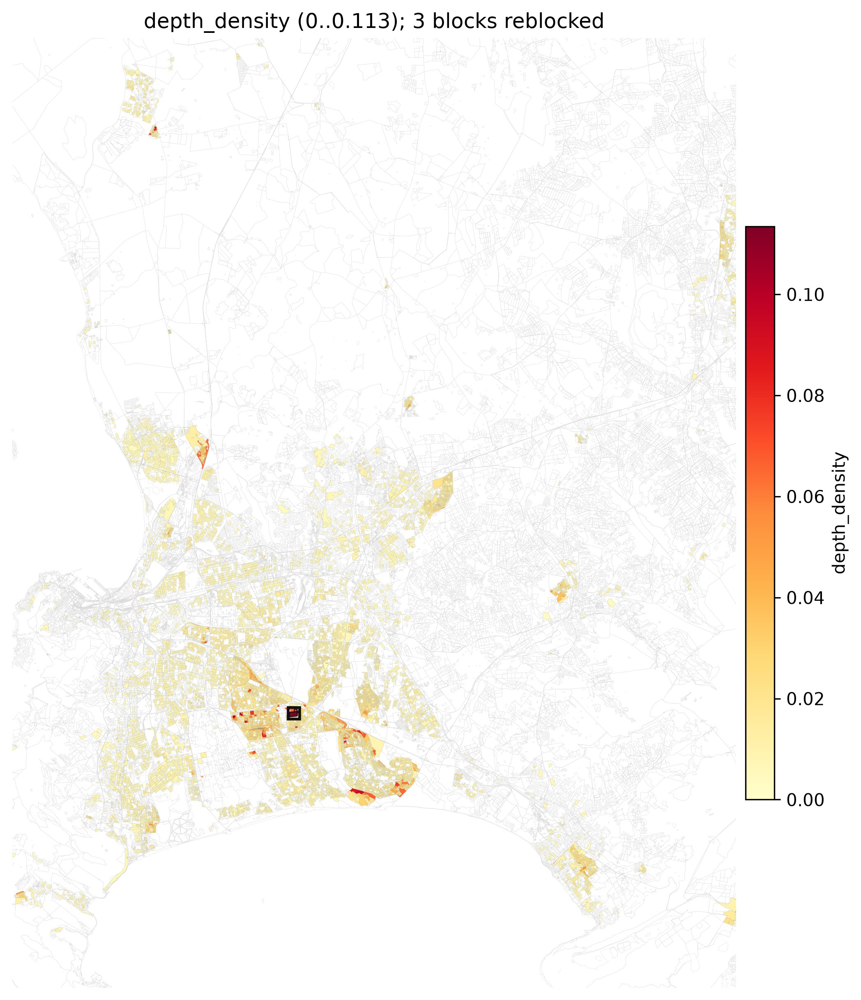
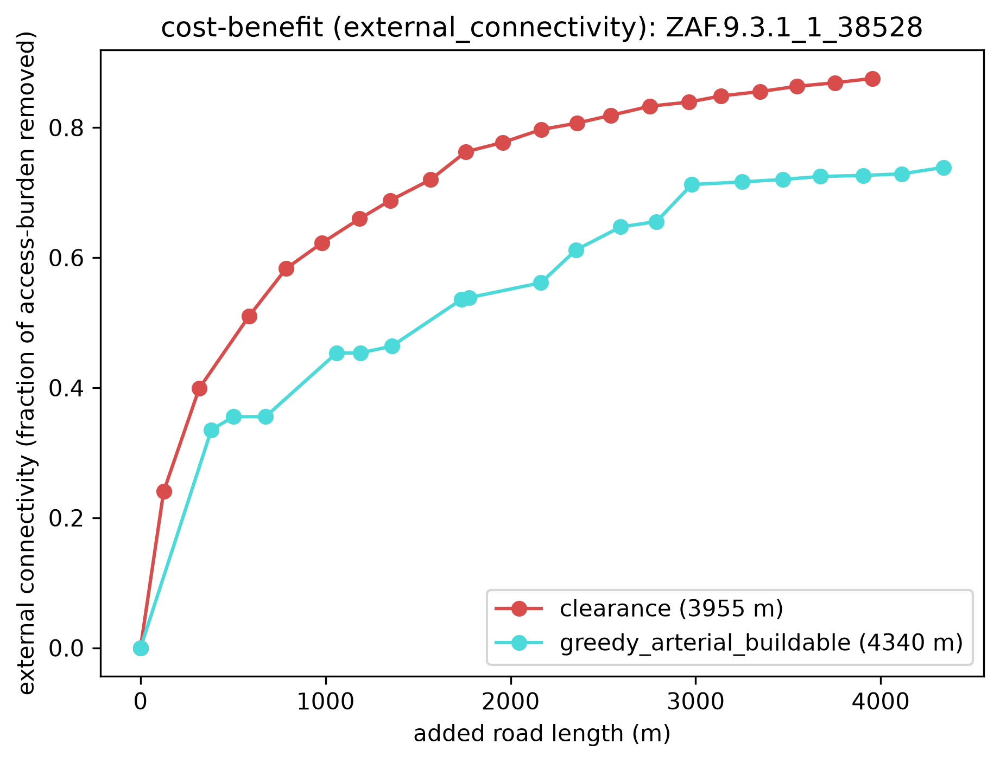
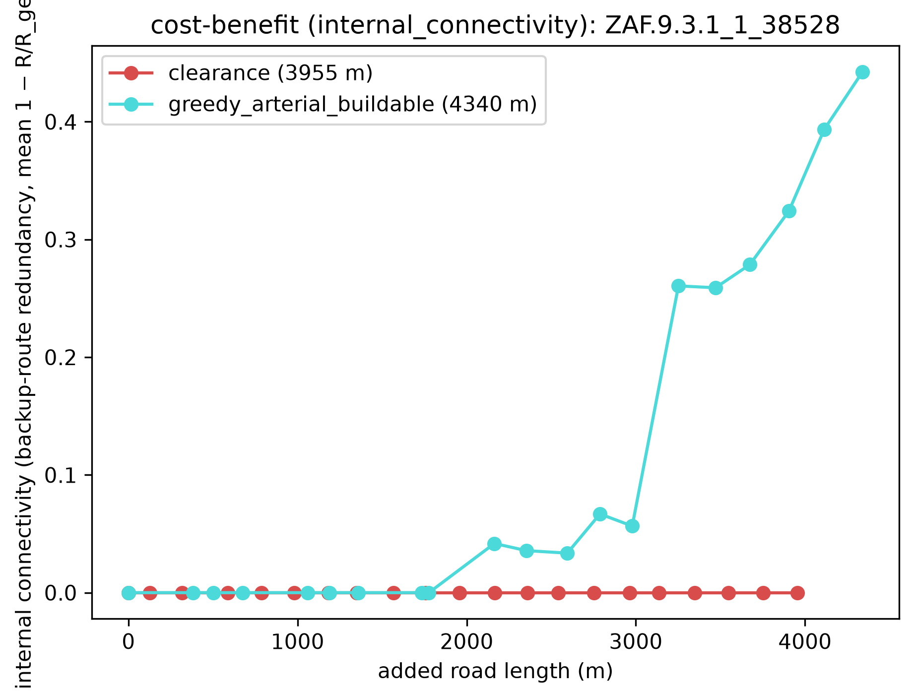
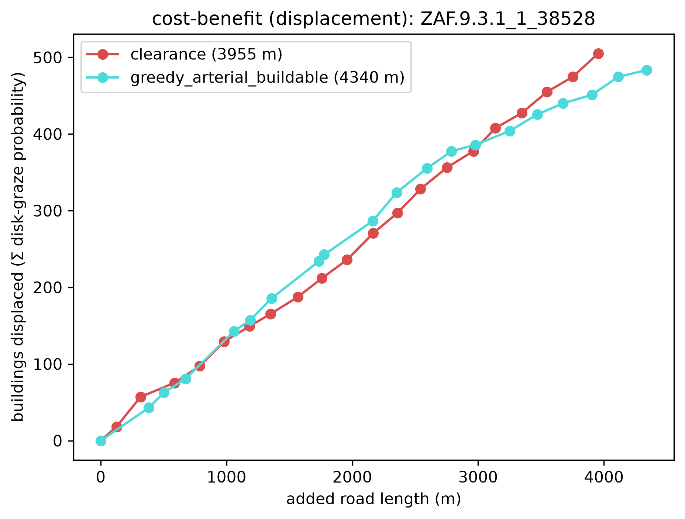

# Multiblock, screened by `depth_density`

*Deep and crowded at once — the metric that isolates the genuine informal settlements and fades the deep-but-sparse blocks.*

**Metric:** `depth × density  —  deep AND crowded` — one metric drives the screen, region growth, and colouring end to end.

## 1. Screen the metro

`depth_density` flagged **13,822 of 83,192** blocks. Top-scoring: `ZAF.9.3.1_1_38528` (peel depth 13).

**Location:** [see the grown region on Google Maps](https://www.google.com/maps/@-34.00410,18.61263,17z).

## 2. Grow the region

The metric grows a **3-block** region (**2,690 parcels**), mean depth 8.7 rings, mean density 117 bldg/ha.

## 3. The method frontier (benefit vs added road)

Each method's benefit as cumulative added road grows — the full trade-off whose fixed-depth and matched-budget slices are tabulated in `lens_a_depth.csv` and `lens_b_matched.csv` (this dir). External connectivity (access burden removed), internal connectivity (backup-route redundancy), and displacement (a rising cost):

