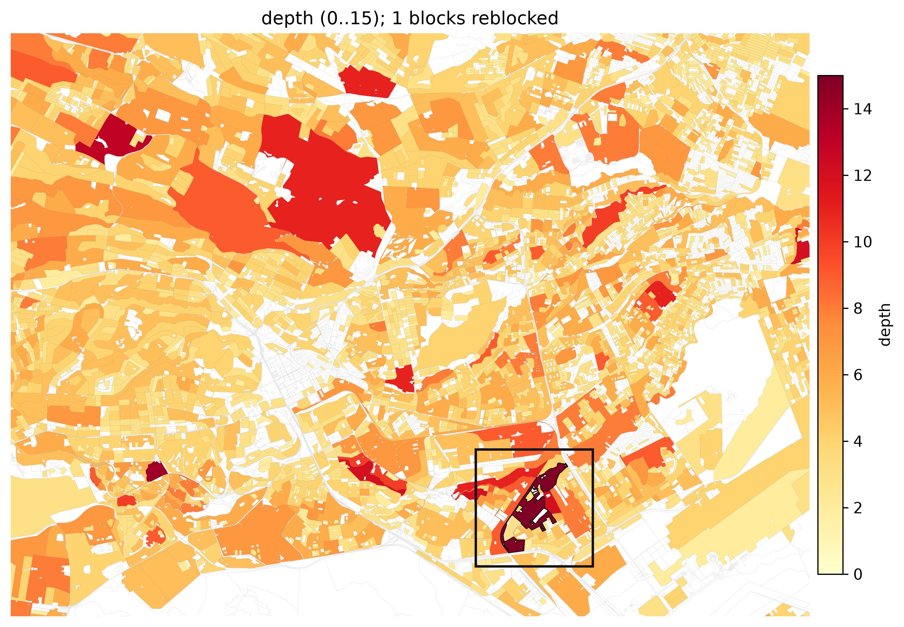
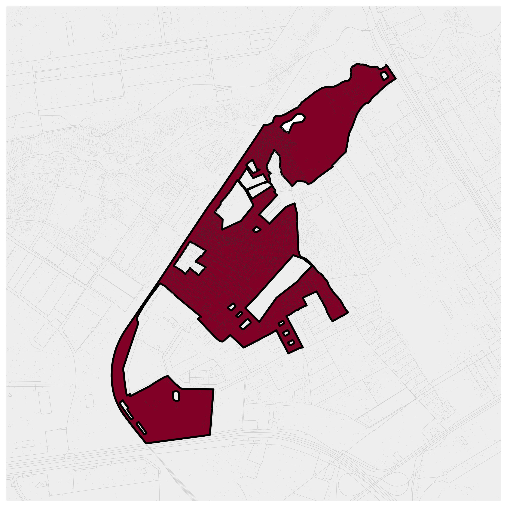
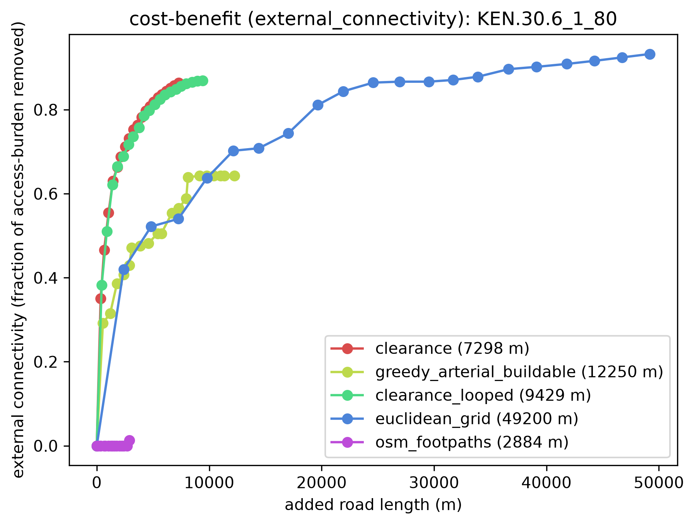
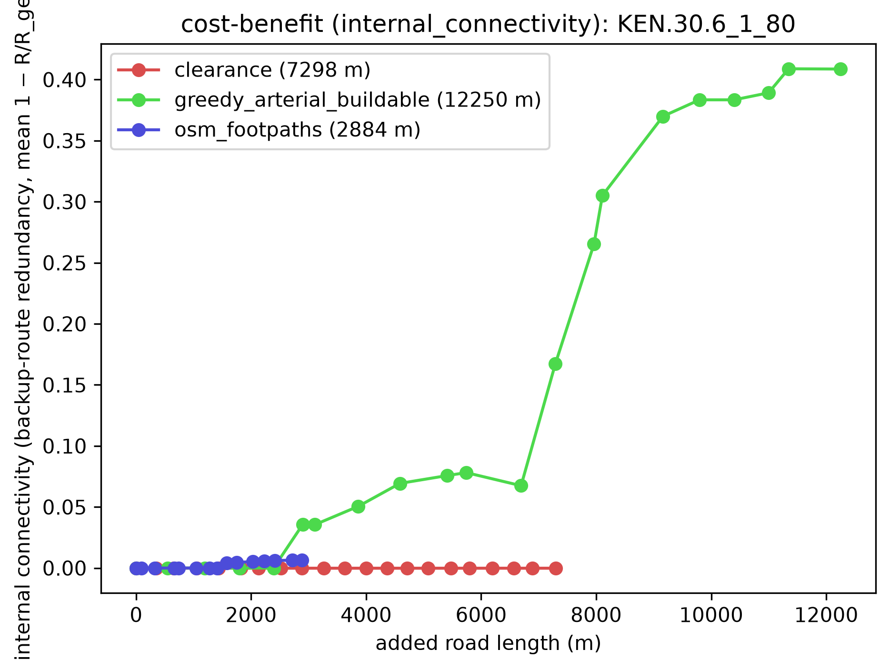
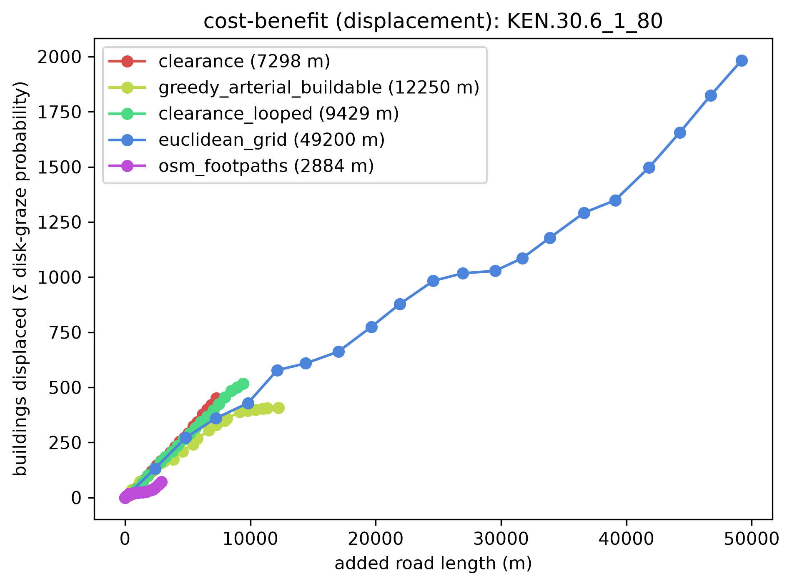
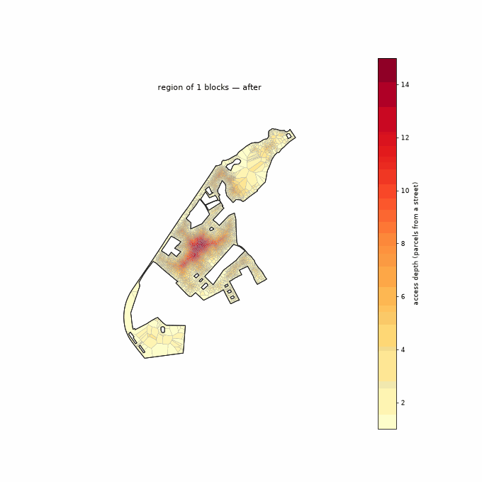
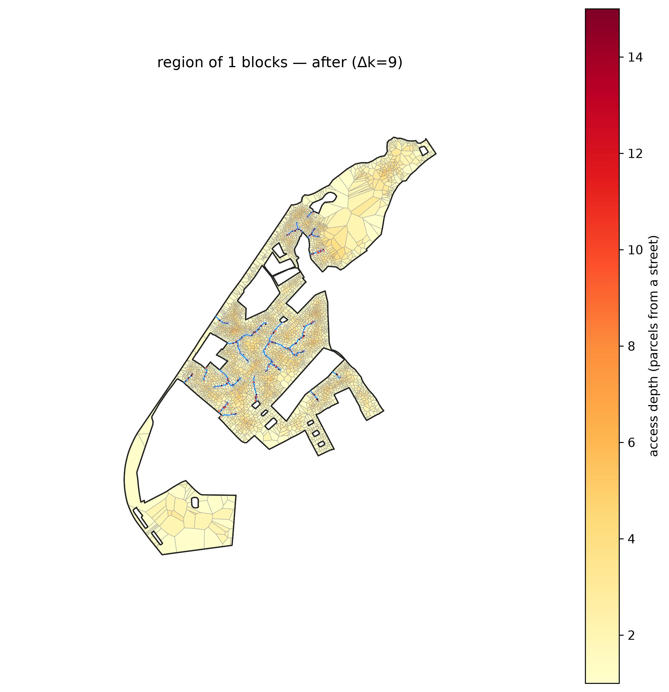
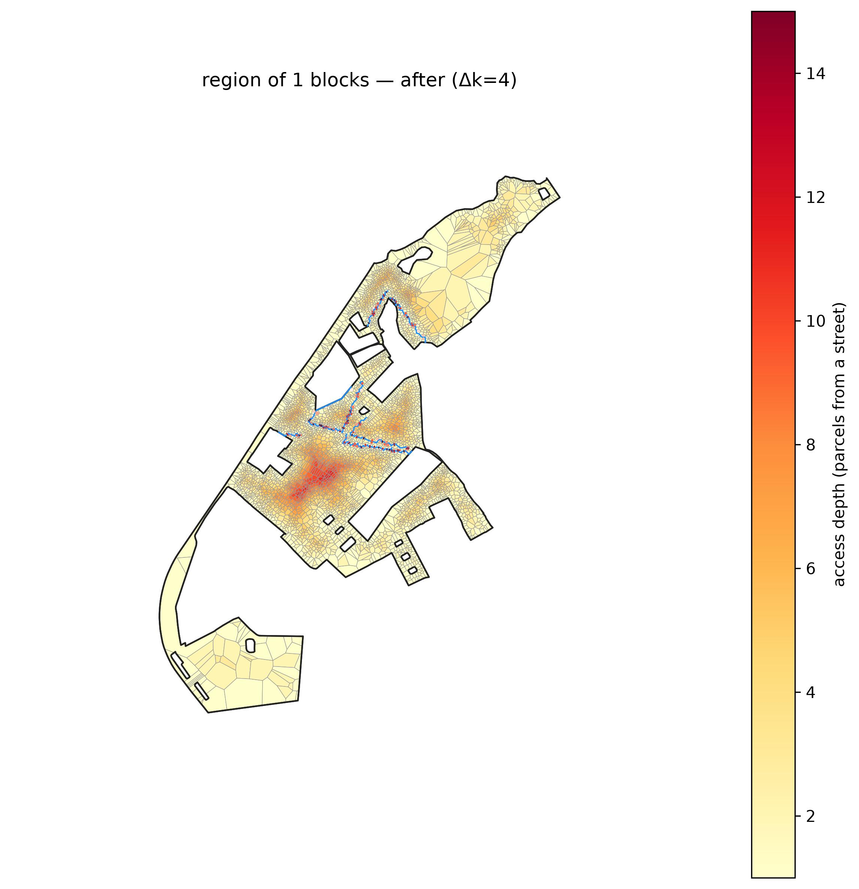
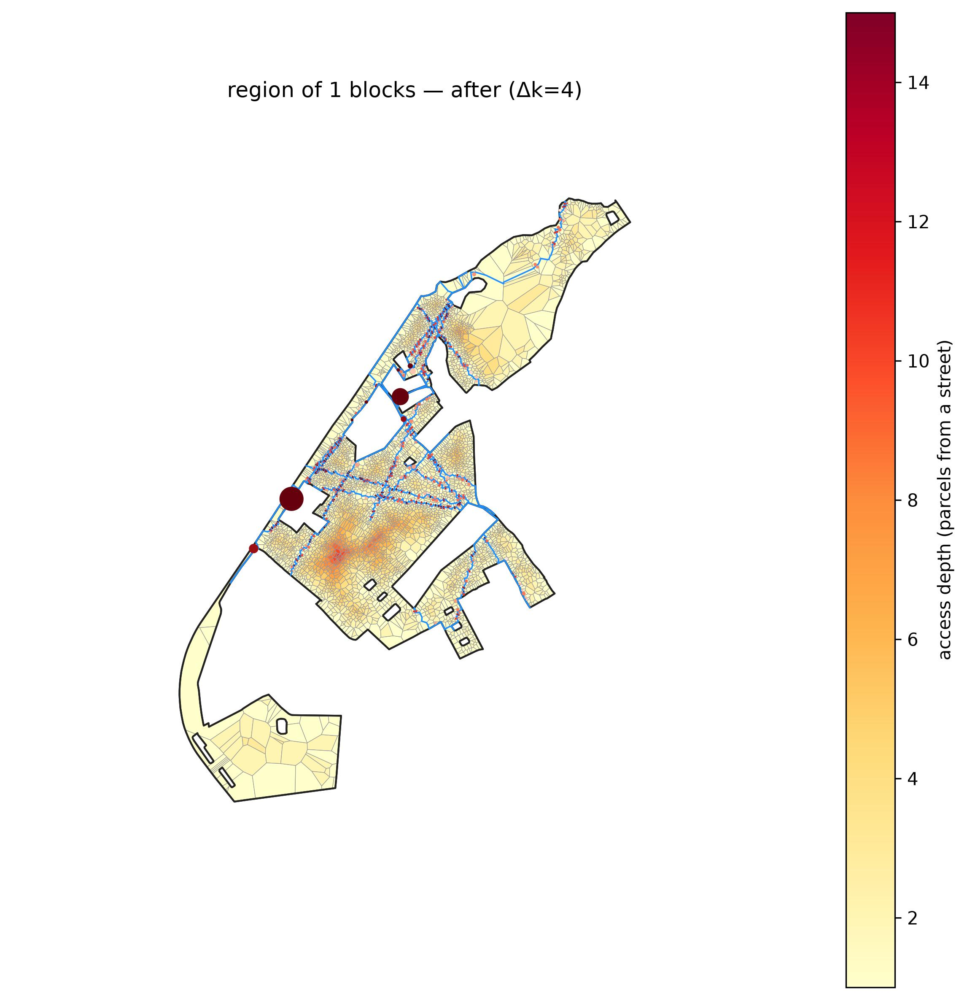

# Multiblock, screened by `depth`

*The deepest street-access fabric: how many parcels a home sits from a street, regardless of crowding.*

**Metric:** `depth = √(n·A)/P  →  true peel rings from a street` — one metric drives the screen, region growth, and colouring end to end.

## 1. Screen the metro

`depth` flagged **3,313 of 16,200** blocks. Top-scoring: `KEN.30.6_1_80` (peel depth 15).

**Location:** [see the grown region on Google Maps](https://www.google.com/maps/@-1.31807,36.88120,15z).

## 2. Grow the region

The metric grows a **1-block** region (**4,365 parcels**), mean depth 15.0 rings, mean density 38 bldg/ha.

## 3. The method frontier (benefit vs added road)

Each method's benefit as cumulative added road grows — the full trade-off whose fixed-depth and matched-budget slices are tabulated in `lens_a_depth.csv` and `lens_b_matched.csv` (this dir). External connectivity (access burden removed), internal connectivity (backup-route redundancy), and displacement (a rising cost):

## 4. Each method on the ground

The same region on the same access-depth colour scale (blue = at a street, red = deep) with displaced buildings marked — so the maps are directly comparable across methods.

**Watch each method reblock** — its full road set added in drainage order, the deep interior draining as the network reaches in:

| clearance | greedy_arterial_buildable | osm_footpaths |
|---|---|---|
|  |  |  |

**Matched road budget** — every method truncated to the same total added road, so this compares the access each *buys for the same cost*:

| clearance | greedy_arterial_buildable | osm_footpaths |
|---|---|---|
|  |  |  |

**Matched access target** — every method truncated where access-depth reaches the target, so this compares the *road each takes* for the same outcome:

| clearance | greedy_arterial_buildable | osm_footpaths |
|---|---|---|
|  |  |  |

