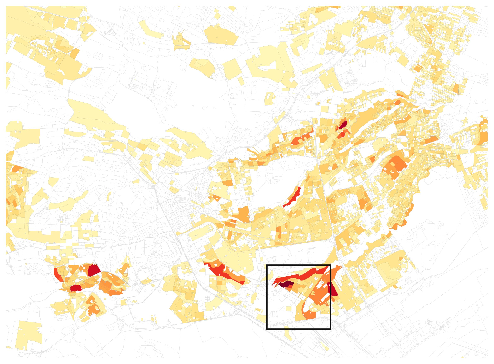
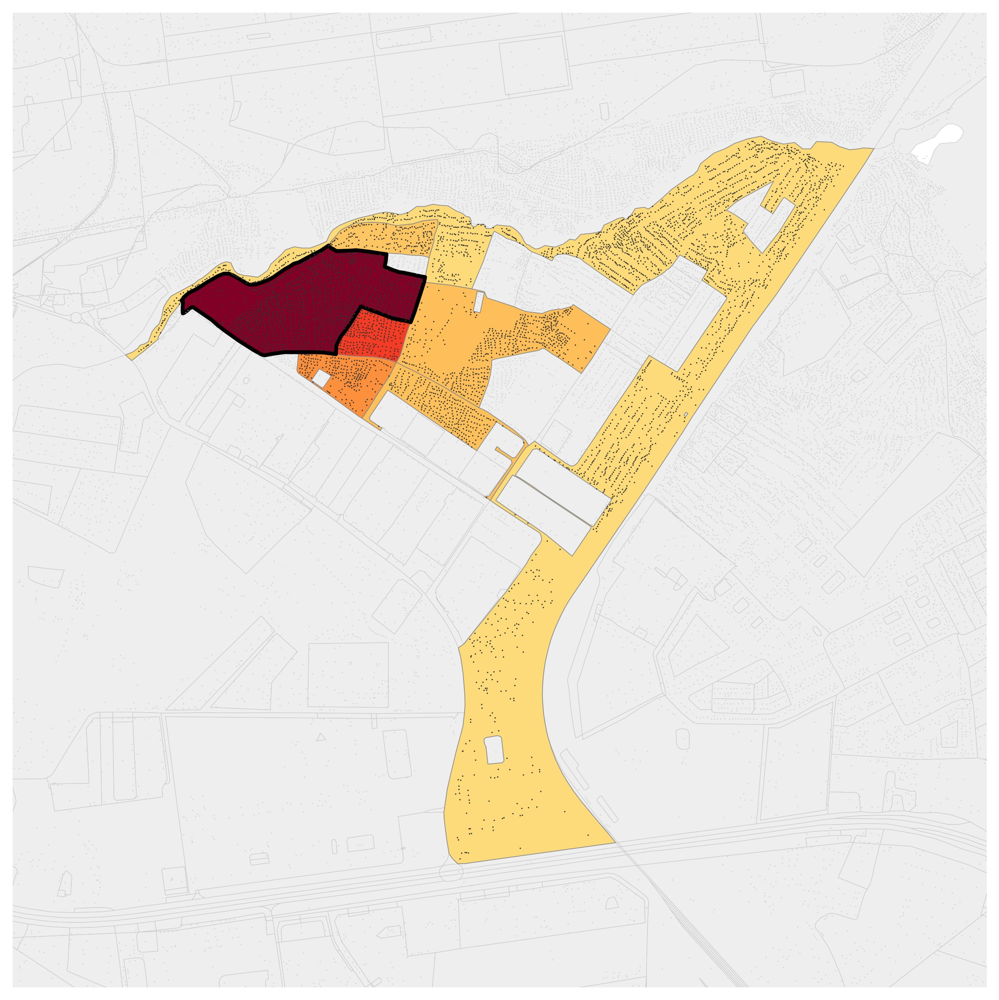
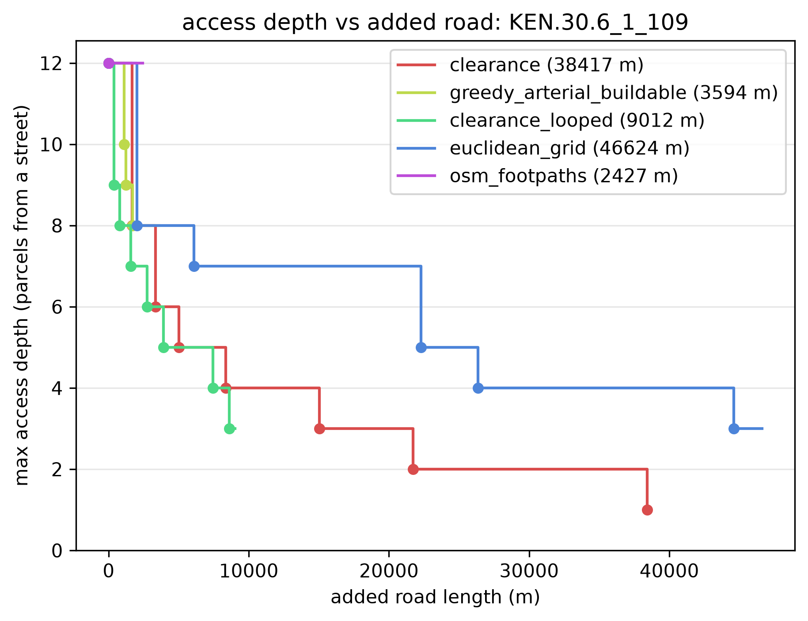
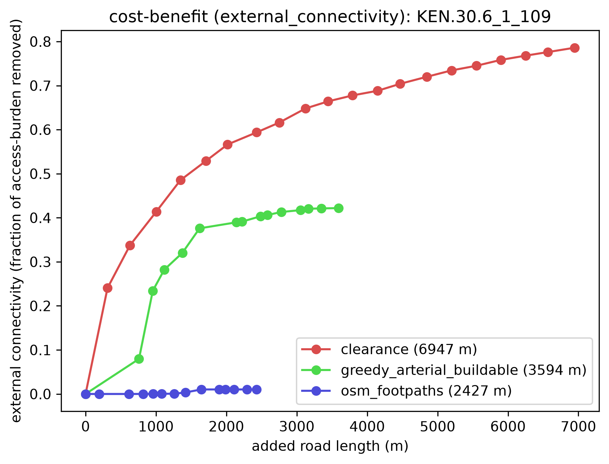
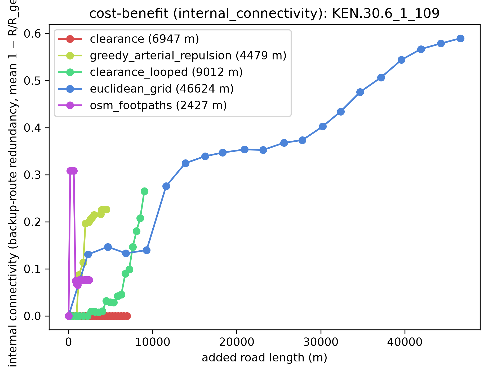
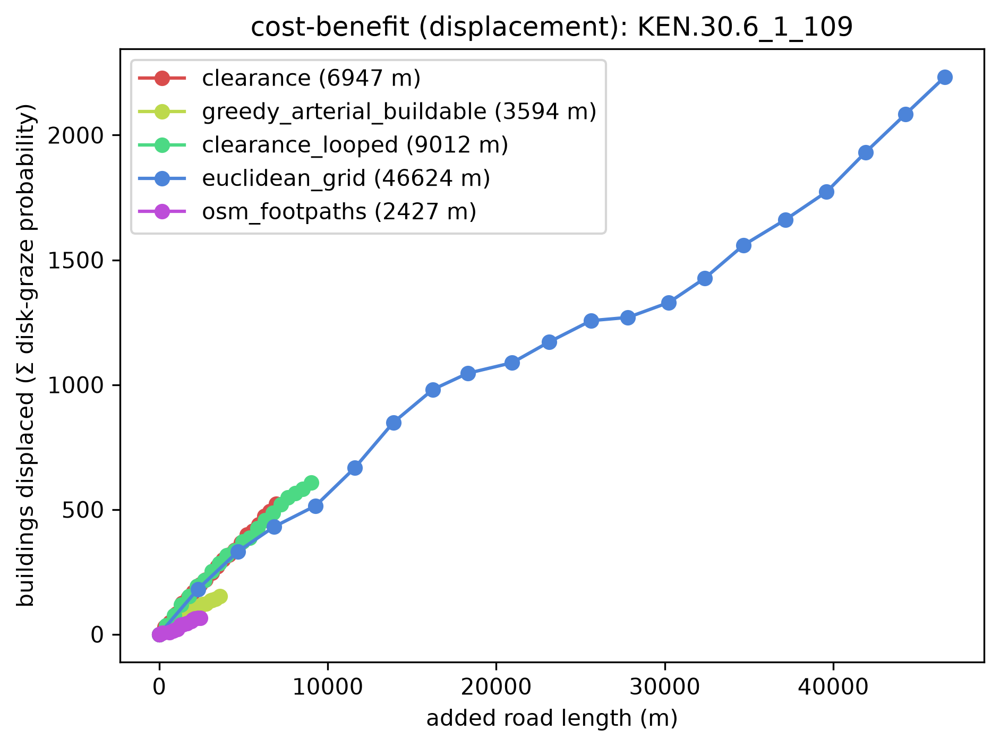
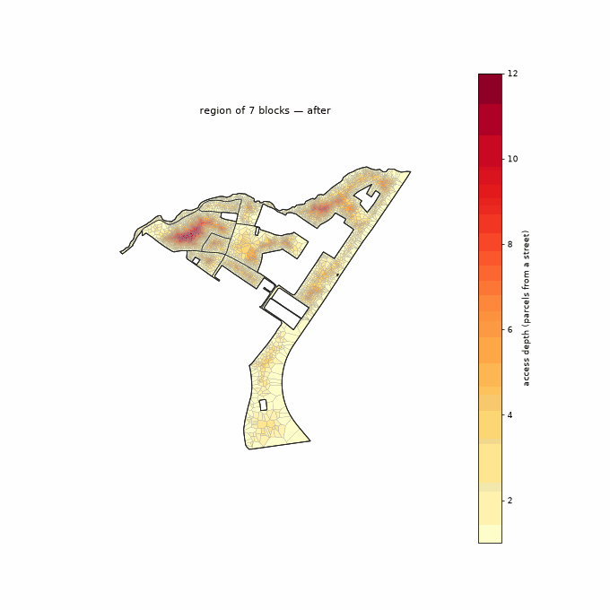
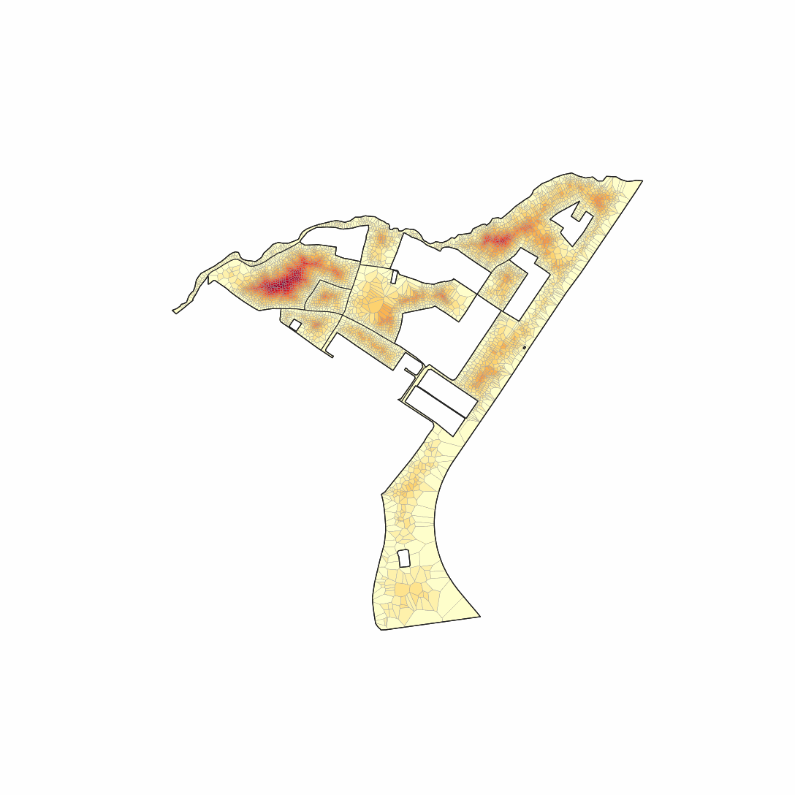
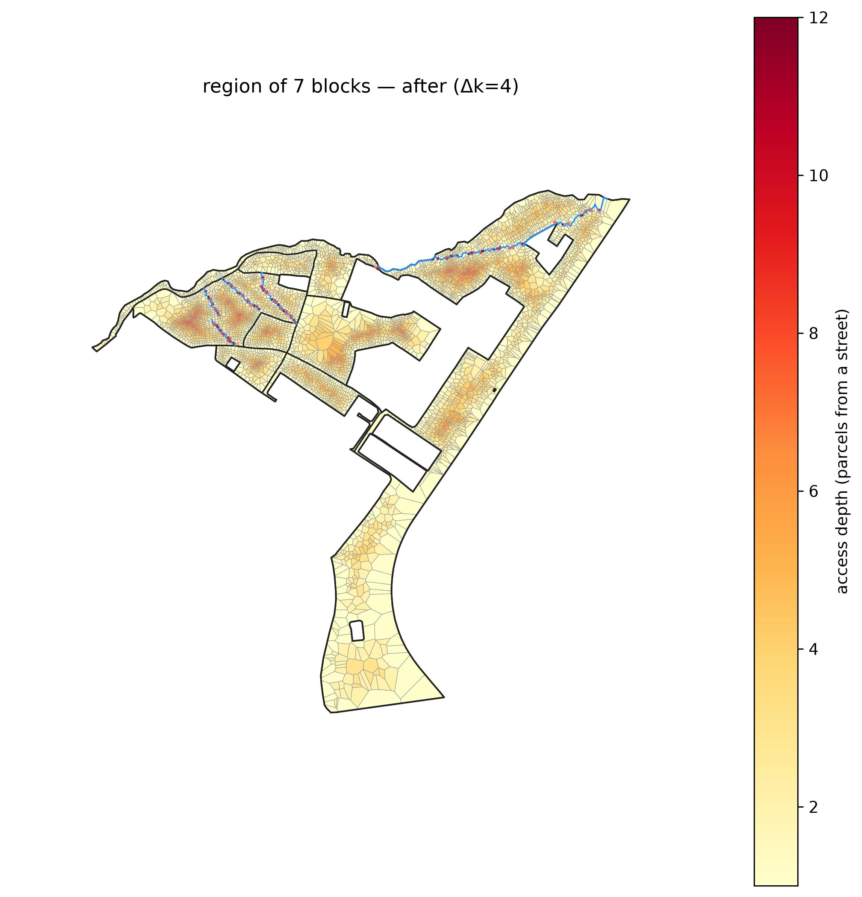
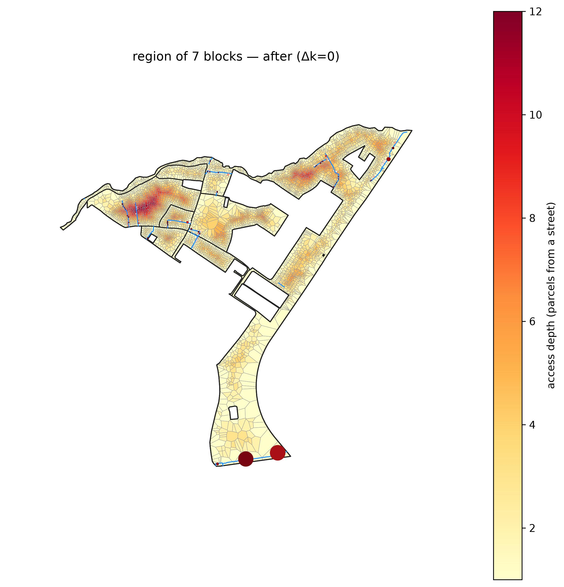

# Multiblock, screened by `depth_density`

*Deep and crowded at once — the metric that isolates the genuine informal settlements and fades the deep-but-sparse blocks.*

**Metric:** `depth × density  —  deep AND crowded` — one metric drives the screen, region growth, and colouring end to end.

## 1. Screen the metro

`depth_density` flagged **3,354 of 16,200** blocks. Top-scoring: `KEN.30.6_1_109` (peel depth 12).

**Location:** [see the grown region on Google Maps](https://www.google.com/maps/@-1.31999,36.87177,15z).

## 2. Grow the region

The metric grows a **7-block** region (**5,095 parcels**), mean depth 7.3 rings, mean density 68 bldg/ha.

## 3. The method frontier (benefit vs added road)

How far each method's road drives the region's **max access depth**, shown **for reference** (the method budget below is now the external-connectivity outcome) — a dot marks where it first reaches each new integer depth. `clearance` is **continued past its depth target** (a full-drainage run) out to the longest method's road, so every method is compared at the same budget: the as-built `osm_footpaths` network plateaus at its floor while `clearance` reaches the same depth for a fraction of the road:

Each method's benefit as cumulative added road grows — the full trade-off whose fixed-depth and matched-budget slices are tabulated in `lens_a_external.csv` and `lens_b_matched.csv` (this dir). External connectivity (access burden removed), internal connectivity (backup-route redundancy), and displacement (a rising cost):

## 4. Each method on the ground

The same region on the same access-depth colour scale (blue = at a street, red = deep) with displaced buildings marked — so the maps are directly comparable across methods.

**Watch each method reblock** — its full road set added in drainage order, the deep interior draining as the network reaches in:

| clearance | greedy_arterial_buildable | osm_footpaths |
|---|---|---|
|  |  |  |

**Matched road budget** — every method truncated to the same total added road, so this compares the access each *buys for the same cost*:

| clearance | greedy_arterial_buildable | osm_footpaths |
|---|---|---|
|  |  |  |

**Matched external-connectivity target** — every method truncated where external connectivity (access-burden removed) reaches 0.70, so this compares the *road each takes* for the same outcome:

| clearance | greedy_arterial_buildable | osm_footpaths |
|---|---|---|
|  |  |  |

