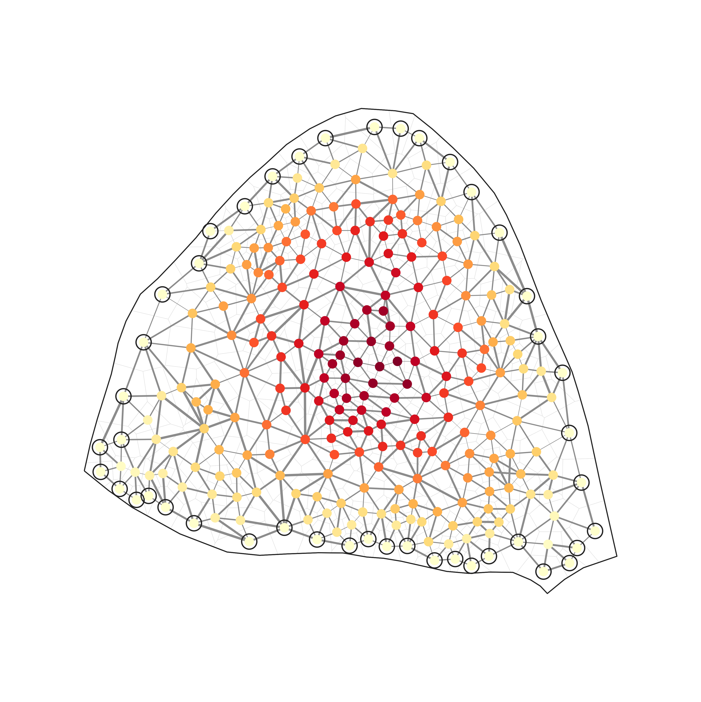
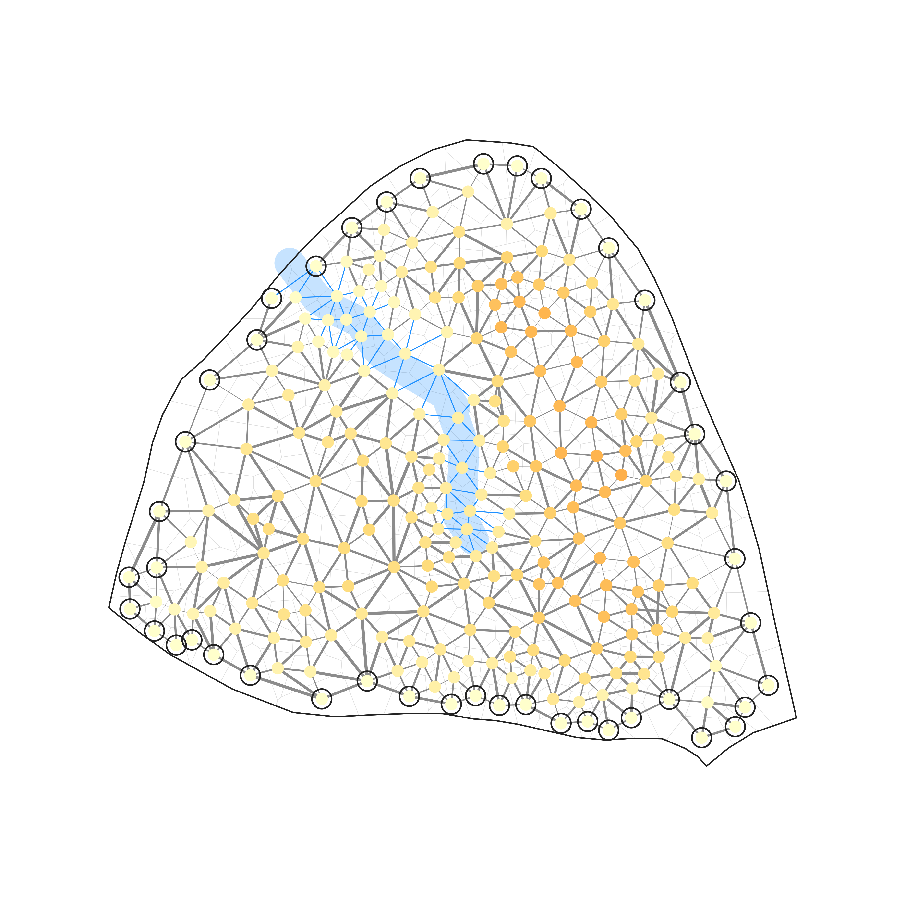
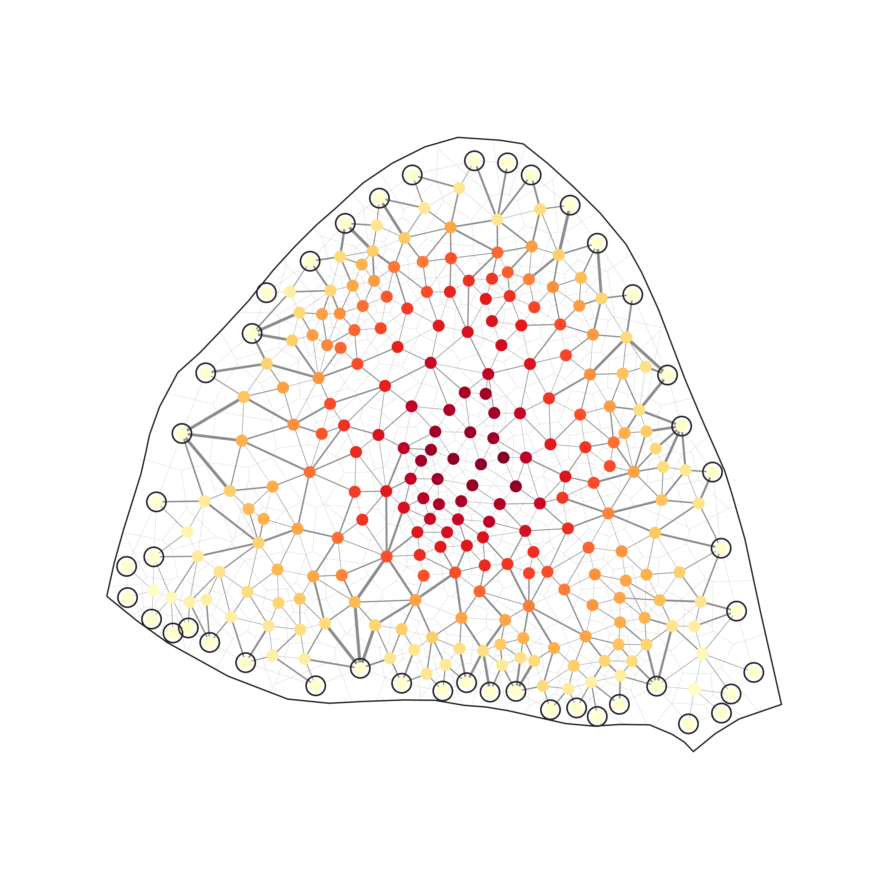
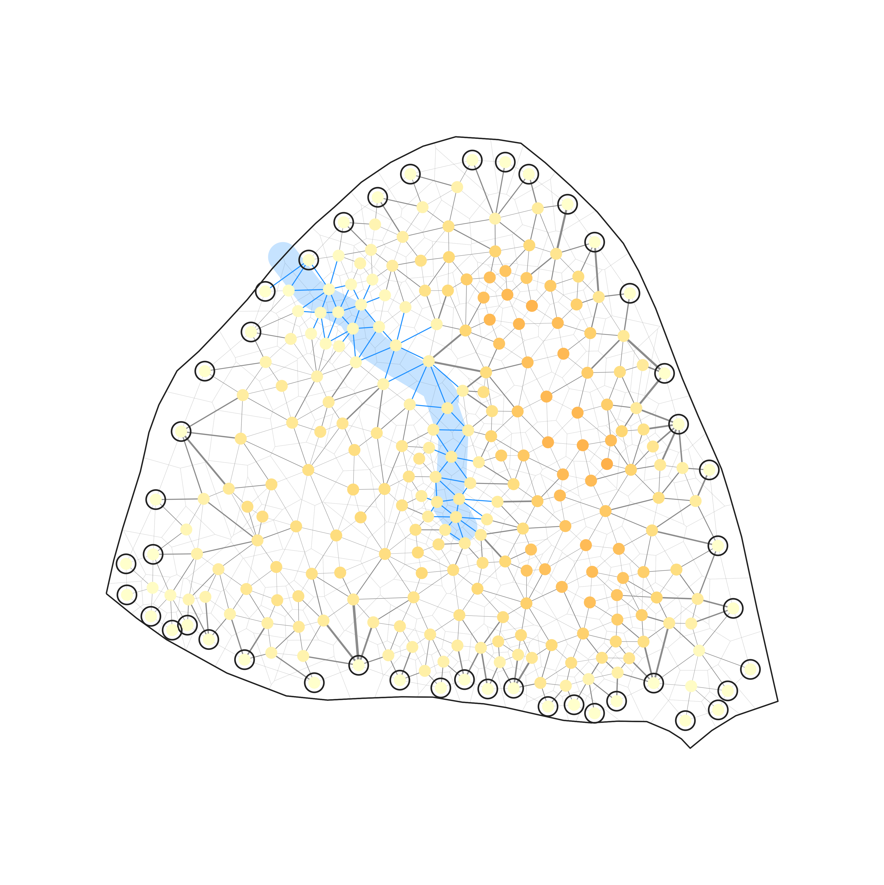

# The egress graph

The figure set for the site's [Permeability](../../docs/_partials/permeability.md) section: the graph
the metric is actually computed on, drawn four ways.

|  | no roads | with roads |
|---|---|---|
| width ∝ conductance |  |  |
| width ∝ current |  |  |

Nodes are parcel centroids, coloured by egress potential φ on the same `YlOrRd` scale the `_perm`
heatmaps use — dark means a harder escape. Grey edge width encodes either the mesh conductance (the
clearance fraction between two footprints) or the current `i = g(φᵢ − φⱼ)` flowing along that edge.
Blue edges are the ones a road raised — every road-raised edge is itself a mesh edge, so it draws at
a fixed width instead of one derived from its (near-saturated) conductance or current. The pale-blue
band under them is the road corridor itself, drawn at its own width. Haloed nodes front the existing
street and drain straight to ground.

**Provenance.** Block `ZAF.9.3.1_1_40972` — the block `conf/example/method_comparison.yaml` pins,
so this is the same block every method page's before/after uses. The roads are `clearance` at its
Lens-B prefix: the minimal drainage-ordered prefix reaching the matched-permeability standard `P*`
from `conf/permeability.yaml`, which is the same road set `examples/method-comparison/` publishes for
that method. Every number quoted on the site page comes from `perm_graph.json`, written by the
generator.

Not one of the flagships in [`../README.md`](../README.md): those are walkthroughs that reproduce a
result from the CLI, and this is a figure set for one page.

Regenerate: `pixi run python -m scripts.gen_perm_graph`
