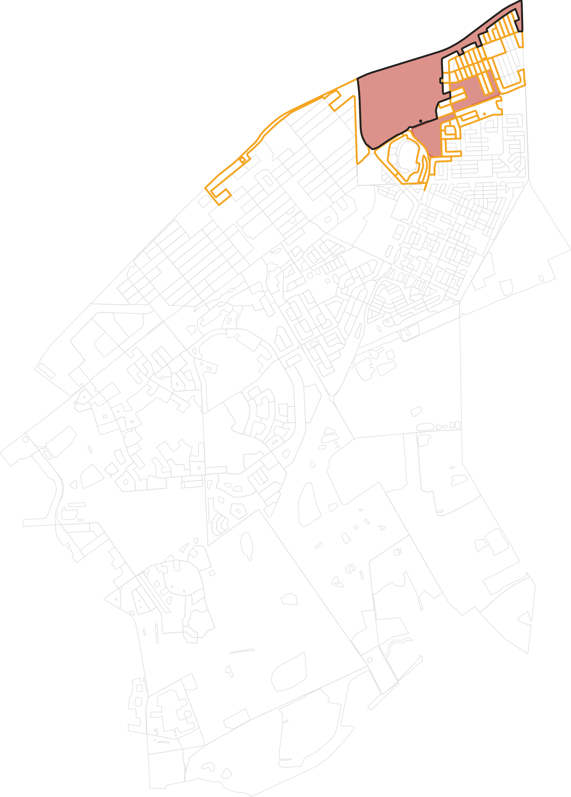

<!-- GENERATED by scripts/gen_region_grow.py -- do not edit. Regenerate:
     pixi run python -m scripts.gen_region_grow -->

# The RegionGrow neighbourhood

The figure set for the site's RegionGrow widget: from one pinned seed block, grow a contiguous
region by block adjacency up to a buildings budget -- the same greedy `DenseClusterRegionBuilder`
runs server-side, replayed live in the browser.

`hood.png` is the **boot state**: the whole shipped neighbourhood outlined, the region grown from
the seed at the slider's default budget (7,500 buildings) filled, that region's
frontier at the same budget outlined, and the seed itself picked out. `hood.json` is the payload
the widget fetches -- every neighbourhood block's `building_count`, area, perimeter and a
precomputed adjacency list, so the widget's own greedy needs no server round trip for any budget on
the slider. The bake also writes `web/src/hood.d.ts`, which is what makes a renamed field a
TypeScript error rather than a blank panel.

**Provenance.** Block `ZAF.9.3.1_1_5810`, the same block PermGraph, Frontier and DisplacementField
pin. The shipped neighbourhood is every block within 7 block-adjacency hops of the seed --
534 blocks, of which 46 carry an interior ring. 7 hops is not a
round number with margin added: it is the smallest radius that contains the seed's own accretion at
the slider's maximum budget, so the widget can never grow a region with a hole in it where shipped
data runs out.

**The budget slider** runs 6,500 to 15,000 buildings in steps of
100, defaulting to 7,500. The floor is deliberate, not arbitrary: at
6,500 buildings the region is the seed alone -- shown, not hidden.

**Reference cases.** `hood.json` carries 12 seed/budget pairs, each with
`DenseClusterRegionBuilder`'s own accretion order for it. They are what
`tests/test_region_grow_bundle.py` re-derives against live Python, pin the TypeScript greedy to
production rather than to a re-implementation of its rule, and confirm growth is NESTED: a bigger
budget's order always extends a smaller one's for the same seed.

| seed | max_buildings | blocks | buildings |
|---|---|---|---|
| `ZAF.9.3.1_1_5810` | 6,500 | 1 | 6,619 |
| `ZAF.9.3.1_1_5810` | 7,500 | 3 | 7,911 |
| `ZAF.9.3.1_1_5810` | 9,000 | 9 | 9,319 |
| `ZAF.9.3.1_1_5810` | 15,000 | 40 | 15,148 |
| `ZAF.9.3.1_1_5378` | 6,500 | 2 | 6,741 |
| `ZAF.9.3.1_1_5378` | 7,500 | 3 | 7,500 |
| `ZAF.9.3.1_1_5378` | 9,000 | 9 | 9,059 |
| `ZAF.9.3.1_1_5378` | 15,000 | 40 | 15,148 |
| `ZAF.9.3.1_1_5379` | 6,500 | 2 | 6,739 |
| `ZAF.9.3.1_1_5379` | 7,500 | 4 | 8,031 |
| `ZAF.9.3.1_1_5379` | 9,000 | 9 | 9,057 |
| `ZAF.9.3.1_1_5379` | 15,000 | 40 | 15,148 |

Regenerate: `pixi run python -m scripts.gen_region_grow`
