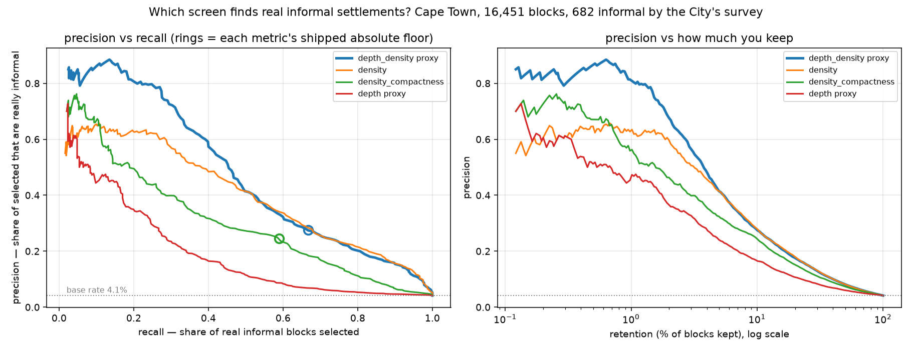
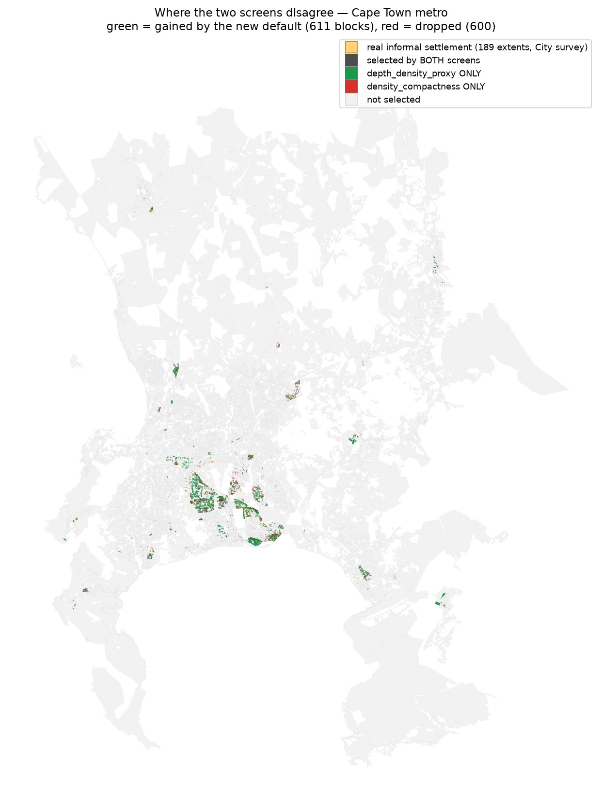
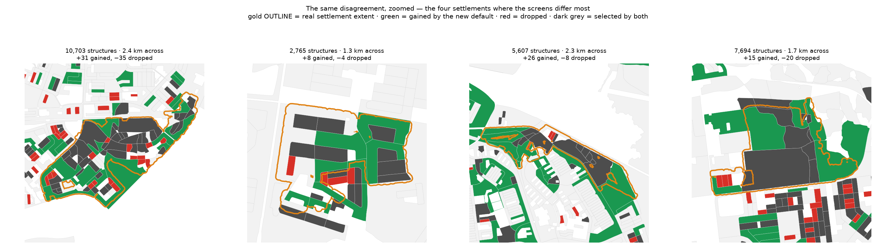

# Screen bake-off — which screen actually finds informal settlements?

Every other example grades reblocking **methods**. This one grades the **screens** that decide which
blocks get reblocked at all — a stage that was never validated against ground truth until
2026-08-08, and where the answer turned out to matter.

Reproduce with `pixi run python -m scripts.gen_screen_bakeoff` (downloads ~18 MB of ground truth
once).

## Ground truth

The City of Cape Town's own informal-structure survey: **117,336 dwelling polygons** digitised from
February 2018 aerial photography at 1:200, published via University of Edinburgh DataShare
([doi:10.7488/ds/2758](https://doi.org/10.7488/ds/2758)). Median structure area **29.5 m²** —
shack-scale, and independently reproduced at 28.9 m² by Google Open Buildings on the same blocks.

The file carries no settlement-name field, so extents are clustered from the structures themselves
(`reblock.data.informal`): **189 settlements covering 15.4 km²**, retaining 97.9% of all structures.
A block counts as informal when at least 30% of its area falls inside one — **682 of 16,451 Cape
Town blocks, 4.15%**.

## Result

All four metrics below are **cheap** — computable from the free kblock columns (`building_count`,
area, perimeter), no Voronoi and no peel. That matters, because `density_compactness`'s historical
selling point was precisely that it needs no peel, and its competitors don't either.

| metric | AUC | prec@1% | prec@5% | prec@30% | recall@30% |
|---|---|---|---|---|---|
| `density` — n/A | **0.922** | 0.628 | 0.416 | 0.131 | 0.946 |
| `depth_density` proxy — √(nA)/P · n/A | 0.921 | **0.817** | 0.416 | 0.130 | 0.937 |
| `density_compactness` — n/P² | 0.841 | 0.561 | 0.322 | 0.111 | 0.802 |
| `depth` proxy — √(nA)/P | 0.708 | 0.463 | 0.241 | 0.083 | 0.603 |

`density` and the `depth_density` proxy tie on AUC, but **`depth_density` is far more precise at the
top — 81.7% against 62.8% in the first 1%** — and a screen is exactly a top-slice operation. That is
why it is the shipped default.

At their shipped absolute floors, on nearly identical pool sizes:

| screen | blocks | precision | recall |
|---|---|---|---|
| `depth_density_proxy ≥ 0.0128` (default) | 1,655 | **27.5%** | **66.7%** |
| `density_compactness ≥ 3.55e-4` (previous) | 1,644 | 24.5% | 58.9% |

Better on **both** axes at equal size — so the change costs nothing and adjudicates no trade-off.
Note the absolute numbers: even the better screen is right about one block in four. Screening is
hard, and the honest headline is that the *previous* default selected three non-settlement blocks
for every settlement one.

## Where they disagree

611 blocks are gained by the new default and 600 dropped. The two views show the same disagreement
at different scales.

City-wide, the pattern is unmistakable: the green (gained) concentrates in the Cape Flats settlement
belt, while the red (dropped) scatters across formal suburbs that n/P² liked for being small and
compact.

Zoomed onto the four settlements where the screens differ most, the mechanism is visible.
**Green sits inside and along the gold settlement outlines; red sits outside them.** n/P² rewards
compactness, which is a property of small tidy formal blocks as much as of shacks — measured, its
compactness term alone scores AUC 0.536, barely above chance, and multiplying density by it *costs*
0.922 → 0.841.

## Caveats

- **Cape Town only.** No equivalent published layer was found for Nairobi — searched across the
  City's ArcGIS portal, openAFRICA, HDX and OSM Overpass; see `reblock.data.informal`. The absolute
  floor does transfer better than the one it replaced (shrinking 2.1× to Nairobi against n/P²'s
  4.3×), but that is evidence for the choice, not a Kenyan calibration.
- The 30% cover threshold is a choice; the metric **ordering** was verified stable at every
  threshold from 10% to 90%.
- Ground-truth structures are from 2018, against blocks built from later OSM and Open Buildings —
  some temporal drift is unavoidable.
- A single Google Open Buildings feature, 90th-percentile footprint area, scores **AUC 0.943** and
  beats every metric here — at the cost of a polygon download this screen does not need. Backlogged.
