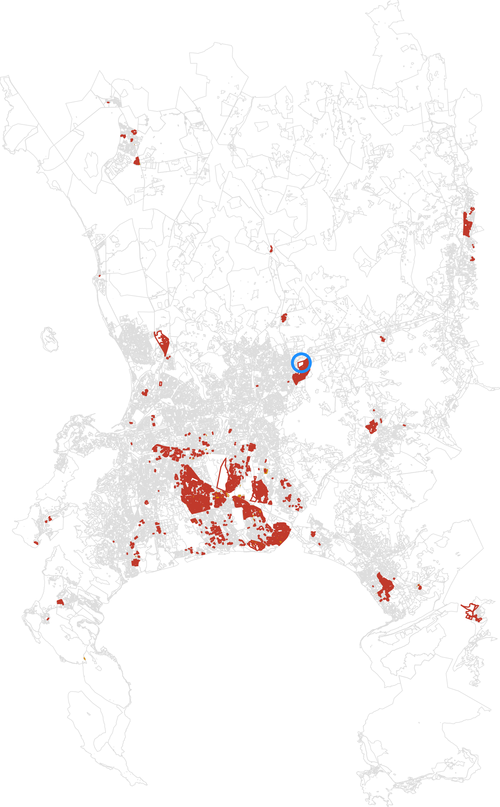

<!-- GENERATED by scripts/gen_screen_map.py -- do not edit. Regenerate:
     pixi run python -m scripts.gen_screen_map -->

# The ScreenMap city tiers

The figure set for the site's ScreenMap widget: pick one of four cheap screening metrics, see which
blocks it selects at its shipped absolute floor, and -- for Cape Town -- how well that selection
matches the City of Cape Town's own informal-structure survey
(775 of 18,309 blocks are really informal by that survey,
via `reblock.data.informal`).

The blue ring marks `ZAF.9.3.1_1_5810` (index 15,849 of the columns below)
-- the single block every later stage of the site is about: perm-graph, displacement-field and
method-comparison all pin it, and region-grow seeds from it. Cape Town's bundle carries it as
`follow`; Nairobi omits the field, the same way it omits `informal`. It is a POINT, not an outline:
a whole metro is fitted into one figure, so at a 700-900 px page width that block
covers 60.4-99.9 px² in the map above, and 19.6-32.5 px²
on the widget's own square map -- its boundary is not a shape a reader could pick out.

`capetown.json` and `nairobi.json` are the payloads the widget fetches: every block's
`building_count`, area, perimeter and simplified boundary rings (fill even-odd), plus the shipped
floors and a rendering `encoding`. Metrics themselves are **not** shipped as columns -- they are
arithmetic on `building_count`/area/perimeter cheap enough for the widget to compute client-side the
same way `reblock.metric` computes them (design §3.1), so switching metrics costs one client-side
sort, not a re-fetch. The bake also writes `web/src/screen_map.d.ts`, which is what makes a renamed
field a TypeScript error rather than a blank map.

| city | blocks | interior rings | JSON (5 m simplify, compact) | gzip |
|---|---|---|---|---|
| Cape Town | 18,309 | 7,044 | 6.46 MB | 2.10 MB |
| Nairobi | 3,839 | 1,128 | 1.21 MB | 0.40 MB |

**Shipped floors.** `n` is each floor's pool size on THAT city's own blocks -- for Nairobi this is
recomputed directly (there is no bake-off row to read it from), not copied from Cape Town's. Cape
Town's `precision`/`recall` are read from `examples/screen-bakeoff/screen_comparison.csv`, which
`gen_screen_bakeoff.py` computes independently of this bundle -- two paths agreeing is the guard
`tests/test_screen_map_bundle.py` checks.

Cape Town:

| metric | floor | pool | precision | recall |
|---|---|---|---|---|
| `depth_density_proxy` | 0.0128 | 3,169 | 20.0% | 81.9% |
| `density_compactness` | 0.000355 | 3,049 | 17.5% | 68.8% |

Nairobi -- same floors, same formulas, **no ground truth to check them against**:

| metric | floor | pool | precision | recall |
|---|---|---|---|---|
| `depth_density_proxy` | 0.0128 | 334 | — | — |
| `density_compactness` | 0.000355 | 224 | — | — |

**Nairobi omits `informal` rather than shipping nulls.** No equivalent published informal-settlement
layer was found for Nairobi -- searched and documented in `reblock.data.informal` (also recorded in
`examples/screen-bakeoff/README.md`'s own caveats). A missing field is a type the widget must
handle explicitly; a null column is a field that looks answerable and is not. That the SAME absolute
floors still produce a plausible, nonzero pool on a corpus with no calibration is itself the point
(design §3.4): an absolute threshold transfers across corpora where a percentile does not, because a
percentile silently redefines "top X%" every time the corpus changes size.

Regenerate: `pixi run python -m scripts.gen_screen_map`
