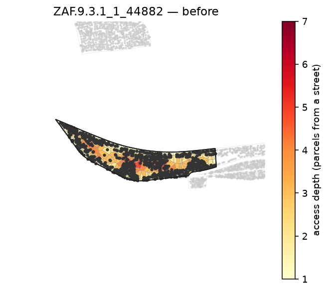
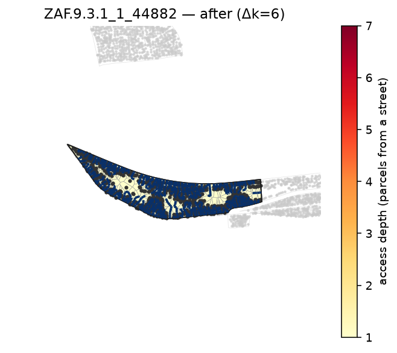

# Single-block reblock

Reblock one block and render its access-depth heatmap before and after a buildable street
network. Building points and dimmed surrounding blocks are overlaid automatically.

```bash
pixi run python -m reblock.run data=capetown method=dijkstra eval=kcomplexity \
  "block_ids=[[ZAF.9.3.1_1_44882]]" render.enabled=true
```

Block `ZAF.9.3.1_1_44882` from the committed Cape Town sample; `dijkstra` routes a frontage street
network in ~1 s. Colour = parcels-from-a-street (darker = deeper).

| before | after |
|---|---|
|  |  |
